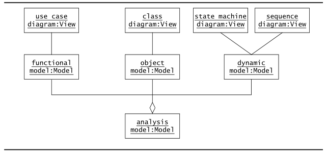
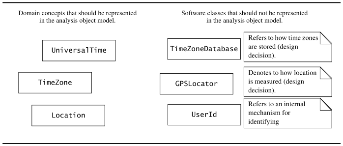
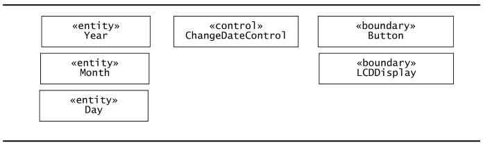
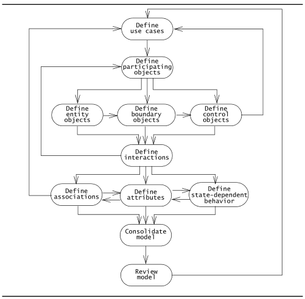
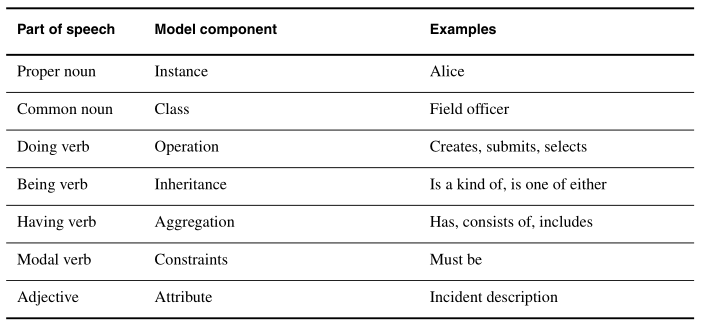
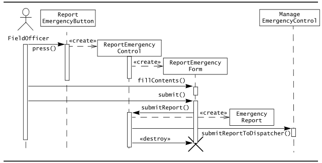
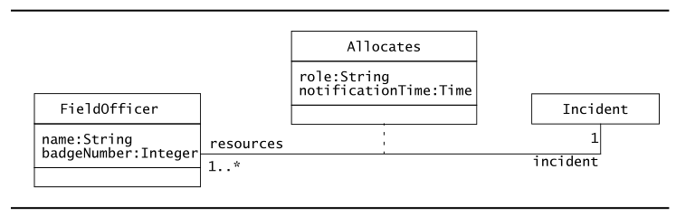
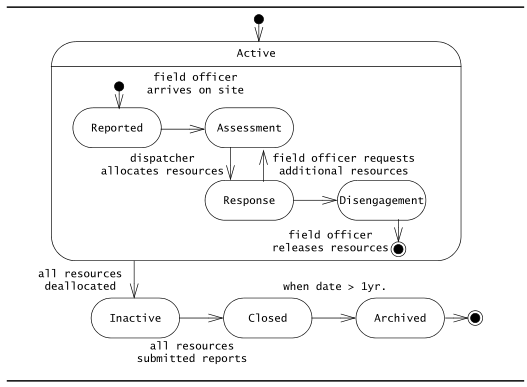
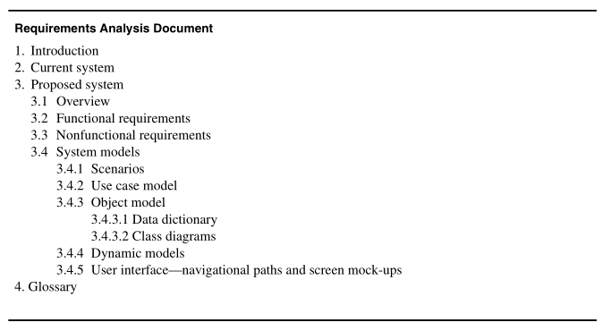

* TOC  
{:toc}
# Introduzione

La formalizzazione aiuta a identificare aree di ambiguità insieme a inconsistenze e omissioni in una specifica dei requisiti. Una volta che gli sviluppatori identificano il problema con la specifica, essi affrontano il problema raccogliendo altre informazioni dagli utenti e dal committente. Raccolta e analisi dei requisiti sono attività iterative e incrementrali ed effettuate concorrentemente.  

La fase di **analisi** si focalizza sul produrre un modello per il sistema, chiamato **modello di analisi** (*analysis model*), che sia corretto, completo, consistente e verificabile.  

L'analisi è diversa dalla raccolta dei requisiti, dato che gli sviluppatori nella fase di analisi si focalizzano a strutturare e formalizzare i requisiti raccolti dagli utenti. Questa formalizzazione porta a nuovi approfondimenti e alla scoperta di nuovi errori nei requisiti.  

Dato che il modello di analisi potrebbe essere incomprensibile per gli utenti e per il committente, gli sviluppatori devono quindi aggiornare la specifica dei requisiti per riflettere gli approfondimenti ottenuti durante le analisi, per poi revisionare i cambiamenti col committente e con gli utenti.  

Tradurre una specifica dei requisiti in un modello formale o semiformale forza lo sviluppatore a identificare, affrontare e risolvere questioni difficili nelle prime fasi dello sviluppo. Questo è molto importante perchè gli sviluppatori hanno l'abitudine di posticipare continuamente le decisioni.  

Il **modello di analisi** è composto da tre modelli individuali:  

* **modello funzionale**: rappresentato da use cases e scenari
* **modello ad oggetti di analisi** (*analysis object model*): rappresentato dai *class diagrams* e *object diagrams*
* **modello dinamico**: rappresentato dagli *state diagrams* e dai *sequence diagrams*

# Concetti

## Modelli ad oggetti di analisi e modelli dinamici

Il *modello di analisi* rappresenta il sistema in sviluppo dal punto di vista dell'utente.  

Il **modello ad oggetti di analisi** è parte del modello di analisi e si focalizza sui concetti indiviuali manipolati del sistema, le loro proprietà e le loro relazioni. Questo modello è rappresentato dai *class diagrams* e include classi, attributi e operazioni. Questo modello è un *dizionario visuale* dei concetti principali e visibili all'utente.  

Il **modello dinamico** si focalizza sul comportamento del sistema. Il modello dinamico è raffigurato da *sequence diagrams* e da *state diagrams*:  

* I *sequence diagrams* rappresentano l'interazione che avviene tra un insieme di oggetti durante un singolo use case.
* I *state diagram* rappresentano il comportamento di un singolo oggetto (o di un gruppo di oggetti strettamente accoppiati).  

Il modello dinamico serve ad assegnare responsabilità alle classi individuali e, nel processo, identifica nuove classi, associazioni e attributi da aggiungere nel *modello ad oggetti di analisi*.  

Quando si lavora col *modello ad oggetti di analisi* o col *modello dinamico*, è essenziale ricordare che questi modelli rappresentano *concetti al livello dell'utente* e non rappresentano invece le effettive classi software o componenti.  
Per esempio, classi come ``Database``, ``Subsystem``, ``Sessionmanager``, ``Network`` non dovrebbero comparire nel modello di analisi dato che l'utente non è esposto a tali concetti. 

Si noti che comunque di solito la maggior parte delle classi nel *modello ad oggetti di analisi* corrisponderà ad una o più classi software nel codice sorgente: tali classi software includeranno molti più attributi e associazioni della loro controparte "analitica".  Di conseguenza, le classi di analisi vanno viste come "astrazioni ad alto livello" da realizzare più nel dettaglio nelle fasi successive.  

## Oggetti *Entity*, *Boundary* e *Control*

Il *modello ad oggetti di analisi* coniste in oggetti *entity*, *boundary* e *control*.  

Gli **Entity objects** rappresentano l'informazione persistente tracciata dal sistema.  
I **Boundary objects** rappresentano l'interazione tra gli attori e il sistema.  
I **Control objects** si occupano di realizzare i casi d'uso.  

>  In the 2Bwatch example, Year, Month, and Day are entity objects; Button and LCDDisplay are boundary objects; ChangeDateControl is a control object that represents the activity of changing the date by pressing combinations of buttons.

Modellare il sistema con oggetti *entity*, *boundary* e *control* fornisce allo sviluppatore semplici euristiche per distinguere concetti diversi ma correlati.  

L'approccio *a tre tipologie di oggetti* porta a dei modelli più resilienti alle modifiche: l'interfaccia di sistema (Rappresentato dai *boundary objects*) è più prono a cambiamenti rispetto alle sue funzionalità di base (rappresentate dagli *entity* e *control*). Separando l'interfaccia dalle funzionalità, siamo capaci di lasciare intatta la maggior parte del modello in caso di cambiamenti all'interfaccia.  

Per distinguere le 3 tipologie di oggetti, UML fornisce il meccanismo degli *stereotipi* per aggiungere *meta-informazioni* agli elementi modellanti. Gli stereotipi sono *«entity»*, *«boundary»* e *«control»*.  

Oltre agli *stereotipi*, è possibile introdurre anche delle *naming conventions* per chiarezza e per distinguere le tre tipologie di oggetti:  

* Gli oggetti *control* potrebbero avrebbe ``Control`` come suffisso nel proprio nome
* Gli oggetti *boundary* potrebbero essere denominati in modo tale da denotare con chiarezza una funzionalità di interfacciamento
  + Es. includendo il suffisso ``Form``, ``Button``, ``Display``, ``Boundary``
* Gli oggetti *entity* solitamente non hanno suffissi nel loro nome

# Attività  

In questa sezione sono descritte le attività che trasformano gli use cases e gli scenari prodotti durante la raccolta dei requisiti in un modello di analisi.  

Le attività della fase di analisi sono illustrate nel seguente *activity diagram*:  

## Identificare oggetti *Entity*

Gli oggetti partecipanti formano le basi del modello i analisi. Come descritto in [[Raccolta dei requisiti]], gli oggetti partecipanti sono trovati esaminando ogni caso d'uso e identificando gli oggetti partecipanti.  

### Euristiche

Il sistema del *Natural Language Analysis*, suggerito da Abbott nel 198, è un insieme di euristiche intuitive per l'identificazione di oggetti, attributi e associazioni a partire da una specifica di requisiti. Queste sono anche comunemente chiamate **Euristiche di Abbott**.  

Le euristiche di Abbott "mappano" le parti del parlato (nomi, verbo avere, verbo essere, aggettivi) in componenti di modellazione (oggetti, operazioni, ereditarietà, classi). La seguente tabela mostra degli esempi di mappings:  

L'*analisi del linguaggio naturale* ha il vantaggio di focalizzarsi sui termini degli utenti. Tuttavia, tale sistema soffre di alcune limitazioni:  

* la qualità dell'object model dipende altamente dallo stile di scrittura dell'analista
  + consistenza nei termini utilizzati, verbificazione di sostantivi
* il linguaggio naturale è uno strumento impreciso: un modello ad oggetto che deriva lterralmente da un testo ha il rischio di essere impreciso  

Gli sviluppatori possono affrontare questa limitazione riforlumando e chiarendo la specifica dei requisiti, identificando e standardizzando oggetti e termini.  

Un'altra importante limitazione nell'analisi del linguaggio naturale è che ci sono più sostantivi che classi rilevanti: molti nomi corrispondono ad attributi o a sinonimi, e andare a smistare tutti i nomi di una specifica dei requisiti può rivelarsi un'attività decisamente *time-consuming*.  

In generale, le *euristiche di Abbott* si prestano bene per generare una lista iniziale di oggetti candidati a partire da brevi descrizioni, come flussi di eventi o use case.   

In aggiunta alle *euristiche di Abbott*, è possibile usare anche le seguenti euristiche per identificare *entity* objects:  
* Termini che gli sviluppatori o gli utenti devono chiarire per comprendere uno use case
* Nomi ricorrenti negli use cases
* Entità del mondo reale che il sistema deve tracciare
* Attività del modo reale che il sistema deve tracciare
* *Data sources* e *Data sinks*
  + Es. ``Database`` o ``Printer``  
  + 
### Denominare e descrivere gli oggetti
Gli oggetti individuati vanno denominati *univocamente*: i loro nomi promuovono l'uso di una terminologia standard ed è preferibile che questi nomi siano vicini al dominio applicativo.  

Gli oggetti individuati vanno in oltre descritti insieme ai loro attributi e alle loro responsabilità: tali descrizioni permettono agli sviluppatori di chiarire concetti ed evitare malintesi. Tuttavia, tali descrizioni **non** sono obbligatorie e possono essere omesse se i concetti risultano ovvi: ci saranno un bel po' di iterazioni in cui l'oggetto sarà revisionato e si potrà eventualmente descrivere l'oggetto.  

## Identificare oggetti *Boundary*

Gli oggetti *boundary* rappresentano l'interfaccia di sistema con gli attori.  

In ogni use case, ogni attore interagisce con almeno un oggetto *boundary*. L'oggetto *boundary* colleziona informazioni dall'attore e le traduce in una forma fruibile dagli oggetti *entity* e *control*.  

Gli oggetti *boundary* rappresentano l'interfaccia utente "in maniera grossolana": quessti non descrivono in dettaglio gli aspetti visuali dell'interfaccia utente (Questo è compito dei mock-ups).  
Ad esempio, oggetti *boundary* come "*menu item*" oppue "*scroll bar*" sono troppo dettagliati.  

Alcune euristiche per identificare gli oggetti *boundary* sono i seguenti:  

* Identifica i controlli dell'UI che l'utente necessita per avviare un caso d'uso
  + Es. ``ReportEmergencyButton``
* Identifica i *form* che l'utente deve compilare nel sistema
  + Es. ``EmergencyReportForm``
* Identifica notifiche e messaggi che il sistema use per rispondere all'utente
  + Es. ``AcknowledgementNotice``
* Quando più attori sono coinvolti in uno use case, identifica i loro terminali
  + Es. ``DispatcherStation``, che rappresenta il computer usato dall'attore ``Dispatcher``
* Non modellare gli aspetti visuali di un'interfaccia con oggetti *boundary*
  + Utilizza i *mock-ups* a tale scopo
* Utilizza sempre i termini usati dall'utente finale per descrivere le interfacce (ossia terminl del dominio applicativo)
  + Non usare termini del dominio della soluzione o del dominio dell'implementazione

## Identificare oggetti *Control*

Gli oggetti *control* sono responsabili per la coordinazione tra gli oggetti *boundary* e gli oggetti *entity*.  

Gli oggetti *control* solitamente non hanno una concreta controparte nel mondo reale. Solitamente vi è una stretta correlazione tra uno *use case* e un *control object*; un *control object* è creato solitamente al'inizio di uno use case e viene distrutto alla fine di quest'ultimo.  

Gli oggetti *control* sono responsbili per la collezioni di informazioni dai *boundary* per poterli mandare agli oggetti *entity*.  

Alcune euristiche per l'identificazione degli oggetti *control*:  
* Identifica un oggetto *control* per ogni use case
* Identifica un oggetto *control* per ogni attore in uno use case
* La durata della vita di un oggetto *control* dovrebbe coprire la lunghezza delo use case (o la lunghezza di una sessione utente)
  + Se risulta difficile identificare l'inizio e la fine di un oggetto *control*, allora lo *use case* corrispondente forse non ha delle condizion di entrata e uscita ben definite

## Mappare Use Cases agli oggetti con i Sequence Diagrams

I **sequence diagram** legano gli use cases agli oggetti. Un *sequence diagram* mostra come il comportamento di uno use case (o scenario) si distribuisca tra i suoi oggetti partecipanti.  

I *sequence diagram* solitamente non sono un buon mezzo di comunicazione per gli utenti quanto gli use cases, dato che i sequence diagrams richiedono un background più solido riguardo la notazione.  

Dettagli riguardanti i *sequence diagram* sono presenti qui: [[Modellare con UML]].   

Per ricapitolare:  
* la colonna più a sinistra rappresenta l'attore che avvia lo use case
* le frecce orizzontale rappresentano i messaggi (o stimoli) mandati da un oggetto a un altro
  + La ricezione di un messaggio scaturisce l'attivazione di un'operazione
* l'attivazione di una operazione è rappresentata da un rettangolo verticale, dove la sua altezza indica la durata dell'operazione
* Il tempo è rappresentato verticalmente dall'alto verso il basso.
* La linea tratteggiata verticale sotto un'oggetto indica il suo tempo di vita

Grazie ai *sequence diagram* è possibile osservare anche il tempo di vita degli oggetti: 

* Gli oggetti che esistono già da prima dello stimolo di avvio sono posizionati in alto nel diagramma; 
* Oggetti che sono stati creati durante l'interazione sono raffigurati col messaggio *«create»*
* Istanze distrutte durante l'interazione presentano una croce (**X**) che indica quando l'oggetto cessa di esistere

**Solitamente**, la seconda colonna di un sequence diagram rappresenta un *boundary* object, con cui un attore interagisce per avviare lo use case. La terza colonna, invece, è un *control* object che gestisce il resto dello use case. Da qui in poi, l'oggetto *control* crea altri oggetti *boundary* e può anche iteragire con altri oggetti *control*.  

Un esempio parziale di *sequence diagram* è il seguente:  

Costruendo i *sequence diagrams*, non solo modelliamo l'ordine delle interazioni tra gli oggetti, ma distribuiamo anche il comportamento dello use case, ossia assegnamo **responsabilità** ad ogni oggetto nella forma di un insieme di **operazioni**. Queste operazioni possono essere condivise da ogni oggetto in cui partecipa tale oggetto: se un oggetto partecipa a più use case, il suo comportamento deve essere lo stesso.  

Condividere operazioni tra gli use cases permette agli sviluppatori di rimuovere ridondanze nella specifica dei requisiti e di migliorarne la consistenza.  

Nella fase di analisi, i sequence diagrams aiutano a identificare nuovi partecipanti, nuovi oggetti e comportamenti mancanti.  

Disegnare degli *interaction diagrams* (vedi: *sequence diagrams*) può risultare time-consuming: per questo, gli sviluppatori devono focalizzarsi prima su funzionalità problematiche o poco specifiche.  

Alcune euristiche per disegnare *sequence diagrams*:  

* La prima colonna rappresenta l'attore che avvia lo use case
* La seconda colonna dovrebbe essere un oggetto *boundary* (ossia l'oggetto che l'attore utilizza per avviare lo use case)
* La terza colonna dovrebbe essere un oggetto *control* che gestisce il resto dello use case
* Gli oggetti *control* sono creati dall'oggetto *boundary* che avvia lo use case
* Gli oggetti *boundary* sono crati dagli oggetti *control*
* Gli oggetti *entity* sono acceduti da oggetti *control* e *boundary*
* Gli oggetti *entity* non accedono **mai** a oggetti *boundary* o *control*
  + Questo rende più facile la condivisione degli oggetti *entity* tra i vari use cases  

## Identificare le associazioni

I *sequence diagrams* descritti prima permettono agli sviluppatori di rappresentare le interazioni tra gli oggetti nel tempo.  

I *class diagrams*, invece, mostrano e descrivono le *interdipendenze* tra gli oggetti. (Vedi [[Modellare con UML]])

Una **associazione** mostra una relazione tra 2 o più classi.  

Identificare le associazioni offre 2 vantaggi:  

* Chiarisce il modello di analisi esplicitando le relazioni tra oggetti
* Permette agli sviluppatori di scoprire nuovi casi limite associati ai *collegamenti* (ricorda: un collegamento è un'istanza di associazione)  

Le associazioni hanno le seguenti proprietà:  

* un **nome** che descrive l'associazione tra le 2 classi
  + è opzionale e non deve essere univoca globalmente
* un **ruolo** ad ogni estremo che identifica la funzione di ogni classe rispetto all'associazione
  + è opzionale
* una **molteplicità** ad ogni estremo, che indica il numero possibile di istanze.  

Le associazioni tra oggetti *entity* sono le più importanti, dato che rilevano il maggior quantitativo di informazioni riguardo il dominio applicativo.  

Riferendoci nuovamente alle *euristiche di Abbott*, le associazioni possono essere identificate esaminado i verbi.  

Altre euristiche per identificare le associazioni sono le seguenti:  

* Esamina i verbi
* Denomina i ruoli e le associazioni in modo preciso
* Usa i *qualificatori* il più spesso possibile per identificare *namespaces* e attributi chiave
* Elimina ogni associazione che può essere derivata da altre associazioni
* Non preoccuparti delle molteplicità fin quando l'insieme delle associazioni non è stabile
* Troppe associazioni rendono un modello poco attendibile

### Identificare le aggregazioni

Le **aggregazioni** sono un tipo speciale di associazioni che denotano una relazione di tipo "*a è parte di b*".  

Vi sono anche le **composizioni** che sono una tipologia di *aggregazione* più forte. (Vedi [[Modellare con UML]])  

Le aggregazioni aggiungono informazioni al modello di analisi riguardo concetti di "*contenimento*" presenti nel dominio applicativo.  

Se non si è sicuri se l'associazione che si descrive è un concetto del tipo "*a è parte di b*", allora è meglio modellarlo come una semplice associazione *uno-a-molti* e rivisitarla più avanti nel processo di sviluppo quando si ha una migliore conoscenza del dominio applicativo  

## Identificare gli attributi  

Gli **attributi** sono proprietà degli oggetti individuali.  

Quando si identificano le proprietà degli oggetti, solo gli attributi rilevanti al sistema dovrebbero essere considerati.  

Ogni attributo ha:  

* un **nome** che li identifica tali attributi nell'oggetto
* una breve descrizione
* un **tipo** che descrive i valori che può assumere l'attributo  

Gli attributi possono essere identificati usando le *euristiche di Abbott*: un sostantivo seguito da un complemento di specificazione può risutare un attributo da esaminare e valutare.  

Nel caso di oggetti *entity*, ogni proprietà memorizzata nel sistema è un attributo candidato.  

**Nota**: gli attributi rappresentano la parte meno stabile dell'object model. Spesso, gli attributi sono scoperti o aggiunti nelle fasi tardive del processo di sviluppo, quando il istema è valutato dagli utenti. Il più delle volte, l'aggiunta di attributi non comprta l'apportamento di grandi modifiche nel sistema (a meno che queste non cambino la struttura del sistema in modo significativo).  
Per questa ragione, gli sviluppatori non dovrebbero spendere troppo tempo (e risorse) nell'identificare attributi che hanno un basso impatto nel sistema. Tali attributi possono essere aggiunti più tardi quando il modello di analisi o gli sketch delle interfacce sono validati.  

Alcune euristiche per identificare gli attributi: 

* Esamina i complementi di specificazione
* Rappresenta gli stati immagazzinati come un attributo degli oggetti *entity*
* Descrivi ogni attributo
* Non rappresenta un attributo come un oggetto
  + Usa un'associazione, invece
* Non sprecare tempo a descrivere dettagli raffinati prima che la struttura dell'oggetto diventi stabile  

## Modellare il comportamento dipendente dallo stato di oggetti individuali

I *sequence diagrams* descritti nelle sezioni precedenti sono usati per distribuire il comportamento tra gli oggetti e per identificare le operazioni. I *sequence diagrams* rappresentano il comportamento del sistema dal punto di vista di un singolo *use case*.  

Gli **state diagrams**, invece, rappresentato il comportamento dal punto di vista di un singolo oggetto.  
Vedere il comportamento dalla prospettiva di un singolo oggetto permette allo sviluppatore di costruire una descrizione più formale di ogni comportamento dell'oggetto, e di donseguenza, di identificare casi d'uso mancanti.  

Focalizzandoci sui singoli stati, gli sviluppatori potrebbero individuare nuovi comportamenti. Per esempio, esaminando ogni transizione nello *state diagram* che è scaturita da una azione utente.  

**Nota**: non è necessario costruire *state diagrams* per ogni classe nel sistema. Vale la pena di considerare solo oggetti con una lunga durata di vita e che presentano dei **comportamenti dipendenti dallo stato**. Solitamente questo è il caso quasi sempre per gli oggetti *control*, qualche volta per gli oggetti *entity* e quasi mai per gli oggetti *boundary*.  

## Modellare l'ereditarietà tra gli oggetti

La **generalizzazione** è usata per rimuovere ridondanze dal moello di analisi. Se due o più classi condividono attributi o comportamento, le somiglianze sono consolidate in una superclasse. Una superclasse può essere astratta (il suo nome deve essere in *corsivo*).  

## Revisionare il modello di analisi

Il modello di analisi è costruito in maniera *incrementale* e *iterativa*. Raramente il modello di analisi si presenta corretto (o completo) alla prima passata: molteplici iterazioni col committente e con gli utenti sono necessarie prima che il modello converga a una specifica corretta utilizzabile dagli sviluppatori per le fasi di design e implementazione.  

Una volta che il numero di cambiamenti al modello diventa minimo e che l'ambito delle modifiche risulta ben localizzato, il modello di analisi diventa **stabile**.  

Il modello, una volta che diventa *stabile*, viene revisionato internamente dagli sviluppatori, poi dagli sviluppatori insieme al committente. L'obiettivo della revisione è assicurarsi che la specifica dei requisiti sia *completa*, *corretta*, *consistente* e *non ambigua*. (Gli sviluppatori verificano anche che tali specifiche siano *realistiche* e *verificabili*).  

La revisione può essere facilitata da una **lista di domande**. Le seguenti sono alcuni esempi di domande (*Jacobson et al., 1999; Rumbaugh et al. 1991*):  

* **Domande da chiedere per verificare la corretezza del modello:**
  + *Il glossario degli oggetti Entity risulta comprensibile agli utenti?*
  + *Le classi astratte corrispondono ai concetti al livello utente?*
  + *Tutte le descrizioni sono in accordo con le definizioni degli utenti?*
  + *Tutti gli oggetti entity e boundary hanno come nome delle frasi nominali abbastanza espressive?*
  + *Tutti gli use cases e oggetti control hanno come nome una frase verbale (sintagma verbale) espressiva?*
  + *Sono stati descritti e gestiti tutti i casi di errore?*
* **Domande da chiedere per verificare la completezza del modello**
  + Per ogni oggetto: *Tale oggetto è necessario per uno use case? In quale use case viene creato? E modificato? E distrutto? Può essere acceduto da un oggetto boundary?*
  + Per ogni attributo: *Quando è impostato? Qual è il suo tipo? Dovrebbe essere un qualificatore?*
  + Per ogni associazione: *Quando è attraversata questa associazione? Perchè è stata scelta questa specifica molteplicità? Le associazioni uno-a-molti e molti-molti possono essere qualificate?*
  + Per ogni oggetto *control*: *Questo oggetto control ha il numero necessario di associazioni per accedere agli oggetti che partecipano nel suo use case corrispondente?*
* **Domande da chiedere per verificare la consistenza del modello**
  + *Vi sono più classi o use cases con lo stesso nome?*
  + *Vi sono entità (use cases, classi, attributi) con nomi simili che denotano lo stesso concetto?*
  + *Ci sono oggetti con attributi e associazioni simili che pero non sono nella stessa gerarchia di generalizzazione?*
* **Domande da chiedere per verifica la realisticità del sistema descritto dal modello di analisi**
  + *Vi sono nuove funzionalità nel sistema? Vi sono stati degli studi o prototipi costruiti per assicurare la sua fattibilità?*
  + *Possono essere soddisfatti i requisiti sulle performance e sull'affidabilità? Sono stati verificati tali requisiti mediante un prototipo in esecuzione sull'hardware stabilito?*
# Requirements Analysis Document

Le attività di [[Raccolta dei requisiti]] e di Analisi sono documentate nel *Requirements Analysis Document* (**RAD**).  

Le sezioni *Modello ad oggetti* e *Modello dinamico* sono scritte durante la fase di analisi, mentre tutte le altre sezioni (già scritte nella fase di raccolta), vengono revisionate.  

Il seguente è un esempio di template per il RAD per la fase di analisi:  

* **Object model**: documenta in dettaglio gli oggetti identificati, i suoi attributi, e, se usati nei sequence diagrams, le sue operazioni
  + Ogni oggetto è descritto con una definizione testuale. Le relazioni tra oggetti sono illustrati con i *class diagrams*
* **Dynamic model**: documenta il comportamento dell'*object model* in termini di *state diagrams* e di *sequence diagrams*
  + Nonostante questa informazione possa sembrare ridondante col modello degli *use case*, il *dynamic model* ci permette di rappresentare più precisamente dei comportamenti complessi, come degli use case che coinvolgono tanti attori. 