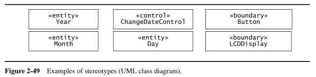

## TicketDistributor

*Preso dal Bruegge, capitolo introduttivo*  

> TicketDistributor is a machine that distributes tickets for trains. Travelers have the option of selecting a ticket for a single trip or for multiple trips, or selecting a time card for a day or a week. The TicketDistributor computes the price of the requested ticket based on the area in which the trip will take place and whether the traveler is a child or an adult. The TicketDistributor must be able to handle several exceptions, such as travelers who do not complete the transaction, travelers who attempt to pay with large bills, and resource outages, such as running out of tickets, change or power.  

### Ruoli

### Casi d'uso

### Modello dinamico

### Object model

### Decomposizione in sottosistemi

## Simple Watch
*Preso da Bruegge*  

### Casi d'uso

### Object model

### Dynamic model

## 2BWatch

### Sequence diagram

### State diagram

### Entity, boundary e control

## FRIEND
*Preso da Bruegge*  

### Attori

### Casi d'uso

#### Casi d'uso raffinati

#### Esempi di casi d'uso inclusi e estesi in forma testuale

#### Scenario

### Class diagram e object diagram

#### Esempio con e senza association class

### State diagram

### Activity diagram

## SatWatch
*Preso da Bruegge*  

### Requisiti non funzionali

### Esempi di requisiti non corretti

### Attori e confini di sistema

## Misc

