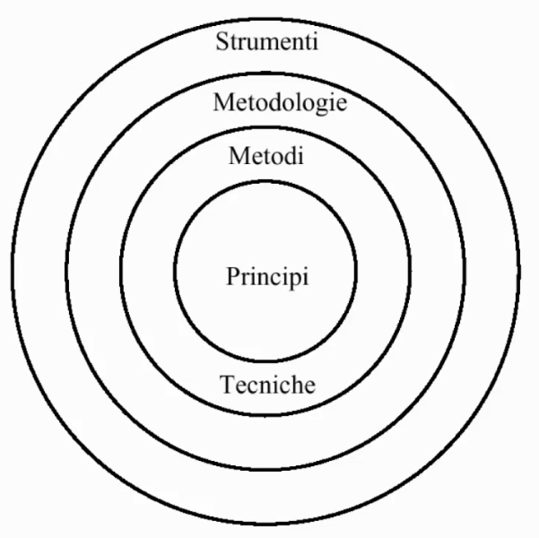

# Riferimenti
* [*IEEE Standard Glossary of Software Engineering Terminology, 1993 (IEEE Std 610.12-1990)*](http://www.informatik.htw-dresden.de/~hauptman/SEI/IEEE_Standard_Glossary_of_Software_Engineering_Terminology%20.pdf)
  + Molti riferimenti sono basati su questo standard
* [SWE Body of Knowledge](https://cs.fit.edu/~kgallagher/Schtick/Serious/SWEBOKv3.pdf)
  + Menzionato alla fine delle slide di introduzione

# Il software

## Natura del software

Il software, per sua natura, è:

* **Invisibile**
* **Intangibile**
* **Malleabile**
* **Presenta molte dipendenze**
* **In europa non è brevettabile (ma protetto)**
* **Facilmente duplicabile e distribuibile**
* **Acquisito su licenza**
  + *Proprietaria (normale, shareware, freeware)*
  + *Public domain*
  + *Open Source*
* **Ad alta intensità di lavoro umano**
* **Spesso costruito ad hoc invece che assemblato**
* **Manutenzione = cambiamento**

Ciò lo differenzia molto dagli altri prodotti industriali.  

## Differenza programma e prodotto software

(Sommerville)  

* **Programma**: l'autore è anche l'utente
  + Il programma non è documentato, quasi mai testato, non è presente un progetto
  + Non serve un approccio formale
* **Prodotto software**: usato da persone diverse da chi lo ha sviluppato
  + È *software industriale* il cui costo è circa 10 volte il costo del corrispondente programma
  + Dobbiamo avere approccio formale nello sviluppo  

Lo standard [IEEE 610.12-1990](http://www.informatik.htw-dresden.de/~hauptman/SEI/IEEE_Standard_Glossary_of_Software_Engineering_Terminology%20.pdf) (non-free) definisce formalmente la differenza ta un *software* e un *prodotto software*:  

* **Software**: *the set of computer programs, procedures and possibly associate documentation and data pertaining to the operation of a computer system*
* **Software product**:
  + *(1) the complete set of computer programs, procedures and possibly associate documentation and data designed for delivery to a user*
  + *(2) Any of the individual items in (1)*

Il *prodotto software*, quindi, non è costituito solo dal codice ma anche da tutti gli *artefatti* che lo accompagnano e che sono prodotti durante l'intero sviluppo: documentazione, casi di test, specifiche di progetto, procedure di gestione, manuali utente…  

## Prodotti e servizi

* **Prodotto**: invisibile, intangibile, facilmente duplicabile ma costosissimo
  + Opera dell'ingegno protetta dalle leggi
* **Servizio**: ha un'interfaccia e si basa su una infrastrutturra

[Difference between software products and software services](https://www.geeksforgeeks.org/difference-between-software-products-and-software-services/)

Il glossario del Summerville dà alla parola **Service** la stessa definizione di **Web Service**: *An independent software component that can be accessed through the Internet using standard protocols. It is completely self-contained without external dependencies. (...)*

## Categorie di software

Alcune categorie:  

* Apps e software ecosystems
  + **Ecosistemi software**: mercati in cui si vendono prodotti (es. Play Store) o componenti e servizi (es. Amazon Elastic Computing). La caratteristica principale è quella di una collezione di prodotti software, su piattaforma definita da un'azienda, che vengono sviluppati ed evolvono nello stesso ambiente.
* Servizi software (*Software as Service*)
* Nuovi strumenti di sviluppo
* Social software
  + Software che supportano la "conversazione" di una comunità di utenti (Facebook, Twitter, ecc)
  + Il termine *Social software* è applicato ad una moltitudine di applicativi web (Wiki, chat, forum, blog...)
* Scraping/mining big data
* Embedded software, IoT

I prodotti software possono essere:  

* **Prodotto generici**: sistemi stand-alone prodotti da una organizzazione e venduti ad un mercato di massa
  +  Detti anche *off-the-shelf* (**OTS**)
  +  Es. videogioco
* **Prodotti specifici**: sistemi commissionati da uno specifico utente e sviluppati specificatamente per questo da un qualche contraente
  + Detti anche *commissionati* o *customizzati*
  + Es. portale del ministero
 * **Servizi in perpetuo sviluppo**: sistemi che offrono servizi 24/7 in continuo cambiamento
   + Categoria relativamente recente
   + Detto anche *continuous development*
   + Es. Facebook, Amazon

*La fetta maggiore della spesa è nei prodotti generici ma il maggior sforzo è nei prodotti specifici*  

## Dipendenze

Ogni prodotto software dipende da altri prodotti software, che a loro volta dipendono da altri software.  
Associamo a ciascun prodotto o sistema software un *grafo di dipendenze* i cui nodi sono pacchetti software (es. librerie) in diverse versioni.  

Esistono le seguenti tipologie di dipendenze:  

* **Dependencies we control**: codice scritto e posseduto da noi o dalla nostra organizzazione
* **Dependencies we don't control**: codice scritto da un vendor di terze parti o da una community open source
* **Dependencies once removed**: dipendenze del codice di terze parti da cui il nostro codice dipende

## Requisito e feature

* **Requisito software**: funzione o proprietà controllabile (testabile) che dovrà possedere l'implementazione di un prodotto software
  + È importante per il cliente
  + Esempio di requisiti per un servizio di commercio elettronico: *l'utente deve poter registrarsi, aggiungere o togliere elementi al carrello, specificare indirizzi alternativi, pagare*
* **Feature software**: insieme di funzioni che permettono di usare un prodotto software in un servizio o business
  + È importante per il fornitore
  + Esempio di feature: *carrello per negozio elettronico*

# Regolamentazione del software
## Software libero

Un programma è *software libero* se gli utenti del programma godono delle quattro libertà fondamentali:  

* Libertà di eseguire il programma come si desidera, per qualsiasi scopo (*Libertà 0*)
* Libertà di studiare come funziona il programma e di modificarlo in modo da adattarlo alle proprie necessità (*Libertà 1*)
  + L'accesso al codice sorgente ne è un prerequisito
* Libertà di ridistribuire copie in modo da aiutare gli altri (*Libertà 2*)
* Libertà di migliorare il programma e distribuirne pubblicamente le modifiche da voi apportate, in modo tale che tutta la comunità ne tragga beneficio (*Libertà 3*)
  + L'accesso al codice sorgente ne è un prerequisito

Maggiori informazioni a riguardo qui: [Cos'è il Software Libero? - Progetto GNU - Free Software Foundation](https://www.gnu.org/philosophy/free-sw.it.html)

Un software libero non deve necessariamente essere gratuito. 

## Differenza licenze software
[Classificazione del Software Libero e non libero - Progetto GNU - Free Software Foundation](https://www.gnu.org/philosophy/categories.html)

## Protezione legale del software

Il software è un opera dell'ingegno: chi lo produce è un autore che ha diritto ad un compenso.  

Copiare software abusivamente (anche se non a scopo di lucro) è illegale in Italia costituisce reato con pena da 6 mesi a 3 anni di carcere. ([Legge 248/2000](https://www.camera.it/parlam/leggi/00248l.htm)). La SIAE cura il **pubblico registro del Software** dove è possibile registrare i software che rispettino i requisiti tali da poter essere identificati come opere dell'ingegno.

I software sono brevettabili negli Stati Uniti.  

I software NON sono invece brevettabili in Europa ([maggiori informazioni](https://web.archive.org/web/20160318092301/http://www.epo.org/news-issues/issues/software.html)), ma sono comunque protetti mediante copyright e licensing ([maggiori informazioni](https://eur-lex.europa.eu/legal-content/EN/TXT/?uri=LEGISSUM%3Ami0016))  

### Protezione del compratore

Nel software di consumo in teoria **non** c'è alcuna garanzia. Il software viene venduto "così com'è" e se ci sono difetti il fabbricante non se ne fa carico: lo dice il contratto che si visualizza quando si usa per la prima volta un'applicazione (**EULA**, *End-User Agreement License*)  

È possibile fornire le giuste garanzie al compratore mediante le attività di **verifica**, **validazione** e **certificazione

#### Verifica, validazione e certificazione
* La **verifica** garantisce l'aderenza alle specifiche
  + *"Stiamo realizzando correttamente il prodotto?"*
  + Attività in genere prevista al termine di ogni fase
    - Si verifica se il prodotto ottenuto alla fine di tale fase è congruente col semilavorato avuto come punto di partenza di quella fase
* La **validazione** garantisce l'accettazione da parte del cliente
  + *"Stiamo realizzando il prodotto corretto?"*
  + Attività prevista normalmente sul prodotto finito (ma è possibile anche durante il processo di sviluppo, limitandosi ad aspetti particolari)
* La **certificazione** garantisce l'aderenza a specifiche definite dalla legge

# Produzione software

## Evoluzione della produzione software

* **Arte**: applicazioni sviluppate da singole  
persone e utilizzate dagli stessi sviluppatori  
* **Artigianato**: applicazioni sviluppate da piccoli  
guppi specializzati per un cliente  
* **Industria**: diffusione del software in diversi  
settori; crescita di dimensioni, complessità e  
criticità delle applicazioni; mercato e  
concorrenza; necessità di migliorare la  
produttività e la qualità; gestione dei progetti;  
evoluzione del software

### Software come prodotto di un processo industriale

L'ingegneria del software identifica una formalizzazione del processo di analisi, progettazione, realizzazione e manutenzione di un sistema informatico. Per tale associazione con una idea quasi di vita si parla spesso di *ciclo di vita* di un software, concetto che ha assunto con il passare dei decenni un'importanza sempre maggiore, abbandonando progressivamente l'idea di software come "prodotto artigianale" e passando ad un'idea del software come prodotto industriale.  
Il software diventa quindi il prodotto di un **processo industriale** attraverso l'adozione di opportune metodologie di sviluppo e differenziazione dei compiti del personale coinvolto nel processo.  

#### Differenza del failure rate nel software rispetto ad altri prodotti industriali

Come si può vedere nell'immagine, il modo in cui il **tasso di fallimento** (*failure rate*) varia in funzione del tempo è diverso nel software rispetto ai prodotti hardware: possiamo notare come il grafico non assume una forma "a vasca da bagno" ma presenta molteplici picchi. Ogni picco rappresenta un cambiamento al software apportato in quell'istante.  

## Problemi della produzione software

* **Costi**: Il software ha costi elevati, dettati dalle risorse usate
  + **ore lavoro** (*manpower*)
    -  Questo è il costo dominante. Tale costo è espresso in mesi/uomo
  + **hardware**
  + **software e risorse di supporto**  

Il testing impiega fino al 50% dei costi di sviluppo.  
La manutenzione costa più dello sviluppo: per sistemi che rimangono a lungo in esercizio i costi di manutenzione possono essere svariate volte il costo di produzione.  

* **Ritardi nelle consegne**: I ritardi nelle consegne portano ad un aumento dei costi stimati.  
* **Progetti fuori budget**
* **Inaffidabilità**: il software è (spesso) inaffidabile
  + Molti malfunzionamenti sono rilevati durante l'operatività del sistema

Tali problemi hanno portato alla necessità di applicare i principi ingegneristici alla produzione software, in modo tale da poter sviluppare il *giusto prodotto*, al *giusto costo*, nel *tempo giusto* e con la *giusta qualità*.  

# Ingegneria del Software
## Definizione

* **Ingegneria del software**: Applicazione di una strategia sistematica, disciplinata e misurabile allo sviluppo, esercizio e manutenzione del software (programmi, procedure, regole e documentazione associata, dati)
  + [*IEEE Standard Glossary of Software Engineering Terminology, 1993 (IEEE Std 610.12-1990)*](http://www.informatik.htw-dresden.de/~hauptman/SEI/IEEE_Standard_Glossary_of_Software_Engineering_Terminology%20.pdf)
* **Ingegneria del software**: la disciplina tecnologica e manageriale che riguarda la produzione sistematica e la manutenzione dei prodotti software che vengono sviluppati e modificati entro i tempi e costi preventivati
  + *D. Farley*

## Scopo

L'ingegneria del software mira principalmente ai problemi elencati prima. L'ingegneria del software riguarda la costruzione di software di **grandi dimensioni**, di **notevole complessità** e sviluppati **tramite lavoro di gruppo**.  

Progetti di questo tipo hanno tipicamente versioni multiple, lunga durata e frequenti cambiamenti (Dovuti a eliminazione di difetti, adattamento a nuovi ambienti o introduzioni di migliorie e nuove funzionalità)  

## Contesto

La **conoscenza del dominio applicativo** è essenziale per un efficace sviluppo del software: il software risulta utile quando questo riesce a condensare nei suoi algoritmi la conoscenza del dominio applicativo.  

La maggior parte del software è collocata all'interno di un sistema misto hardware/software: l'obiettivo finale di chi produce è creare tale sistema che soddisfa globalmente i requisit dell'utente. Vi è quindi un coinvolgimento della figura dell'ingegnere software nella definizione dei requisiti del sistema. 
In sintesi, tra le attività di Software Engineering sono incluse delle attività di *System Engineering*

## Fondamenti
 
 L'ingegneria del Software si occupa dei *metodi*, delle *metodologie*, dei *processi* e degli *strumenti* per la gestione professionale (sviluppo, manutenzione, ritiro del software)
 

 
## Principi
 
* **Rigore e formalità**
  + In ogni fase del processo di produzione del software bisogna definire il livello di rigore e formalità necessario
* **Separazione di aspetti diversi**: affrontare separatamente i vari lati di un problema complesso
  + Rispetto al tempo
  + Rispetto a diverse proprietà del sistema
  + Rispetto a diverse viste del sistema
  + Rispetto a diverse componenti del sistema
  + …
* **Modularità**: suddividere un problema complesso in parti più semplici
  + Decomporre il problema (*Divide et impera*)
  + Comporre le soluzioni ai sotto-problemi
  + Comprendere meglio il sistema globale
* **Astrazione**: si identificano gli aspetti cruciali in un certo istante ignorando gli altri
* **Anticipazione del cambiamento**: la progettazione deve favorire l'evoluzione del software
* **Generalità**: tentare di risolvere il problema nella sua accezione più generale
  + Tale accezione può essere più semplice o più complessa del problema originario
  + Comporta trade-offs con fattibilità, costo e benefico 
* **Incrementalità**: lavorare per passi successivi
  + Un sottinsieme iniziale, una consegna iniziale, feedback iniziali
  + Molte feature possono essere aggiunte in un modo incrementale
 

## Glossario

* **Metodo (o tecnica)**: procedimento generale per risolvere classi di problemi specificati di volta in volta
  + Linee guida o regole che governano le attività
  + Esempio: il metodo di Newton, come fare la pasta al pomodoro
* **Metodologia**: insieme di principi, di metodi, degli elementi di cui una o più discipline si servono per garantire la correttezza e l'efficacia del proprio procedere
* **Strumento**: un artefatto, un sistema per fare qualcosa in *modo migliore*
* **Procedura**: una combinazione di **strumenti** e **metodi** che assieme permettono di produrre un certo prodotto
  + Es. una ricetta di cucina
* **Paradigma**: un particolare approccio o filosofia per fare qualcosa
* **Processo**
  + Un particolare *metodo* per fare qualcosa costituito da una **sequenza di passi** che coinvolgano *attività*, *risorse* e *vincoli* (*Pfleeger*)
  + Una particolare metodologia operativa che nella tecnica definisce le singole operazioni fondamentali per ottenere un prodotto industriale (*Zingarelli*)
* **Processo software** (*Software development process*): un metodo per sviluppare del software (*Sommerville*)
  + Insieme organizzato di *attività* che sovrintendono alla costruzione del prodotto da parte del team di sviluppo utilizzando metodi, tecniche, metodologie e strumenti
  + Suddiviso in varie fasi secondo uno schema di riferimento (Il **ciclo di vita del software**)
  + Descritto da un *modello* (che può essere informale, semi-formale o formale)
* **Processo software (IEEE 610.12-1990)**: *The process by which user needs are translated into a software product. The process involves translating user needs into software requirements, transformating the software requirements into design, implementing the design in code, testing the code, and sometimes installing and checking out the software for operational use*
  + *These activities may overlap or be performer iteratively*
  + *See also: incremental development; rapid prototyping, spiral model, waterfall model*
* **CASE** (*Computer-Aided Software Engineering*): Sistemi software che intendono fornire supporto automatico per le attività di un processo software
  + **Upper-CASE**: strumenti che supportano le attività delle fasi di analisi e specifica dei requisiti e progettazione di un progetto software
    - Includono editor grafici per sviluppare modelli di sistema, dizionari dei dati per gestire entità del progetto
  + **Lower-CASE**: strumenti che supportano le attività delle fasi finali del processo, come programming, testing e debugging
    - Includono generatori di graphical UI, debuggers, traduttori automatici per generare nuove versioni di un programma

## Organizzazioni

* www.ieee.org per gli standard IEEE del software
* www.w3c.org per gli standard del software web
* www.omg.org per gli standard del software ad oggetti
* www.oasins-open.org per gli standard del software business