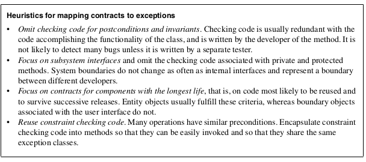

* TOC  
{:toc}

# Introduzione

Una **trasformazione** mira al migliorare un aspetto del modello (es. la sua modularità) preservando tutte le altre proprietà (es. funzionalità). Una trasfroamzione è quindi solitamente localizzata, incide su un piccolo numero di classi, operazioni ed è eseguita in una serie di piccoli step.  

Tali trasformazioni avvengono durante numerose attività di implementazione e object design.  

## Concetti  

Distinguiamo tre tipi di trasformazioni:  

* *Model transformations* operano sui modelli ad oggetti. (Es. conversione di attributo a classe)
* *Refactoring*: trasformazioni sul codice sorgente: migliorano l'aspetto del sistema senza cambiare funzionalitò
* *Forward engineering*: produce un modello del codice sorgente che corrisponde all'object model
  + Alcuni costrutti modellanti, come attributi e specifica delle associazioni, sono mappati meccanicamente, mentre altre cose come il body e metodi privati sono aggiunti dagli sviluppatori
* *Reverse engineering* produce un modello che corrisponde al codice sorgente. Tale trasformazione è usata quando la progettazione del sistema è stata persa e va recuperata

### Model transformation 

Un **model transformation** è applicato su un object model e risulta in un altro object model. Lo scopo della trasformazione dell'object model è semplificare o ottimizzare il modello originale, portandolo a un maggiore soddisfacimento di tutti i requisiti nelle specifiche. Una trasformazione può aggiungere, rimuovere o rinominare classi, operazioni, associazioni o attributi. Una trasformazione può anche aggiungere informazioni al modello o rimuovere informazioni.  

### Refactoring  

Un **refactoring** è una trasformazione del codice sorgente che migliora la leggibilità o manutenibilità senza cambiare il comportamento del sistema. Per asicurarsi che il refactoring non altera il comportamento del sistema, sono alternati passi incrementali a dei test. L'esistenza di un test driver per ogni glasse dà agli sviluppatori la confidenza nel cambiare il codice.  

### Forward engineering  

Il **forward engineering** è applicato ad un set di elementi modellanti e risulta in un set di corrispondenti statements nel codice sorgenti come ad esempio class declaration, Java expression o schemi del db.  

Lo scopo delforward engineering è mantenere una forte corrispondenza tra oggetti del design model e il codice, e ridurre il numero di errori ontrodotti durante l'implementazione.  

La relazione UML *generalization* è mappato ad uno statement *Extends*, ad esempio. Ogni attributo nel modello UML è mappato ad un attributo privato e al rispetto get/setter. Gli sviluppatori possono poi raffinare il risultato aggiungendo comportamenti aggiuntivi.  

### Reverse engineering  

Il **Reverse engineering** è applicato ad un insieme di elementi di codice sorgente e risulta in un set di elementi modellanti.  

### Principi di trasformazione  

Una trasformazione mira a migliorare la progettazione del sistema nel rispetto di alcuni criteri.  

* Una trasformazione del modello migliora la conformità dell'object design model ad un design goal. 
* Un refactoring migliora la leggibilità e la modificabilità del codice
* Forward engineering migliora la consistenza del codice nel rispetto dell'object design model
* Il reverse engineering prova a scoprire il design dietro il sorgente

Tuttavia, cercando di migliorare un aspetto, uno sviluppatore incorre nel rischio di introdurre nuovi errori. Per evitare l'introduzione di errori, tutte le trasformazioni dovrebbero seguire questi principi:  

* OGni trasformazione deve affrontare un singolo criterio. Una trasformazione deve migliorare il sistema nel rispetto di un solo design goal.  
* Ogni trasformazione deve essere locale  
* Ogni trasformazione deve essere applicata in modo isolato da altri cambiamenti
* Ogni trasformazione deve essere seguito da uno step di validazione: revisionare casi d'uso, sequence diagram, esegui test..  

# Attività di mapping  

## Ottimizzare il modello dell'object design  

La traduzione diretta del modello di analisi nel codice sorgente spesso è inefficiente.  

Durante l'object design, trasformiamo il modello ad oggetti per venire incontro ai design goals identificati nel system design, come minimizzare i tempi di risposta, tempi di esecuzione…  

Quando si applicano ottimizzazione, gli sviluppatori devono trovare il giusto bilanciamento tra efficienza e chiarezza.  

### Ottimizzare i cammini degli accessi  

Sorgenti comuni di inefficienza sono il percorrimento ripetuto di molteplici associazioni, l'attraversamento di associazioni con molteplicità *many*, e il mal piazzare attributi.  

#### Percorrimenti ripetuti di associazioni  

PEr identificare percorsi inefficienti, occorre identificare operazioni invocate spesso ed esaminare (con l'aiuto di sequence diagram) il sottoinsieme di operazioni che richiede l'attraversamento di molteplici associazioni. Operazioni frequenti non dovrebbero richiedere molti attraversamenti, ma avere una diretta connessione tra l'oggetto chiesto e il richiedente.  

Nel caso di progetti greenfield, associazioni ridondanti vanno aggiunti dopo un test di sistema.  

#### Associazioni "many"  

Per associazioni con molteplicità "many" occorre provare a diminuire il tempo di ricerca riducendo il "many" con "one". Questo si può fare con una **associazione qualificata** ( vedi [[Modellare con UML]]) oppure indicizzando gli oggetti dal punto di vista del "many".  

#### Misplaced attributes  

Durante l'analisi molte classi identificate potrebbero risultare successivamente senza nessun comportamento interessante. Se e molti attributi sono usati solamente in set() e get() allora si dovrebbe riconsiderare un raggruppamento di tali attributi nella **Classe chiamante**.   (Legge di Demetra???)

### Collapsing objects  

Dopo aver ristrutturato e ottimizzato delle classi, alcune classi potrebbero avere degli attributi o comportamento mancante. Alcune classi, quando associate colo con una classe, possono essere accorpate in un attributo, riducendo la complessità totale del modello.  

### Posticipare computazioni complesse  

Spesso, degli oggetti specifici sono costosi da creare. La loro creazione potrebbe essere posticipata fin quando il loro contenuto non sia effetivamente necessario. Possiamo realizzare tale ottimizzazione col **Proxy Design Pattern**.  

### Caching di computazioni costose  

**saltato** 

### Mappare associazioni a collezioni  

Associazioni sono concetti UML che denotano collezioni di collegamenti bidirezionali tra 2 o più oggetti. Linguaggi OO, tuttavia, non forniscono ilc oncetto di associazioi: forniscono invece il concetto di riferimento e di collezioni.  

* Unidirectional 1:1
* Bidirectional 1:1
* 1:m
* m:n
* associazioni qualificate (mappa)  
* association class  

### Mappare contratti ad eccezioni  

Linguaggi OO che includono vincoli posso automaticamente controllare contratti e lanciare eccezioni. Java non permette questo. Tuttavia, possiamo usare il meccanismo delle eccezioni per segnalare e gestire violazioni del contratto.  

* Controlla precondizioni: all'inizio del metodo
* Controlla postcondizioni: alla fine del metodo
* Controlla invarianti: se si trattano i contratti delle operazioni individualmente allora le invarianti sono controllati allo stesso modo delle postcondizioni
* Ereditarietà: il codice che controlla le condizioni deve essere incapsulato in metodi separati utilizzabili dalle superclassi  

### Mappare modello ad oggenti allo schema dello storage persistente  

Finora abbiamo trattato gli oggetti persistenti come ogni altro oggetti. Tuttavia, linguaggi OO non forniscono solitamente un modo efficiente di memorizzare oggetti persistenti.  

In questo caso, occorre mappare oggetti persistenti a una struttura dati memorizzabile dal sistema di gestione dei dati persistente scelto durante il system design. Per database OO non serve alcun mapping. Tuttavia, per database relazionali e file occorre mappare gli oggetti ad uno schema e fornire l'infrastruttura per convertire i dati.  

**SALTATO**  
