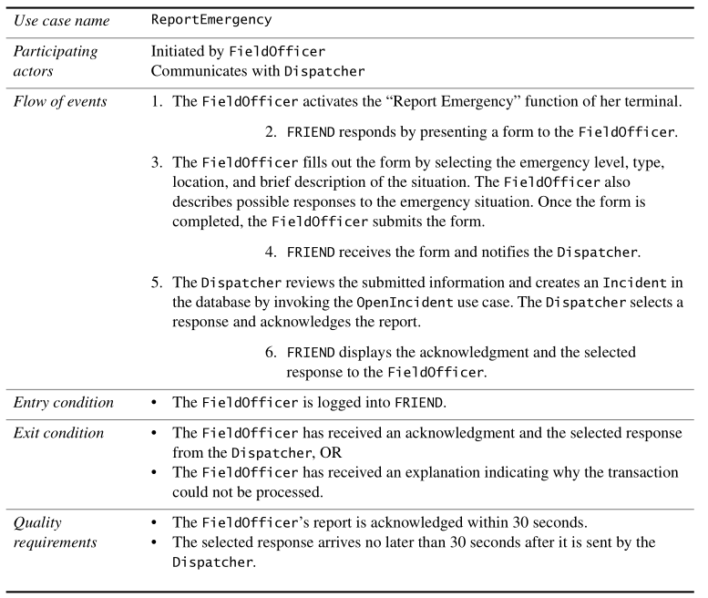
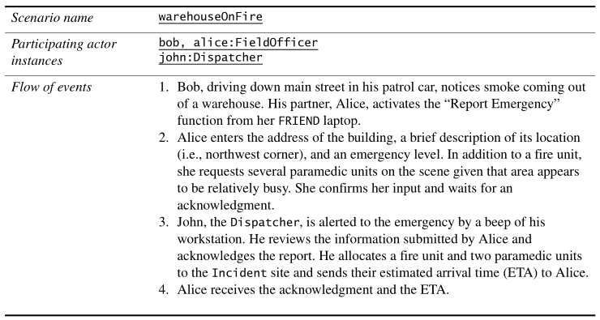
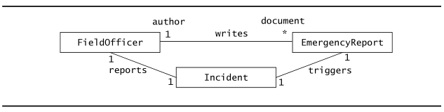
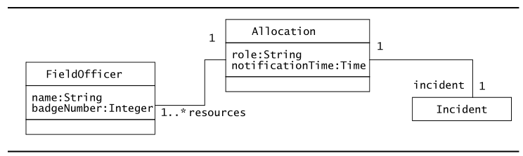
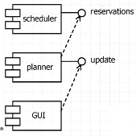

* TOC  
{:toc}

# Concetti di modellazione  
## Sistemi e modelli

Un **sistema** è un insieme organizzato di parti comunicanti. Parti di un sistema possono esere considerati come sistemi più semplici detti **sottosistemi**; tale decomposizione in sottosistemi può esere applicata ricorsivamente ai sottosistemi: gli oggetti ottenuti rappresentano la fine di questa ricorsione quando ogni pezzo ottenuto è abbastanza semplice da poter essere pienamente compreso senza ulteriore decomposizione.  

Molti sistemi sono composti da numerosi sotosistemi interconnessi in modi complicati, spesso con una complessità tale che nessuno sviluppatore lo possa gestire nella sua interezza. La **modellazione** è un modo per trattare tale complessità.  

*Modellare* significa costruire un'astrazione del sistema che si focalizza su aspetti interessati e ignora dettagi irrilevanti. Ciò che è interessante e ciò che è irrilevante varia a seconda del task che si ha a portata di mano. 
La modellazione ci permette quindi di trattare la complessità usando un approccio *divide-et-impera*: per ogni tipo di problema che vogliamo risolvere, costruiamo un modello che si focalizza sulle questioni legate a tale problematica.  

La modellazione ci permette di trattare la complessità anche permettendo di raffinare in maniera *incrementale* semplici modelli in modelli più dettagliati e più vicini alla realtà.  

I sistemi complessi quindi sono generalmente descritti da più di un modello, con ognuno di questi che si focalizza su diversi aspetti o diversi livelli di accuratezza.    

Le **notazioni** sono regole grafiche o testuali per rappresentare un modello.  

## Modellazione orientata agli oggetti

Il **dominio applicativo** rappresenta tutti gli aspetti del problema dell'utente. Questo include l'ambiente fisico, gli utenti e le altre persone, il loro *work process*, e cosi via…; Il dominio applicativo può cambiare nel tempo, insieme alle persone e ai loro *work process*.  

Per gli analisti e per gli sviluppatori comprendere il dominio applicativo del sistema è fondamentale per poter svolgere il loro compito in maniera efficace.  

Il **dominio della soluzione** è lo spazio di modellazione di tutti i possibili sistemi. La modellazione nel dominio della soluzione costituisce le attività di *system design* e di *object design* del processo di sviluppo.  
Il **modello del dominio della soluzione** (*solution domain model*) è più ricco e volatile del modello del dominio applicativo: questo perchè i lsistema è solitamente modellato usando un livello di dettaglio maggiore rispetto al dominio applicativo. Inoltre, tecnologie emergenti, maggiore formazione degli sviluppatori riguardo le tecnologie adottate e cambi nei requisiti scaturiscono cambiamenti nel modello del dominio della soluzione.  

L'**analisi orientata agli oggetti** si occupa di modellare il dominio applicativo.  
La **progettazione orientata agli oggetti** si occupa di modellare il dominio soluzione.  
Entrambe le attività di modellazione appena citate usano la stemma rappresentazione (classi e oggetti).  

Nell'analisi e progettazione orientata agli oggetti, il modello del dominio applicativo è parte del modello di sistema (Cioè il sistema presenta i concetti del dominio applicativo codificati nel sistema; un esempio è un sistema per il controllo del traffico aereo con le classi ``TrafficController`` e ``Aircraft`` codificate).  
In questo modo ci è quindi possibile modellare il dominio applicativo e il dominio della soluzione usando una singola notazione.

# UML

**UML** (*Unified Modeling Language*) è un **linguaggio** (e notazione) **universale** per la creazione di modelli software.  

* *Linguaggio* per specificare, costruire, visualizzare e documentare gli artefatti di un sistema
* *Universale*: può rappresentare sistemi molto diversi, da quelli web ai legacy; dalle tradizionali applicazioni COBOL a quelle object-oriented e a componenti  

UML *non* è un metodo nè una metodologia. UML è un **linguaggio di modellazione**.  
UML è indipendente dai metodi, dalle tecnologie e dai produttori.  

UML è una notazione risultante dall'unificazione delle notazioni **OMT** (*Object Modeling Technique*), **Booch**, e **OOSE** (*Object-Oriented Software Engineering*). UML ha anche preso spunto da idee di numerosi altri metodologi.  

UML è un linguaggio **semi-formale**: presenta una sintassi ben definita ma non una precisa semantica.  

Con UML il processo di sviluppo assume un approccio:  

* basato sui casi d'uso (*use case driven*)
* [incentrato sull'architettura](https://it.wikipedia.org/wiki/Architettura_guidata_dal_modello)
* iterativo e incrementale

## Obiettivi di UML

L'obiettivo di UML è di fornire una notazione standard e *non-proprietary* che possa essere usata per tutti i metodi orientati agli oggetti e che selezioni e integri i migliori elementi delle notazioni precedenti.  

**Obiettivi di UML:  **

* Fornire all'utente un linguaggio di specifica espressivo, visuale e pronto all'uso
* Offrire meccanismi di estensibilità e specializzazione del linguaggio
* Essere indipendente dagli specifici linguaggi di programmazione e dai processi di sviluppo
* Incoraggiare la crescita dei tool OO commerciali
* Supportare concetti di sviluppo ad alto livello come frameworks, pattern ed i componenti
* Integrare i migliori approcci

Cosa UML **non è**:

* UML non è un linguaggio di programmazione visuale
  + È un linguaggio di specifica visuale
* UML non è un modello per la definizione di interfacce
* UML non è dipendente dal paradigma di sviluppo nel quale può essere utilizzato

## Meta-Modello UML

UML si fonda su un *meta-modello* che descrive descrive la sua struttura.  

UML descrive il proprio meta-modello in UML. I fruitori del meta-modello sono gli sviluppatori di tool di sviluppo CASE e utenti esperti.  

UML è basato su un modello architetturale a quattro livelli:  

| **Livello**         | **Descrizione**                                                          | **Esempio**                                        |
|:-------------------:|:------------------------------------------------------------------------:|:--------------------------------------------------:|
| *Meta-meta-modello* | Definisce un linguaggio per la specifica dei metamodelli                 | Meta-classi, meta-attributi, ...                   |
| *Meta-modello*      | Definisce un linguaggio per la specifica dei modelli                     | Classi, attributi, operazioni, ...                 |
| *Modello*           | Definisce un linguaggio per la specifica di un certo dominio applicativo | Classi di uno specifico contesto                   |
| *Oggetti*           | Istanze del modello                                                      | Oggetti ottenuti istanziando le classi del modello |

**Nota:** un modello è un'istanza di un meta-modello.  

Nell'architettura a quattro livelli di UML ogni livello è un'astrazione di quello sottostante, ed è definito in termini di quello sovrastante.  

La *sintassi astratta* di UML viene definita utilizzando la notazione dei metamodelli. È usata una parte delle notazioni dell'UML *class diagram* per definire gli elementi dei modelli UML e le loro relazioni.  

Le *regole sintattiche* si applicano ad istanze delle metaclassi. Queste sono descritte tramite *Object Constraint Language* (**OCL**) e linguaggio naturale.  

La *semantica* è descritta tramite il linguaggio naturale con il supporto di alcuni diagrammi.  

## Modelli di sistema

UML fornisce costrutti per un'ampia gamma di sistemi e attività.  

Il processo di sviluppo di sistemi si focalizza su 3 differenti **modelli di sistema**:  

* Il **modello funzionale**, rappresentato in UML con gli *use case diagrams*, descrive le funzionalità dell'utente dal punto di vista dell'utente
* Il **modello ad oggetti**, rappresentato in UML con i *class diagrams*, descrive la struttura del sistema in termini di oggetti, attributi, associazioni e operazioni.
  + Durante la raccolta e analisi di requisiti, il modello a oggetti è usato per l'*analisi del modello a oggetti* e descrive i concetti dell'applicazione rilevati al sistema
  + Durante la fase di *system design*, il modello a oggetti viene raffinato in quello che viene chiamato *system design object model* e include descrizioni delle interfacce dei sottosistemi.
  + Durante la fase di *object design*, il modello a oggetti è raffinato nell'*object design model* e include descrizioni dettagliate degli oggetti soluzione.
* Il **modello dinamico**, rappresentato in UML con gli *interaction diagrams*, *state machine diagrams* e *activity diagrams*, descrive i comportamenti interni del sistema e le sue reazioni ad eventi esterni
  + Gli *interaction diagrams* descrivono il comportamento come una sequenza di messaggi scambiati tra un insieme di oggetti
  + Gli *state machine diagrams* descrivono il comportamento in termini di stati di un oggetto individuale, e le possibili transizioni tra gli stati
  + Gli *activity diagrams* descrivono il comportamento in termini di controllo e flusso di dati
 
            
            
            
# Diagrammi UML
In questa sezione sono introdotte alcune notazioni UML.  
## Use case diagrams
**Ulteriori informazioni qui: [[Raccolta dei requisiti]]**

I *casi d'uso* (*use cases*) sono usati durante la raccolta e analisi dei requisiti per rappresentare le funzionalità del sistema.  

Gli **use cases** rappresentano una classe di funzionalità fornite dal sistema.  
Gli use cases si focalizzano sul comportamento del sistema da un punto di vista *esterno*. Uno use case descrive una funziona fornita dal sistema come una serie di eventi che produce un risultato visibile per un attore.  
Gli use cases rappresentano quindi una possibile "modalità di utilizzo" del sistema e descrivono l'interazione tra attori e sistema. I casi d'uso **non** descrivono la logica interna della funzione.  

Un **attore** descrive un'entità esterna che interagisce col sistema. (es. un utente, un altro sistema, un ambiente fisico del sistema).  
Esempi di attori includono un ruolo di un utente (es. un amministratore di sistema) o un altro sistema (es. un database centrale).  
Gli attori devono avere nomi e descrizioni univoche.  

In pratica gli **use case diagrams** mostrano le modalità di utilizzo del sistema (casi d'uso), gli attori e le relazioni tra attori e casi d'uso.  

L'insieme di tutti i casi duso che descrive in maniera completa le funzionalità di un sistema costituisce lo **use case model**.  

L'identificazione degli attori e dei casi d'uso risulta nella definizione dei **confini** (*boundary*) del sistema: ossia una separazione tra i task compiuti dal sistema e i task compiuti dal suo ambiente. Gli attori sono fuori dai confini del sistema, mentre i casi sono al suo interno.  

Il seguente è un esempio di use case diagram per un semplice orologio. Gli use case sono rappresentati da ovali, gli omini rappresentano gli attori mentre il rettangolo rappresenta i confini del sistema.  

La figura sottostante mostra l'attore ``FieldOfficer`` che invoca lo use case ``ReportEmergency`` per notificare l'attore ``Dispatcher`` di una nuova emergenza. Come risposta, ``Dispatcher`` invoca lo use case ``OpenIncident`` per creare un rapporto e avviare una pratica per gestire l'incidente. Il ``Dispatcher`` immette le informazioni preliminari ottenute da ``FieldOfficer`` nel database e manda altre unità alla scena dell'incidente col caso d'uso ``AllocateResources``.  

**Nota**: le associazioni tra gli attori e i casi d'uso denotano il flusso di informazioni. Tali associazioni sono *bidirezionali*: queste posse rappresentare l'attore che avvia il caso d'uso oppure il caso d'uso che fornisce informazioni ad un attore. Il rettangolo attorno ai casi d'uso definisce i confini di sistema (*System boundary*)  

### Descrizione testuale degli use case

Per una descrizione testuale del caso d'uso, si può usare un template composto da 6 campi adattato dal *[[Constantine & lockwood, 2001](https://www.researchgate.net/publication/2350151_Structure_and_Style_in_Use_Cases_for_User_Interface_Design)]*:  

* **Nome del caso d'uso**, univoco in tutto il sistema e non ambiguo
* **Attori partecipanti** al caso d'uso
* **Entry conditions** per descrivere le condizioni che devono essere soddisfate prima che il caso d'uso sia avviato
* **Flusso di eventi**: descrive le sequenze di interazioni del caso d'uso, numerate per riferimento.
  + I casi comuni (ossia quelli previsti dall'utente) e i casi eccezionali (ossia gli imprevisti, come errori e condizioni insolite) vanno descritte separatamente in diversi use case per chiarezza
  + Organizziamo i passi nel flusso degli eventi in 2 colonne: la colona di sinistra rappresenta gli step effettuati dall'attore, mentre la colonna di destra rappresenta gli step effettuati dal sistema. Ogni coppia di passi attore-sistema rappresenta un'interazione
* **Exit conditions**: descrivono le condizioni soddisfatte dopo il completamento del caso d'uso
* **Special requirements** sono requisiti che non sono correlati alle funzionalità del sistema. Questi includono i vincoli sulle performance del sistema, la sua impleentazione, la piattaforma hardware su cui gira e cosi via.

Un esempio di caso d'uso è il seguente:  

I casi d'uso sono scritti in linguaggio naturale. Questo permette agli sviluppatori di usare i casi d'uso per le comunicazioni con il committente e gli utenti, che solitamente non hanno una conoscenza estensiva delle notazioni usate nell'ingegneria del software. L'uso del linguaggio naturale consente anche partecipanti da altre discipline di comprendere i requisiti del sistema. Infine, l'uso del linguagio naturale consente agli sviluppatore ci catturare cose - in particolare i requisiti speciali, che non possono essere facilmente coperti mediante i diagrammi. 

### Relazioni tra use cases
I diagrammi per gli use case incldono quattro tipi di relazioni: *communication*, *inclusion*, *extension* e *inheritance*.  

#### Communication

Gli attori e i casi d'uso comunicano quando tra di loro vengono scambiate informazioni. Le **communication relationships** sono raffigurate da una linea solida tra l'attore e il caso d'uso.  

La **communication relatiship** tra attore e use case può essere usato anche per denotare l'acceso ad una funzionalità.  

#### Include

Quando si descrive un sistema complesso, il suo use case model può diventare complesso e contenere ridondanza. Possiamo ridurre la complessità identificando punti in comune nei diversi casi d'uso.  

Due casi d'uso sono correlati da una relazione di *«include»* se uno di questi inclde l'altro nel suo flusso degli eventi.  

Negli use case diagrams, le relazioni "include" sono raffigurate da una freccia tratteggiata che parte dallo use clase che include e termina nello use case incluso.  

Ad esempio, supponiamo che ``Dispatcher`` possa premere in ogni momento un tasto per accedere alla mappa stradale. Questo può essere modellato da uno use case ``ViewMap`` che è incluso dallo use case ``Open Incident`` e ``AllocateResources`` (e ogni altro use case accessibile da ``Dispatcher``). Il modello risultante descrivere la funzionalità ``ViewMap`` solo una volta, riducendo la complessità totale del modello use case.  

Possiamo rappresentare la relazione *include* in una descrizione testuale dello use case in 2 modi:  

* se lo use case può essere incluso in qualunque punto del flusso degli eventi, allora possiamo indicare l'inclusione nei "*Special requirements*"
* Se lo use case incluso è invocato durante un evento particolare, indichiamo l'incusione nel flusso degli eventi

#### Extend

Le relazioni *«extend»* sono un modo alternativo per ridurre la complessità negli *use case model*.  
Uno use case può *estendere* (*extend*) un altro use case aggiungendo eventi.  
Una relazione *«extend»* indica che un'istanza di uno use case può includere - sotto determinate condizioni - il comportamento specificato dallo use case che sta estendendo.  

Un'applicazione tipica della relazione è per la specifica dei comportamenti eccezionali.  

Per esempio, la figura in basso suppone che la connessione tra dispatcher e fieldofficer possa essere interrotta in qualunque momento. L'use case ``ConnectionDown`` descrive l'insieme di eventi acquisiti dal sistema e dagli attori quando la connessione è persa. ``ConnectionDown`` estende i casi ``OpenIncident`` e ``AllocateResources``. Separare comportamenti eccezionali da quelli comuni ci permette di scrivere gli use cases in maniera più breve e concisa.  

Nella rappresentazione testuale di uno use case, rappresentiamo *extend* come entry condition dello use case **che estende** (**non** nello use case esteso.).  

La differenza tra *«include»* e *«extend»* sta nel dove è situata la dipendenza.  
Supponiamo di voler aggiungere nuovi casi d'uso per l'attore ``Dispatcher``: ``UpdateIncident`` e ``ReallocateIndicent``. Se avessimo modellato ``ConnectionDown`` con una relazione di *include*, gli autori di ``UpdateIncident`` e ``ReallocateResources`` dovrebbero conoscere e includere lo use case ``ConnectionDown``. Se usiamo extend, invece, solo lo use case ``ConnectionDown`` necessita di essere modificato.   

In genere, casi eccezionali sono modellati usando l'*«extend»*, mentre casi d'uso che descrivono comportamenti comuni ad un numero limitato di casi d'uso sono modellato con l'*«include»*.  

#### Ereditarietà

Uno use case può specializzare un altro use case più generale aggiungendo un maggiore grado di dettaglio. 

L'ereditarietà è denotata con una freccia.  

**Nota**: *«extend»* e ereditarietà sono differenti. In un *extend*, ogni caso d'uso descrive un diverso flusso di eventi per compiere un task diverso. In un inheritance, lo use case generico e quello specializzato descrivono lo stesso task ma a diversi livelli di astrazione.  

Ad esempio, i ``FieldOfficers`` devono autenticarsi prima di poter usare FRIEND. Durante le prime fasi della raccolta dei requisiti, l'autenticazione è modellata come uno use case di alto livello chiamato ``Authenticate``. Successivamente, gli sviluppatori descrivono lo use case in maggior dettaglio e consentendo diverse piattaforme hardware. Questa attività di raffinamento risulta in 2 casi d'uso in più: ``AuthenticateWithPassword`` e ``AuthenticateWithCard``. Questi 2 nuovi casi d'uso sono rappresentati come specializzazioni di ``Authenticate``.  

Nella rappresentazione testuale, gli use case specializzati ereditano gli attori e le condizioni (entry e exit) dal caso generale.  

### Scenari

Uno use case è un'astrazione che descrive tutti i possibili senari che coinvolgono le funzionalità descritte. Uno **scenario** è un'istanza di uno use case che descrive un concreto insieme di azioni.  

Gli scenari sono usati come esempio per illustrare casi comuni; il loro obiettivo è la *comprensibilità*.  
Gli use case, invece, sono usati per descrivere tutti i possibili casi; il loro obiettivo è la *completezza*.  

Descriviamo uno scenario usando un template con 3 campi:  

* **Nome** dello scenario a cui possiamo riferirci senza ambiguita.
  + Deve essere _sottolineato_ per indicare che si tratta di un'istanza.
* **Istanze di attori partecipanti** indica le occorrenze di attori coinvolte in questo scenario
  + Devono essere _sottolineati_ per indicare che si tratta di istanze
* **Flusso degli eventi** di un oscenario per descrivere la sequenza ad ogni passo  

**Nota**: non serve entry o exit condition negli scenari. Queste sono astrazioni che permettono agli sviluppatori di descrivere una gamma di condizioni su cui uno use case può essere invocato. Uno scenario, invece, descrive una e una sola specifica situazione.  

## Class Diagrams

I **class diagrams** sono usati per descrivere la struttura del sistema in termini di classi e oggetti.  
I *class diagrams* descrivono la struttura del sistema in termini di oggetti, clasi, attributi, operazioni e associazioni.  

I class diagrams possono essere usati a diversi livelli di dettaglio (in fase di *analisi* e in fase di *progettazione*)  

La seguente figura è esempio di *class diagram*:

Il seguente è un esempio di *object diagram*:  

### Classi e oggetti

Le **classi** sono astrazioni che specificano la struttura e il comportamento comune di un insieme di oggetti. Gli **oggetti** sono istanze di classi che vengono creati, modificati e distrutti durante l'esecuzione del sistema. Un oggetto ha uno stato che include il valore di tutto i suoi attributi e le sue associazioni con altri oggetti.  

In UML, le classi e gli oggetti sono rappresentati da rettangoli con 3 compartimenti: il compartimento in alto mostra il nome della classe o oggetto, il compartimento centrale mostra i suoi attributi, il compartimento in basso mostra le sue operazioni; il compartimento centrale e quello in basso possono essere omessi per brevità e chiarezza.  

I nomi degli oggetti sono _sottolineati_ per indicare che si tratta di istanze. I nomi degli oggetti cominciano con la minuscola e seguono il nome della classe con un ``:`` che li divide. È possibile avere oggetti senza nomi (*istanze anonime*)  

**Esempio**: ``tarif2006:TarifSchedule``, ``:TarifSchedule``

Per convenzione, i nomi delle classi cominciano con la maiuscola.  

Il **tipo** di un attributo è usato per specificare il range di valori che l'attributo può assumere. Un tipo è specificato dopo il nome dell'attributo separandoli con un ``:`` e può essere anche non specificato (È possibile, ad esempio, posticipare la scelta fino all'*object design*).  

#### Differenza oggetti e attori

Un **attore** è un'entità esterna al sistema che interagisce con esso, **da modellare**.  
Una **classe** è un'astrazione che modella un'entità del dominio applicativo (o del domino della soluzione). Una classe è parte del modello di sistema.  
Un **oggetto** è una specifica istanza di una classe.  

### Associazioni e collegamenti

Le **associazioni** sono relazioni tra classi.  
Un **collegamento** (*link*) rappresenta una connessione tra 2 oggetti. Un collegamento è un'istanza di un'associazione.  

Le associazioni possono essere *simmetriche* (*bidirezionali*) oppure *asimmetriche* (*unidirezionali*). Le associazioni unidirezionali hanno una freccia che indica il senso di percorrenza.  Un'associazione con 0 o 2 frecce è un'associazione bidirezionale.  

#### Molteplicità

Ogni estremo di un'associazione può essere etichettata con una coppia di interi che indica il numero di *collegamenti* a cui l'oggetto in quell'estremo può partecipare.  

In UML un'estremo di un'associazione può avere un numero arbitrario di interi come molteplicità (Es. ``1,2,5,7``) oppure specificare un intervallo. Scrivere solamente ``*`` equivale a scrivere ``0,n``.  

Nella pratica, le tipologie di associazioni più comuni ricadono nelle seguenti 3 categorie:  

* **associazion uno-a-uno**: ha una molteplicità ``1`` in ogni estremo estremo.
* **associazione uno-a-molti**: ha una molteplicità ``1`` in un estremo e ``0..n`` o ``1..n`` nell'altro estremo
  + È possibile scrivere ``*`` anzichè ``n``. Es. ``0..*``
* **associazione molti-a-molti**: ha una molteplicità ``0..n`` o ``1..n`` in entrambi gli estremi.

####  Ruoli

Ad ogni estremo di un'associazione è possibile etichettare un **ruolo**. Etichettare gli estremi di un'associazione con i ruoli ci consente di chiarire lo scopo di un'asociazione e di distinguere tra più associazioni che provengono da una classe.  
#### Classi di associazione

Le associazioni sono simili alle classi: queste possono avere attributi e operazioni ad esse associate. Associazioni di questo tipo sono chiamate **classi di associazione** (*association class*) e sono raffigurate da un simbolo di classe collegato però con una linea tratteggiata.  

Ogni classe di associazione può essere trasformata in una normale classe. Tuttavia, usare una classe di asociazione risulta più chiaro dato che una classe di associazione non può esistere senza le classi che collega.  

#### Aggregazione
Le **aggregazioni** sono particolari associazioni *uno-a-molti* o *molti-a-molti* e servono a denotare aspetti gerarchici e aciclici di una relazione.  
In pratica, le aggregazioni forniscono semantica per rappresentare relazioni gerarchiche del tipo "*a fa parte di b*".  

La clase padre è detta **aggregata**.  

#### Composizione
Una **composizione** è una forma più forte di aggregazione in cui il ciclo di vita di un'istanza dipende dal padre (*aggregato*). In pratica, i figli non hanno "esistenza autonoma".  

#### Qualificazione

La **qualificazione** è una tecnica per ridurre la molteplicità usando le *chiavi*.  

Le associazioni con una molteplicità ``0..1`` o ``1`` sono generalmente più facili da comprendere rispetto ad associazioni con una molteplicità ``0..n`` o ``1..n``.  
Spesso, gli oggetti con partecipazione di tipo "*molti*" in un'associazione possono essere distinti usando un attributo (es. nome). È possibile denotare tale attributo come **qualificatore** (*qualifier*, o anche chiave) allo scopo ri ridurre la molteplicità dell'associazione. Un'associazione che presenta un qualificatore è detta *qualified association*.  

**Esempio:** i file in una directory hanno tutti nome distinto tra loro.    

#### Ereditarietà

L'**ereditarietà** è una relazione tra una classe generale e una o più classi specializzate.  

L'ereditarietà ci permette di descrivere tutti gli attributi e tutte le operazioni comuni ad un insieme di classi.  

**Nota:** le classi astratte hanno nome in *corsivo*.  

## Interaction Diagrams

Un oggetto interagisce con un altro oggetto mandandogli dei *messaggi*. La ricezione del messaggio da parte di un oggetto scaturisce l'esecuzione di un metodo, che a sua volta potrebbe mandare messsaggi ad altri ogetti.  Insieme al messaggio potrebbero essere passati degli *argomenti*.  

Gli **interaction diagrams** descrivono i pattern di comunicazione tra un insieme di oggetti che interagiscono.  Questi descrivono il *comportamento in termini di interazioni*. Tali diagrammi completano il *class diagram* (che si focalizza sulla struttura degli oggetti).  

Gli *interaction diagrams* sono usati per formalizzare il comportamento dinamico dei sistemi e per visualizzare le comunicazioni tra gli oggetti.  
Gli *interaction diagrams* sono usati per definire la specifica sequenza di eventi di un caso d'uso, gli oggetti coinvolti all'interazione e i messaggi che si scambiano.  

Gli *interaction diagrams* sono usati:

* durante la fase di *analisi* per raffinare le descrizioni dei casi d'uso e per individuare eventuali *oggetti partecipanti* nel caso d'uso
* durante la fase di *design* per raffinare le interfacce ai sottosistemi

La seguente figura mostra una forma speciale di interaction diagram, chiamato **sequence diagram**, per il caso d'uso  ``SetTime`` di un semplice orologio. La colonna più a sinistra mostra l'attore ``WatchUser`` che inizia il caso d'uso. Le frecce etichettate rappresentano gli "stimoli" (*messaggi*) che l'attore (o un oggetto) invia ad un altro oggetto. Gli oggetti sono _sottolineati_ per denotare che si trattano di istanze.  

In UML, gli *interaction diagrams* possono avere due forme: *sequence diagrams* o *communication diagrams*.  
### Sequence diagrams

I **sequence diagrams** rappresentano in *orizzontale* gli oggetti partecipanti all'interazione e rappresentano in *verticale* il tempo.  

La seguente figura mostra il sequence diagram di un attore che imposta il suo ``2Bwatch`` un minuto in avanti.  

Ogni colonna rappresenta un **oggetto partecipante**. La linea tratteggiata lungo una colonna indica il tempo di vita dell'oggetto.   
I **messaggi** sono rappresentati da frecce (le etichette sulle frecce rappresentano il nome del messaggio ed eventuali parametri).
Le **attivazioni** (es. esecuzione di un metodo) sono rappresentate da rettangoli.  
L'**attore** che avvia l'interazione si trova nella colonna più a sinistra. Se vi sono ulteriori attori che partecipano all'interazione, questi vanno messi a destra.  

I sequence diagrams possono essere usati anche per descrivere sequence concrete (come sopra) o sequenze astratte (es. tutte le possibili interazioni).  
Quando si descrivono tutte le possibili interazioni, i sequence diagrams forniscono notazioni per le *iterazioni* e le *condizioni*.  

Una *iterazione* è denotata da un **frammento combinato** (*combined fragments*, ossia una suddivisione logica del diagramma) con l'operatore ``loop``.  
Le **alternative** sono denotate da un frammento combinato contenenti una partizione per ogni alternativa.  

### Communication diagrams

I **communication diagrams** rappresentano le stesse informazioni dei sequence diagram.  

I communication diagrams rappresentano la sequenza dei messaggi numerando le interazioni.  

## State Diagrams
Uno **stato** è una condizione soddisfatta dagli attributi di un oggetto.  
Una **transizione** rappresenta un cambiamento di stato scaturito da eventi, condizioni o tempo.  

Gli **State machine diagrams** (o *State diagrams*) descrivono il comportamento dinamico di un oggetto individuale mediante stati e transizioni.  
Gli *State diagrams* specificano il ciclo di vita di un oggetto. Questi rappresentano il comportamento dei singoli oggetti in termini di:  

* Eventi a cui gli oggetti sono sensibili
* Azioni prodotte
* Transizioni di stato

Gli *UML state machines* sono un'estensione del **modello di automa a stati finiti** (*finite state machine model*).  

**Nota**: questo diagramma rappresenta diverse informazioni rispetto al *sequence diagram* visto sopra. Il *sequence diagram* si focalizza sui messaggi scambiati tra gli oggetti come risultato di un evento esterno scaturito da attori. Lo *state diagram* invece si focalizza sulle transizioni tra gli stati come risultato di eventi esterni per uno specifico oggetto.  

Uno *stato* è raffigurato da un rettangolo smussato etichettato con il proprio nome.  
Una *transizione* è raffigurata da una freccia che collega due stati.  
Lo *stato iniziale* è raffigurato da un cerchio nero pieno.  
Lo *stato finale* è raffigurato da un cerchio nero con un anello intorno.  

La seguente figura mostra lo *state machine diagram* per un orologio:  

La seguente figura mostra gli stati che asssume la classe ``Incident``:  

Il seguente è un esempio degli stati assunti da un telefono:  

### Attributi di uno stato

Opzionalmente, è possibile definire degli attributi per uno stato:  

* **Nome**: una stringa
  + Uno stato può essere anonimo
* **Entry/Exit actions**: azioni eseguite all'ingresso o all'uscita dello stato
  + Tali azioni hanno breve durata e sono ininterrompibili
  + ``entry/nome_azione`` e ``exit/nome_azione``
* **Transizioni interne**: transizioni che non lasciano lo stato
  + Tali transizioni non scaturiscono le azioni di entrata/uscita
* **Attività** dello stato: insieme coordinato di azioni dalla durata significativa e *interrompibili*
  + ``do/nome_azione``
* **Eventi differiti**: eventi da posticipare fin quando non si entra in uno stato che non presenta tali eventi in questa lista
  + ``nome_evento/defer``
* **Sottostati**: struttura innestata di stati
  + Tali stati innestati possono essere *disgiunti* (sequenzialmenti attivi) o *concorrenti* (concorrentemente attivi)

Il seguente esempio mostra le azioni di entrata/uscita e le transizioni interne nello stato ``SetTime``: 

#### Stati innestati

I **nested state machines** riducono la complessità. Questi possono essere usati al posto delle transizioni interne. Il seguente mostra lo stato ``SetTime`` usando gli *stati innestati* anzichè le transizioni interne. (**Nota:** *lb = left button, rb = right button*)  

I sottostati di uno stato possono essere **disgiunti**, ossia lo stato può assumere solo uno dei sottostati. Questi sottostati sono detti **sequenziali**:  

I sottostati sequenziali ereditano le transizioni dei loro superstati.  

In alternativa, i sottostati di uno stato possono essere **concorrenti**, ossia lo stato può assumere più stati in maniera parallela: se un sottostato raggiunge lo stato finale prima dell'altro, il controllo aspetta lo stato finale dell'altro.  
Quando avviene una transizione in uno stato che presenta sottostati concorrenti, il flusso di controllo subisce una **biforcazione** (*fork*) per ciascun sottostato concorrente, per poi riunirsi (*join*) in un unico flusso alla fine dei sottostati concorrenti.  

### Attributi di una transizione

Gli attributi (opzionale) di una transizione seguono questa sintassi: ``evento [guardia]/azione``

* **Evento**: può essere un segnale, un messaggio da altri oggetti, il passaggio del tempo o un cambiamento
* **Condizione di guardia**: la transizione accade se l'evento accade e la condizione di guardia è verificata
* **Azione**: eseguita durante la transizione
  + Un'azione è di breve durata e ininterrompibile

Se una transizione è senza eventi (*triggerless*) allora la transizione scatta in questo modo:  

* Se la transizione è con guardia, allora la transizione scatta se la condizione di guardia diventa vera
* Se la transizione è senza guardia, allora la transizione scatta se l'attività interna dello stato iniziale è completata

## Activity Diagrams

Le **attività** sono elementi modellanti che rappresentano l'esecuzione di un insieme di operazioni. L'esecuzione di un' attività può essere scaturita dal completamento di altre attività, dalla disponibilità di certi oggetti oppure da eventi esterni.  
Una **attività** è una esecuzione non atomica in uno *stato* (vedi *state diagram*  differenza con *action*)  

Un **activity diagram** descrive il comportamento di un sistema in termini di attività. Questi forniscono la sequenza di operazioni che definiscono un'attività più complessa. Questa tipologia di diagrammi è un retaggio della *scomposizione funzionale*.  

Gli *activity diagrams* rappresentano il sequenziamento e la coordinazione di comportamenti di basso livello. Un activity diagram denota come il comportamento è realizzato in termini di una o più sequenze di attività e in termini di flussi di oggetti necessari per coordinare le attività.  

Gli activity diagram somigliano ai tipici **diagrammi di flusso** (*flowchart diagrams*): tali diagrammi possono rappresentare il flusso di controllo (ossia l'ordine in cui le operazioni vengono eseguite) e il flusso di dati (ossia gli oggetti scambiati tra le operazioni).  
Questa tipologia di diagrammi permette di rappresentari processi paralleli e la loro sincronizzazione.  

Gli *activity diagram* possono essere visti come degli *state diagram* particolari, in cui ogni stato è un'azione.  

Un *activity diagram* può essere associato:  

* ad una classe
* all'implementazione di un'operazione
* ad uno *use case*  

Gli *activity diagram* si prestano bene per modellare:  

* comportamenti sequenziali
* non determinismo
* concorrenza
* sistemi distribuiti
* business workflow
* operazioni

Il seguente è un *activity diagram* che rappresenta le attività riguardanti la gestione di un ``Incident``. I rettangoli rappresentato le azioni e le attività; gli archi tra le attività rappresentano il flusso di controllo; le barre nerre rappresentano la sincronizzazione del flusso di controllo.  

La figura ci comunica quindi che le attività ``AllocateResources``, ``CoordinateResources`` e ``DocumentIncident`` possono essere avviate solo dopo che l'attività ``OpenIncident`` viene completata. Allo stesso modo, l'attività ``ArchiveIncident`` può essere avviata solo dopo il completamento di tutte e 3 le attività nella colonna precedente. (Tali attività possono essere eseguite contemporaneamente)  

Come gli *state machine*, anche negli *activity diagrams* è possibile denotare l'inizio e la fine del flusso rispettivamente con un pallino nero e un pallino nero con un anello intorno. Inoltre, anche negli *activity diagrams*  è possibile etichettare le transizione con una **guard condition** che permette la transizione solo se la condizione è verificata.  

### Nodi di controllo

I **control nodes** coordinano il flusso di controllo in un activity diagram, fornendo meccanismi per rappresentare decisioni, concorrenza e sincronizzazione. I nodi di controllo usati principalmente sono le *decisioni*, i *fork nodes* e i *join nodes*.  

**Decisions** sono i *rami* di un flusso di controllo. Questi denotato le alternative sulla base di una condizione sullo stato di uno o più oggetti. le decisioni sono raffigurate da un diamante con uno o più frecce in ingresso e una o più frecce in uscita. Le frecce in uscita sono etichettate con le **condizioni** che selezionano un ramo nel flusso di controllo.  

I **fork nodes** e i **join nodes** rappresentano la concorrenza. I fork nodes denotano la divisone del flusso di controllo in più thread, mentre i join noes denotano la sincronizazione di più thread e l'unione del loro flusso di controllo in un singolo thread.  
*Nota*: il numero di fork e join dovrebbe essere bilanciato.  

### Attività composte  

Un'attività può essere composta da altre attività.  

### Swimlanes

Le attività possono essere raggruppate in **corsie** (*swimlanes*, dette anche **activity partitions**) per denotare l'oggetto o il sottosistema che implementa l'azione. Le corsie sono rappresentate da rettangoli che raggruppano più azioni. Le transizioni possono attraversare le corsie.  

Le *swimlanes* identificano le responsabilità relative alle diverse operazioni. 

### Flussi di oggetti

I **flussi di oggetti** (*object flows*) rappresentano l'utilizzo degli oggetti da parte delle azioni e delle attività. Gli oggetti possono essere creati, usati e manipolati da una action.  

L'oggetto è denotato con un rettangolo non smussato.  Lo *stato* di un oggetto è indicato tra parentesi quadre ``[]``. Gli oggetti creati/usati sono denotati con frecce tratteggiate.  

**NOTA**: un'attività attende che gli oggetti in input necessari siano pronti per poter essere eseguita. (In maniera simile a una *join*)  

## Package Diagrams

I modelli di sistemi complessi diventano velocemente anch'essi complessi non appena vengono raffinati. la complessità dei modelli può essere trattata raggruppando elementi correlati tra loro in **packages**. Un *package* è un raggruppamento di elementi dei modelli - come use cases o classi - definendo degli scope.  
È possibile usare il meccanismo degli UML *packages* per poter organizzare le classi in sottosistemi.  

I package sono mostrati come rettangoli con un tab nell'angolo in alto a sinistra.  
La figura sottostante mostra un esempio di use cases organizzati in base agli attori coinvolti.  

È possibile mostrare i package nascondendone il contenuto. Il seguente diagramma è analogo a quello sopra:  

Il seguente è invece un esempio di class diagram:  

Una **dipendenza** tra due package sussiste se esiste una dipendenza tra almeno due classi appartenenti a ciascuno dei package in questione.  

È possibile organizzare package in **subpackages**:  

## Component Diagrams

I **component diagrams** rappresentano l'implementazione del sistema. Un *componente* rappresenta un pezzo "*fisico*" dell'implementazione di un sistema.  
Questi diagrammi definiscono le relazioni tra i componenti software che realizzano l'applicazioni. Tali componenti software possono essere sorgenti, binari, eseguibili, …  

Questi componenti sono parte della specifica architetturale ed evidenziano l'organizzazione e le dipendeze esistenti tra componenti.  

Questi diagrammi sono usate durante la fase di implementazione.  

I *component diagrams* costituiscono il primo passo verso il *component programming*. 

Le interfacce di un componente sono denotate con un pallino. Una linea piena indica la realizzazione dell'interfaccia, mentre una linea tratteggiata indica la fruizione e la dipendenza da essa.  

### Componenti e classi  

Le classi rappresentano astrazioni logiche mentre le componenti rappresentano cose fisiche. Le classi sono realizzate da componenti.  

### Component stereotypes  

Gli *stereotype* sono un meccanismo di estensione che consente la distinzione di elementi modellanti in UML. In questo caso, vi sono 5 *stereotypes* standard per distinguere i model:  

* *«executable»*: un component che può essere eseguito in un nodo
* *«library»*: una libreria statica o dinamica
* *«table»*: una tabella di un database
* *«file»*: un component contenente codice sorgente o dati
* *«document»*  

## Deployment Diagrams

I **deployment diagrams** (detti anche *diagramma di allocazione* o di *dislocazione*) consentono di rappresentare, a diversi livelli di ettagli, l'architettura fisica del sistema. Questi diagrammi permettono anche di evidenziare la configurazione dei nodi elaborativi in un ambiente di esecuzione, e dei componenti, processi ed oggetti ubicati in questi nodi.  

Gli elementi rappresentati in questo diagramma sono i nodi e le connessioni tra questi.  

Ciascun **nodo** è identificato da un nodo. Un nodo può connettersi ad altri nodi ed essere in relazione con dei *components*.  

