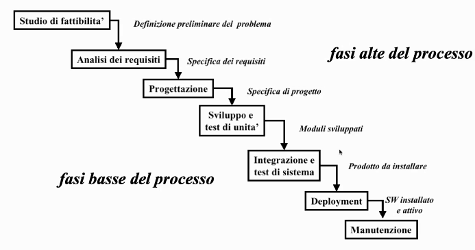
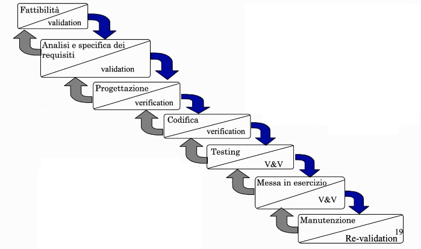
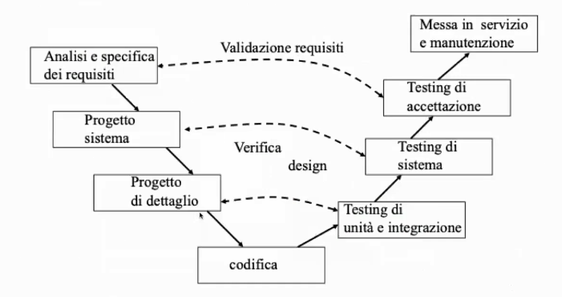
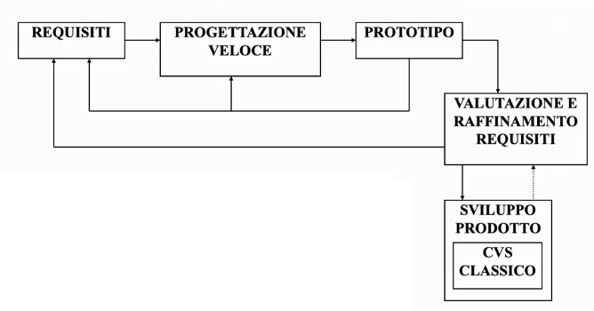
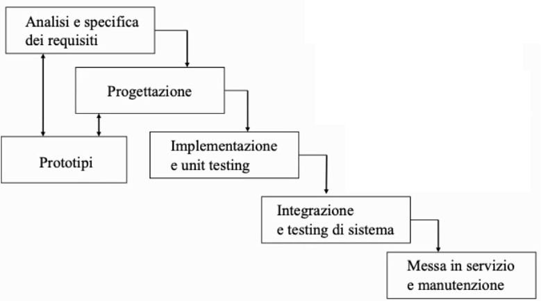
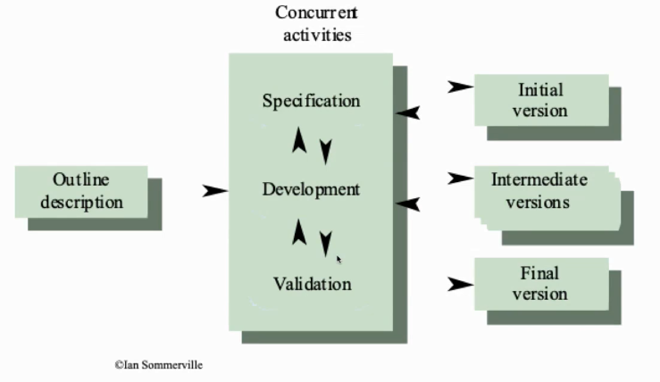
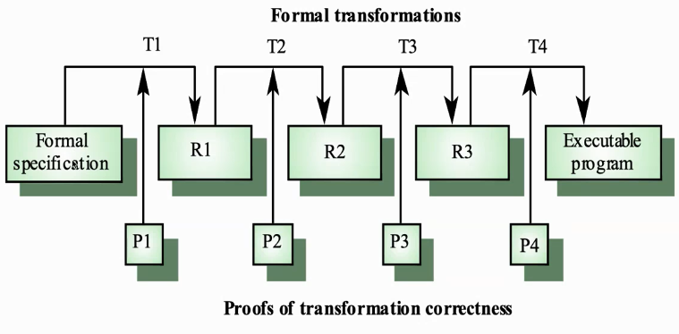
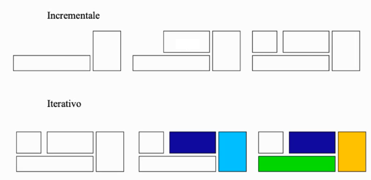
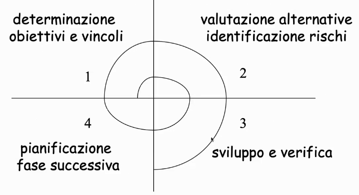
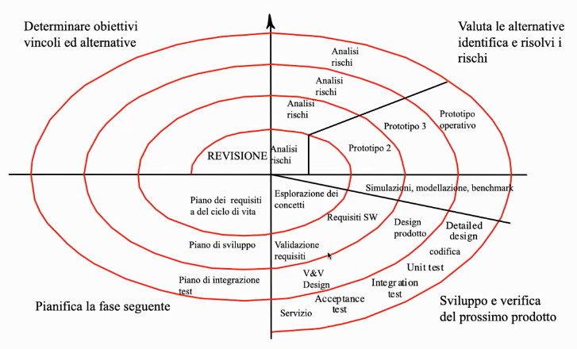

# Introduzione

## Definizioni

 **Software life cycle**: *The period of time that begins when a software product is conceived and ends when the software is no longer available for use. The software life cycle typically includes a concept phase, requirements phase, design phase, implementation phase, test phase, installation and checkout phase, operation and maintenance phase, and , sometimes, retirement phase. **Note:** These phases may overlap or be performed iteratively* [IEEE 610.12-1990].  
 
 Il ciclo di vita del software non è da confondersi con il **ciclo di sviluppo del software** (*Software development cycle*).  
 
 **Software development cycle**: *The period of time that begins with the decision to develop a software product and ends when the soft-ware is delivered. This cycle typically in-cludes a requirements phase, design phase, implementation phase, test phase, and some-times, installation and checkout phase. **Notes: (1)** The phases listed above may over-lap or be performed iteratively, depending upon the software development approach used. **(2)** This term is sometimes used to mean a longer period of time, either the period that ends when the software is no longer being enhanced by the developer, or the entire software life cycle. * [IEEE 610.12-1990]  
  
Il *software development cycle* corrisponde a una porzione del *software life cycle*.  

Alcuni testi (es. Sommerville) usano i termini **Software Process** e **Software Development Process** come sinominimi delle due definizioni date sopra.  

 Un **modello del ciclo di vita del software** è una caratterizzazione *descrittiva* o *prescrittiva* di come un software viene o dovrebbe essere sviluppato.  
 I **modelli di processo software** sono precise, formalizzate descrizioni di dettaglio delle attività degli oggetti, delle trasformazioni e degli eventi che includono strategie per realizzare, ottenere l'evoluzione del software.  
 
Tra gli aspetti che influenzano la definizione dei diversi modelli vi sono:  
 * specificità dell'organizzazione produttrice
 * know-how
   + Un modello più complesso richiede più conoscenze e preparazione
 * area applicativa e particolare progetto
 * sturmenti di supporto
 * diversi ruoli produttore/commitente

Le fasi di un CVS (*Ciclo di Vita del Software*) possono essere suddivise in 3 macrocategorie:  

* **Definizione**: si occupa del *cosa*
  + Determinazione dei requisiti, informazioni da elaborare, funzioni e prestazioni attese, comportamento del sistema, interfacce, vincoli progettuali, criteri di validazione
* **Sviluppo**: si occupa del *come*
  + Definizione del progetto, dell'architettura software, della strutturazione dei dati e delle interfacce e dei dettagli procedurali
  + Traduzione del progetto nel linguaggio di programmazione
  + Collaudi
* **Manutenzione**: si occupa delle *modifiche*
  + Correzioni, adattamenti, miglioramenti, prevenzione

# Modelli del ciclo di vita del software

Nonostante il nome, tali modelli coprono principalmente solo il ciclo di sviluppo del software.  

## Modello a cascata

Il **Modello a cascata** (*Waterfall model*), popolare negli anni '70, è stata una reazione al modo ancora artigianale di produrre software (con l'approccio *code and fix*) segnando quindi il passaggio alla pratica dello sviluppo software come un processo industriale.  

Il modello a cascata prevede un modello sequenziale lineare, con una **progressione sequenziale di fasi**, senza ricicli.  
Nel modello sequenziale vengono definite e separate le varie fasi e attività del processo, in modo tale che vi sia un overlap nullo (o minimo) tra le fasi.  

Ogni fase prevede un *deliverable* in uscita che consiste in semilavorati del processo di sviluppo: tali prodotti in uscita possono essere, ad esempio, documentazioni di tipo cartaceo oppure programmi. Tali prodotti in uscita sono formalizzati in struttura e contenuti. I semilavorati output di una fase sono input alla fase successiva.  

Il modello a cascata consente un'attività di verifica e controllo dell'evoluzione del processo ad ogni fase ("*verification step*").  

* Ogni fase raccoglie un insieme diattività omogenee per metodi, tecnologie, skill del personale, etc…
* Ogni fase è caratterizzata dalle attività (*tasks*), dai prodotti di tali attività (*deliverables*), dai controlli relativi (*quality control measures*)
* La fine di ogni fase è un punto rilevante del processo (*milestone*)
* I semilavorati output di una fase sono input alla fase successiva
* I prodotti di una fase vengono "congelati", ovvero non sono più modificabili se non innescando un processo formale e sistematico di modifica

### Fasi del modello a cascata

Le **fasi alte** sono le seguenti:  

* **Studio di fattibilità**: valutazione preliminare di costi e benefici
  + **Obiettivo**: stabilire se avviare il progetto, individuare le possibili opzioni e le scelte più adeguate, valutare le risorse umane e finanziare necessarie
  + **Output**: documento di fattibilità
    - Definizione preliminare del problema
    - Scenari e strategie alternative di soluzione
    - Costi, tempi, modalità di sviluppo per ogni alternativa
* **Analisi dei requisiti**: analisi completa dei bisogni dell'utente e del dominio del problema
  + Necessita del coinvolgimento del committente e degli ingegneri software (e di altri eventuali stakeholder)
  + **Obiettivo**: descrivere le caratteristice di qualità che l'applicazione deve soddisfare
    - Specificando il "**cosa**" e non il "**come**"
  + **Output**: documento di specifica dei requisiti
    - Manuale d'utente
    - Piano di *acceptance test* del sistema (test di accettazione da parte del committente)
* **Progettazione**: definizione di una struttura opportuna per il software
  + Prevede una scomposizone del sistema in componenti e moduli
    - Allocazione delle funzionalità ai vari moduli
    - Definizione delle relazioni tra i moduli
  + Si distingue tra:
    - *architectural design*: struttura modulare complessiva (componenti)
    - *detailed design*: dettagli interni a ciascuna componente
  + In questo caso l'obiettivo è specificare il "**come**"
  + **Output**: documento di specifica del progetto
    - È possibile l'uso di linguaggi/formalismi di basso livello per la progettazione
  
  
Le **fasi basse** sono le seguenti:  

* **Programmazione e testi di unità**: ogni modulo viene codificato nel linguaggio scelto e testato in isolamento
* **Integrazione e test di sistema**
  + Composizione dei moduli nel sistema globale
  + Verifica del corretto funzionamento del sistema
  + *alpha-testing*: sistema rilasciato internamente al produttore
  + *beta-testing*: sistema rilasciato a pochi e selezionati utenti
* **Deployment**: distribuzione e gestione del software presso l'utenza
* **Manutenzione**: evoluzione del software. 
  + Segue le esigenze dell'utenza
  + Comporta ulteriore sviluppo per cui racchiude in sè nuove iterazioni di tutte le precedenti fasi

### Vantaggi e svantaggi

* **Pro**
  + Il modello a cascata ha definito molti concetti utili (semilavorati, fasi, ecc...)
  + Ha rappresentato un punto di partenza importante per lo studio di processi SW
  + Facilmente comprensibile e applicabile
* **Contro**
  + Interazione con il committente solo all'inizio e alla fine
      - Requisiti congelati alla fine della fase di analisi
      - Requisiti utente spesso imprecisi: "*l'utente sa quello che vuole solo quando lo vede*"
      - Errori nei requisiti scoperti solo alla fine del processo
  + Il nuovo sistema software diventa installabile solo quando è totalmente finito
      - Nè l'utente nè il management possono giudicare prima della fine dell'adesione del sistema alle proprie aspettative

Il modello a cascata offre una visione semplicistica del processo software. Nella realtà si ha un riscontro diverso:  

* Di norma le specifiche del prodotto sono incomplete o inconsistenti
  + Ci manca sempre qualcosa e risulta difficile (se non impossibile) raccogliere tutto esclusivamente alla fase iniziale del processo software
* L'applicazione evolve durante tutte le fasi
  + Non esiste una netta separazione tra le fasi di specifica, progettazione e produzione
  + Gli overlap e i ricicli esistono!
  + In alcuni casi è auspicabile sviluppare prima una parte del sistema e poi completarlo
* La manutenzione non può essere considerata marginale (non deve quindi essere esclusivamente la fase finale del processo)

A tal proposito sono stati definiti altri modelli di processo software, derivanti dalle critiche al modello a cascata. Tali modelli vogliono ovviare al problema dell'instabilità dei requisiti, inserendo anche la possibilità di effettuare ricicli e dando maggiore enfasi alla manutenzione.  

## Una variante del modello a cascata: V&V e Retroazione

Una variante del modello a cascata prevede un'attività di **verifica e/o validazione** ad  ogni fase. Tale variante prevede anche il concetto di **retroazione** (*feedback*) ossia la possibilità ad ogni fase di ritornare a quelle precedenti.  

* **Verifica**: Stabilire la verità della corrispondenza tra un prodotto software e la sua specifica
  + "*Are we building the product right?*"
* "**Validazione** (o convalida): Stabilire l'appropriatezza di un prodotto software rispetto alla sua missione operativa
  + "*Are we building the right product?*"

## Modello a V

Il **modello a V** è una variazione del modello a cascata che esplicita le dipendenze tra le attività di sviluppo e le attività di verifica.  

Il modello a V presenta la stessa sequenzialità del modello a cascata ma offre anche una rappresentazione dei livelli di astrazione: tutte le attività prima della codifica si focalizzano sul costruire una rappresentazione sempre più dettagliata del sistema, mente tutte le attività dopo la codifica si focalizzano sul validare il sistema. Le attività a sinistra della codifica sono collegate a quelle a destra della codifica.  

Se si trova un errore in una fase a destra (es. testing di sistema) si ri-esegue l'attività collegata. È possibile quindi iterare sulle attività (ricicli)  

## Modelli basati su prototipo  

Un *prototipo* aiuta a comprendere i requisiti e/o a valutare la fattibilità di un approccio.   
Un *prototipo* consiste nella realizzazione di una prima implementazione più o meno incompleta e da cosiderare come "prova": il suo scopo è quello di **accertare la fattibilità** del prodotto e di **validare i requisiti**. Il prototipo è quindi un mezzo attraverso il quale si interagisce con il committente per accertarsi di aver ben compreso le sue richieste e per valutare la fattibilità del prodotto.  

Nei modelli *basati su prototipo* un prototipo viene costruito, testato e rielaborato fino ad ottenerne uno accettabile. Tale prototipo costituirà la base sul quale produrre il software finale.  

Dopo la fase di utilizzo del prototipo si passa alla produzione della versione definitiva del sistema software mediante un modello che è in genere di tipo waterfall.  

### Tipi di prototipi

* **mock-ups**: produzione completa dell'interfaccia utente. Consente di definire con completezza e senza ambiguità i requisiti
  + Si può, già in questa fase, definire il manuale utente
* **breadboards**: *implementazione* di sottoinsiemi in funzionalità critiche del sistema, non nel senso della fattibilità ma in quello dei vincoli pesanti che sono posti nel funzionamento del sistema, senza le interfacce utente
  + Esempi di vincoli pesanti: carichi elevati, tempo di risposta, ...
  + Produce feedbacks su come implementare le funzionalità
  + Praticamente si anticipa la fase del **come** (ossia quella di progettazione) per poter indirizzare fin da subito determinate problematiche

### Tipi di prototipazioni

* **Prototipazione "*throw-away*"**: si mira ad una migliore comprensione dei requisiti del prodotto da sviluppare
  + Lo sviluppo dovrebbe avviarsi con la parte dei requisiti meno compresa
  + In questo caso il prototipo è uno strumento di identificazione dei requisiti utente; è incompleto, approssimativo, realizzato utilizzando parti già possedute
  + Il prototipo **deve essere gettato**
    
* **Prototipazione "*esplorativa*"**: si mira alla produzione del prodotto finale partendo da una descrizione di massima e lavorando a stretto contatto con il committente
  + Lo sviluppo dovrebbe avviarsi con la parte dei requisiti meglio compresa

### Modello misto cascata/prototipi

Si producono prototipi preliminari con l'obiettivo di lavorare con i clienti ed evolvere i prototipi verso il sistema finale.

## Modello evolutivo

Il **modello di sviluppo evolutivo** si basa sull'idea di sviluppare un'implementazione iniziale, ottenere feedback dagli stakeholder per poi evolvere il software attraverso varie versioni fin quando i requisiti non vengono raggiunti.  

Le attività di specifica, sviluppo e validazione sono sovrapposte anzichè separate, con un rapido feedback tra le attività.  

Ogni evoluzione (versione) del sistema incorpora alcune funzionalità di necessità del committente. In genere, le prime versioni del sistema includono le funzionalità più importanti o più urgenti.  

I vantaggi sono i seguenti:  

* La quantità di analisi e documentazione da rifare (ad esempio in caso di mutamento nei requisiti) è molto meno di quanto è richiesto nel modello a cascata
* È più facile ottenere feedback dal committente sul lavoro svolto, dato che possono "toccare con mano" il software
* È possibile consegnare tempestivamente il prodotto, ance se non tutte le funzionalità sono state incluse

Da un pusto di vista della gestione, il modello evolutivo presenta i seguenti problemi:  

* Il processo non è visibile. I manager necessitano dei *deliverables* per misurare il progresso e se il sistema è sviluppato velocemente non è conveniente dover produrre documenti per ogni versione del sistema
* L'infrastruttura del sistema tende a degradarsi quando con l'avanzare delle versioni. Cambi regolari fatti in qualunque modo possibile portano a un codice disordinato.
  + A tal fine, la metodologia *agile* (che si basa appunto sul modello evolutivo), suggerisce di effettuare periodicamente un *refactor* del software
  
Un altro problema è la necessità di competenze specifiche nell'uso di *linguaggi di prototipazione rapida*.  

Casi di applicabilità del modello evolutivo sono i seguenti:  

* Sistemi interattivi di taglia medio-piccola
* Parti di sistemi più grandi (es. UI)
* Sistemi con un ciclo di vita breve

## Modello a trasformazioni formali

In questo modello lo sviluppo viene visto come una sequenza di passi che trasformano formalmente una specifica in una implementazione.  

Il **modello a trasformazioni formali** (*transformation model*) vede lo sviluppo software come una sequenza di passi che parte da una specifica formale (matematica) dei requisiti e si trasforma gradualmente in un'implementazione.  

I requisiti informali vengono analizzati e le funzioni vengono specificate formalmente. Tali descrizioni formali vengono a loro volta trasformate aggiungendo un maggiore livello di dettaglio.  

Problemi:  

* Richiede competenze e skill specifici per l'applicazione delle tecniche
* Difficoltà nello specificare formalmente alcuni aspeti del sistema (es. interfaccia utente)
* Pochi esempi di applicazione per sistemi complessi

L'applicabilità di questo modello è giustificata nello sviluppo di sistemi critici (i fattory di *safety* e *security* hanno la priorità)  

## Modelli di sviluppo a componenti

I **modelli di sviluppo a componenti** sono basti su un riuso sistematico di componenti. Tali componenti sono sistemi software integrati da componenti esistenti o da sistemi *Commercial-off-the-shelf* (**COTS**).  

Tali modelli di sviluppo risultano particolarmente adatti per sviluppo di software object-oriented.  

Uno dei riferimenti al modello di sviluppo a componenti è il **Full Reuse Model** (Basili, 1990), che prevede repository di componenti riusabili a diversi livelli di astrazione, prodotti durante le diverse fasi del ciclo di vita. Tali componenti includono specifiche, progetti, codice, casi di test, …  
Durante lo sviluppo di un nuovo sistema è possibile riusare i componenti esistenti o popolare la repository con nuovi componenti.  

Il *Rapid application development model* è un altro modello la cui idea si basa su quello del riuso di componenti.  

## Modello incrementale

Il **modello incrementale** prevede che le fasi alte del processo (quelle di progettazione) vengano completamente realizzate; successivamente, il sistema così progettato viene decomposto in **sottosistemi** (o incrementi) che gengono implementati, testati, rilasciati, installati e messi in manutenzione secondo tempi e priorità diverse.  

Nel modello incrementale diventa fondamentale la fase di **integrazione** di nuovi sottosistemi con quelli già in esercizio.  

Vantaggi:  

* Possibilità di anticipare da subito delle funzionalità al committente
  + Ciascun incremento corrisponde al rilascio di una parte delle funzionalità
  + I requisiti a più alta priorità per il committente vengono rilasciati per prima
  + Minore rischio di un completo fallimento del progetto
* Testing più esaustivo
     + I rilasci iniziali agiscono come prototipi e consentono di individuare i requisiti per i successivi incrementi
     + I servizi a più alta priorità sono anche quelli maggiormente testati
 
### Differenza modelli incrementali e modelli iterativi
I modelli incrementali e i modeli iterativi sono accomunati dal prevedere più versioni successive del sistema. Ad ogni istante dopo il primo rilascio esiste un sistema versione $N$ in esercizio e un sistema $N+1$ in sviluppo.  

La differenza tra i 2 modelli è la seguente:  

* Sviluppo incrementale: ogni versione aggiunge nuova funzionalità/sottosistemi
* Sviluppo iterativo (evolutivo): da subito sono presenti tutte le funzionalità/sottosistemi che vengono successivamente raffinate, migliorate

## Modello a spirale

Il **modello a spirale** si focalizza sull'indirizzare i rischi in maniera incrementale, in ordine di priorità.  

Nel modello a spirale il riciclo diventa un fondamento: il concetto di iterazione viene formalizzato (a differenza degli altri modelli in cui viene solo accennato)  

Nel modello a spirale il processo viene rappresentato come una spirale: ogni giro in questa spirale prevede 4 fasi (ognuna delimitata da un quadrante) che prevedono la scoperta, la valutazione e il trattamento esplicito dei rischi.  
Le fasi (e le attività in esse) non sono predefinite ma vengono stabilite in accordo al tipo di prodotto.  

Il modello a spirale è un **meta-modello**, ossia un modello che comprende altri modelli. Una spirale con un solo giro, ad esempio, rappresenta il modello a cascata.  

Il modello a spirale è quindi un generatore di modelli di processo *risk-driven*. Tale modello ha un approccio ciclico per aumentare in modo incrementale il grado di definizione e implementazione di un sistema diminuendo il suo grado di rischio. Tale modello prevede una serie di *milestones* in cui ricevere feedback da tutti gli stakeholder.  

Tale (meta-)modell presenta quindi è grande flessibilità ed è possibile adottare con essa altri modelli secondo la natura del progetto:  

* Per sistemi o sottosistemi di cui si ha una buona conoscenza si può adottare il modello a cascata
  + La fase di analisi dei rischi ha costi limitati
* In caso di requisiti stabili oppure in caso di sistemi critici per cose o persone (*safety critical systems*) questi possono essere sviluppati con approcci trasformazionali (*Trasformazioni formali*)
* In caso di aree non completamente specificate, interfacce utente possono impiegare il modello a prototipi

### Il modello a spirale tradizionale

Il seguente è il modello a spirale tradizionale:  

Le attività in questa spirale sono le stesse di quelle del modello a cascata, aggiungendo però attività di prototipazione, gestione rischi e riuso.  

Ogni *giro* della spirale è composto da quattro fasi (ogni fase è delineata da un quadrante):  

* Nella prima fase (quadrante in alto a sinistra), gli sviluppatori esprolano le alternative, definiscono i vincoli e identificano gli obiettivi
* Durante la seconda fase (in alto a destra), gli sviluppatori gestiscono i rischi associati alle soluzioni definite nella prima fase
* Durante la terza fase (quadrante in basso a destra), gli sviluppatori realizzano e validano un prototipo o parte del sistema associato ai rischi indirizzati nel giro che si sta percorrendo
* Durante la quarta fase ci si focalizza nel pianificare il prossimo giro sulla base dei risultati del giro corrente.
  + L'ultima fase del giro viene solitamente condotto come una revisione che coinvolge i partecipanti al progetto (includendo sviluppatori, committente e fruitori). Tale revisione copre i prodotti sviluppati durante i piri percorsi (attuale e precedenti) e copre anche i piani per il prossimo giro

### Rischi

Nel modello a spirale l'articolazione di un progetto non è guidata da una rigida sequenza di fasi predefinite, bensì da una gestione sistematica dei rischi di progetto, allo scopo di arrivare alla loro progressiva diminuzione.  

All'inizio di un progetto di sviluppo software, i rischi sono tipicamente molto elevati:  

* Manca la chiarezza sui requisiti, mentre le scelte sulle tecnologie e sulla strutturazione del sistema sono ipotesi non ancora consolidate
* In alcuni casi vengono scelte tecnologie innovative per le quali manca una sufficiente esperienza nel gruppo di progetto
* In altri casi, anche a fronte di tecnologie conosciute, esistono incertezze legate alla necessità di far fronte a un numero di utilizzatori contemporanei molto elevato (oppure far fronte a volumi di dati mai gestiti in precedenza)

Nel modello a spirale, ogni iterazione (*giro*) ha lo scopo di ridurre i rischi del progetto.  

Inizialmente, si riduce il rischio tramite la costruzione di **prototipi**: tali prototipi possono essere *mock-up* (per affrontare il rischio riguardo l'incertezza dei requisiti) oppure *breadboard* (per affrontare i rischi legati alla scelta delle tecnologie ed i dubbi sulla strutturazione del sistema).   

Succesivamente, quando i rischi principali sono stati messi sotto controllo, ogni iterazione ha lo scopo di costruire, in modo progressivo, nuove porzioni del sistema, via via integrate con le precedenti, e di verificarle con il committente e le altre parti interessate. (**Nota**: a differenza del modello incrementale, qui è però possibile cambiare i requisiti "in corso d'opera")

 
### Vantaggi e svantaggi

**Vantaggi**  

* Rende esplicita la gestione dei rischi
* Aiuta a determinare errori nelle fasi iniziali
* Obbliga a considerare gli aspetti di qualità
* Integra sviluppo e manutenzione

**Svantaggi**

* Per contratto di solito si specifica a priori il modello di processo e i *deliverables*
  + In questo caso occorre specificare vincoli, modello di processo, tempi di consegna e artefatti da consegnare
  + Occorre quindi di fatto "concretizzare" il meta-modello
* La pianificazione dei progetti condotti in modo iterativo è più complessa
  + Il piano di un processo iterativo evolve durante tutta la durata del progetto stesso e richiede un controllo sistematico degli avanzamenti
* Un punto cruciale per il successo di un progetto iterativo è la collaborazione *sistematica* tra committenti (e altri stakeholders) e gruppo di progetto
* Richiede persone in grado di valutare i rischi
* Per poter essere usato deve essere adattato alla realtà aziendale e/o del team

# Gestione del rischio

Il compito dei manager è quello di minimizzare i rischi.  
I rischi sono insiti in tutte le attività umane e provocano ritardi e costi imprevisti.  

**Tipologie di rischi** possono riguardare il personale non adeguato, lo scheduling, il budget non realistico, sviluppo del sistema sbagliato…    

Il rischio è correlato alla quantità e qualità delle informazioni disponibili.  

## I modelli e il rischio

* **Cascata**
  + Alti rischi per sistemi nuovi, non familiari per problemi di specifica e progetto
  + Bassi rischi nello sviluppo di applicazioni familiari con tecnologie note
* **Prototipazione**
 + Bassi rischi per le nuove applicazioni; specifica e sviluppo vanno di pari passo
 + Alti rischi per la mancanza di un processo definito e visibile
* **Trasformazionale** (*Trasformazioni formali*)
  + Alti rischi per le tecnologie coinvolte e le professionalità richieste
 * **Spirale**: vedi sopra