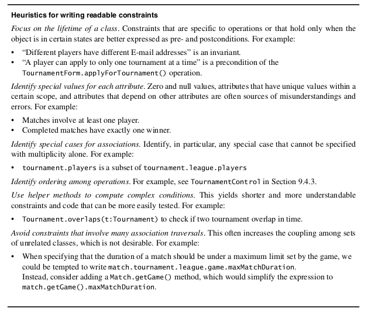

* TOC  
{:toc}

# Introduzione

Durante l'analisi si descrive lo scopo del sistema; durante il system design si descrive il sistema in termini di architettura, sottosistemi, flusso di controllo globale e gestione della persistenza.  

Durante l'object design, chiudiamo il gap tra gli oggetti dell'applicazione e i componenti off-the-shelf, identificando oggetti soluzione aggiuntivi e raffindando gli oggetti esistenti.  

Durante l'object design gli sviluppatori chiudono il gap tra gli oggetti applicazione identificati durante l'analisi e la piattaforma hw/sw scelta durante il system design. Gli sviluppatori identiicano e costruiscono oggetti soluzione il cui scopo è realizzare ogni funzionalità rimanente per colmare il gap.  

Durante la fase di analisi il sistema viene descritto in termini di comportamento esterno (con gli use case), termini di oggetti del dominio applicativo, in termini di interazioni e in termini di requisiti non funzionali.  

Il system design va un pochino più in "basso livello", descrivendo una macchina virtuale che fornisce un livello di astrazione più alto rispetto a una macchina reale e specificando componenti OTS come UX toolkits, middlewares, librerie ecc..   

L'object design include:  

* *riuso*: identifichiamo componenti off-the-shelf e design patterns per riutilizzare soluzioni esistenti
* *specifiche dei servizi*: descriviamo precisemente ogni interfaccia di classe
* *ristrutturazione del modello ad oggetti*: in cui trasformiamo il modello dell'object design per migliorare la sua comprensibilità ed estendibilità
* *ottimizzazione del modello ad oggetti*: in cui trasformiamo il modello dell'object design per affrontare criteri di performance come tempo di risposta o utilizzo di memoria

L'object design non è sequenziali. Le attività descritte sopra sono in genere eseguite in modo concorrente. DI solito, la specifica dei servizi e quella di riuso avvengono per prime: focalizzarsi prima sull'ottimizzazione prota a strutture rigide e difficili da modificare.  

# Concetti di riuso
## Oggetti del dominio applicativo e oggetti soluzione

Durante l'analisi identifichiamo gli oggetti entità con le loro associazioni, attributi e operazioni. La maggior parte degli entity sono ggetti applicazioni e sono indipendenti da ogni specifico sistema. Durante l'analisi identifichiamo anche oggetti soluzione visibili all'utente, come boundary e control che rappresentano form e transazioni definite dal sistema.  

Durante il system design, identifichiamo più oggetti soluzioni in termini di piattaforme hardware e software.  

Durante l'object design, raffiniamo e dettagliamo sie gli oggetti del dominio applicativo che gli oggetti soluzione e identifichiamo oggetti soluzione aggiuntivi allo scopo di *colmare il gap*.  

## Ereditarietà nella specificha e nell'implementazione 

Durante l'analisi utilizziano l'ereditarietà per classificare gli oggetti in tassonomie. Queswto ci consente di differenziare comportamenti comuni di casi generali.  

Il focus dell'ereditarietà nell'object design è quello di ridurre la ridondanza e aumentare l'estendibilità. Fattorizzando i comportamenti ridondanti in una singola superclasse, riduciamo i rischi di introdurre inconsistenze durante le modifiche. Nonostante questo, l'ereditarietà è un meccanismo potente che gli sviluppatori principianti dovrebbero usare con accortezza per non finire di creare un codice offuscato e meno comprensibile della controparte senza ereditarietà.  

L'ereditarietà porta i suoi benefici disaccoppiando le classi che usano una specifica superclasse da tutte le sue sottoclassi. Fare questo, però, porta a un forte accoppiamento lungo tutta la gerarchia della sottoclasses: questo può risultare accettabile quando l'ereditarietà rappresenta una tassonomia, ma può anche risultare controproducente se si tratta di concetti sconnessi tra loro (Es. HashMap e Set: un set utilizza una mappa mediante composizione anzichè ereditarietà, appunto perchè non sono concettualmente legati).  

L'uso dell'ereditarietà al solo scopo di riutilizzare il codice è detto **implementation inheritance**.  

La classificazioni di concetti in tipologie di gerarchie è detto **specification interface**.  

## Delegazione

La **delegatione** è l'alternativa all'*implementation inheritance* che dovrebbe essere usata quando il riuso è desiderato. Una classe *delega*  a un'altra classe quando la prima implementa un'operazione inviando un messaggio a quest'ultima.  

La delegazione esplicita le dipendenze tra la classe riutilizzata e la nuova classe. Questo, a differenza dell'ereditarietà, affronta i problemi di *Estendibilità* e *Subtyping*.  

La delegazione è un mecanismo preferibile all'*inheritance implementation* dato che non interferisce con componenti esistenti  e porta a un codice più robusto.  

## Principio di sostituzione di Liskov  

Fornisce una definizione formale per la *specification inheritance*. Il principio afferma che, se un codice client utilizza un metodo fornito da una superclasse, allora gli sviluppatori dovrebbero poter aggiungere nuove sottoclassi senza modificare il codice client.  

**Liskov Substitution Principle**: *Se un oggetto di tipo S può essere sostituito in tutti i posto dove ci si aspetta un tipo T, allora S è un sottotipo di T*  

## Delegation e ereditarietà nei design pattern  

Nello sviluppo OO sono soluzioni modello che gli sviluppatori hanno raffinato nel corso del tempo e che risolvono un'ampia gamma di problemi ricorrenti.  

Un design pattern ha quattro elementi: 

1. Un *nome* che lo identifica
2. Una *Descrizione del problema* che descrivono le situazioni in cui il pattern può essere usato
3. Una *soluzione* composta da un insieme di classi collaboranti e da interfacce
4. Un insieme di *conseguenze* che descrivono i trade off e le alternative da cosiderare rispetto al design pattern  

Molti pattern usano un mix di delegation e inheritance.  

Nel corso del capitolo sarà usato i seguenti termini:  

* La **classe client** accede al pattern
* L'**interfaccia pattern** è la parte del pattern visibile alla *classe client*
* La **classe implementator** fornisce il comportamento di basso livello del pattern
* La **extender class** specializza la *classe implementator* per fornisce un'implementazione diversa o un comportamento esteso del pattern.   

# Attività di riuso: selezionare design pattern e componenti  

Cause che scatenano le modifiche successive ad un sistema sono solitamente queste:  

* Nuovi vendor, nuove tcnologie
* Nuove implementazioni
* Nuove viste per gli stessi dati
* Nuove complessità del dominio applicativo (cambi nei requisiti)
* Errori  

L'uso di delegazione ed ereditarietà in modo congiusto alle classi astratte disaccoppia l'interfaccia di un sottosistema dalla sua vera implementazione. In questo capitolo sono descritti vari pattern che fanno uso di questi meccanismi  

## Patterns

Vedi Appendice  

## Euristiche per la selezione dei design pattern  

## Identificare e adeguare application framework  

A differenza delle librerie, i framework sono mirati a particolari tecnologie, come il data processing o UX interface. I benefici chiave dei freamework sono la riutilizzabilità e l'estendibilità.  

La riusabilità dei fremework influenza la conoscenza del dominio applicativo ed evita di creare e validare soluzioni a problemi ricorrenti.  

**felicemente saltato**  

# Gestire il riuso  

Il riuso, sia mediante pattern che mediante framework o componenti, ha molti vantaggi tecnici e manageriali:  

* *Minor sforzo per lo sviluppo*
* *Rischi minori*
* *Adozione più ampia di termini standardizzati*
* *Leggibilità*

## Documentare il riuso  

Le attività di riuso coinvolgono due tipi di documentazione: la documentazione delle soluzioni template riutilizzate e la documentazione del sistema che riusa tali soluzioni.  

La documentazione delle soluzioni riutilizzabili include non solo una descrizione della soluzione, ma anche uan descrizione della classe di problemi che affronta, i trade off coinvolti, le implementazioni alternative ed esempi di utilizzo.  

Questa documentazione è tipicamente difficile da produrre, dato che l'autore della soluzione riutilizzabile potrebbe non essere capace di anticipare tutti i problemi adatti a tale oluzione. Inoltre, tale documentazione è solitamente generica e astratta e deve essere illustrata da eswempi concreti per farli comprendere a sviluppatori novizi.  

Gli sviluppatori possono migliorare in modo incrementale tale documentazione ogni volta che riutilizzano una soluzione aggiungendo le seguenti:  

* *Riferimento a un sistema che usa tale soluuzione*
* *Esempi di utilizzo*
* *Soluzioni alternative considerate*
* *Trade off incontrati*  

  
  
## Assegnare le responsabilità   
  
  I ruoli principali coinvolti nel riuso:  
  
  * **Component expert**: l'esperto familiare con l'utilizzo di una specifica componente
  * **Pattern expert**: l'esperto di determinati design patterns
  * **Technical writer**: deve essere cosciente del riuso e deve documentare le dipendenze tra patterns, componenti e sistema.
  * **Configuration manager**: come nelle fasi precedenti, ma deve tenere conto anche delle versioni delle componenti utilizzate  
 

# Concetti di specifica delle interfacce

## Class implementator, class extender, clas user  

occorre differenziare gli sviluppatori in base al loro punto di vista rispetto alle interfacce:   

* **Class implementator**: responsabile per realizzare la classe in considerazione. Progetta le strutture dati interne e implementa il codice per ogni operazione pubbliche. Si occupa della specifiche nelle interfacce, pure.
* **Class User**: invoca le opereazioni fornite dalla classe in considerazione durante la realizzazione di un'altra classe (chiamata **client class**)
* **Class extender**: sviluppa una specializzazione della classe in considerazione  

## Contratti: invarianti, precondizioni e postcondizioni  

I **contratti** sono vincoli su una classe che consentono a tutti gli sviluppatori di condividere le stesse supposizioni su una clase. Un contratto specifica vincoli che il class user deve rispettare prima di usare la classe.  

Vi sono tre tipi:  

* Una **invariante** è un predicato che è sempre vero per ogni istanza di una classe. Sono associati a classi o interfacce e sono usati per specificare vincoli di consistenza tra gli attributi di classe
* **Precondizione** è un predicato sempre vero prima di invocare una operazione. Sono destinati al class user
* **Postcondizione** è un predicato sempre vero dopo aver invocato l'operazione. Sono usati per specificarevincoli che l'implementor e il class extender devono tenere in considerazione  

Usiamo i contratti per specificare casi speciali o eccezionali senza ambiguità. è anche possibile usare i vincoli per specificare in modo completo il comportamento di una operazione (**constraint based specification**).  

## Object Constraint Language  

Un vincolo può essere espresso in linguaggio naturale o in un linguaggio formale come l'**OCL**. OCL è un linguaggio che permette di specificare vincoli su singoli elementi modellanti o gruppi di tali elementi.  

Un vincolo è espresso come una espressione booleana e può essere rappresentata come nota attaccata ad un elemento UML.  

Espressioni OCL possono essere anche espresse in forma testuale:  

    context Tournament inv:
        self.getMaxNumPlayers()>0

La keyword ``context`` indicate l'entità a cui si riferisce il vincolo. Tale keyword è seguita da ``inc``, ``pre`` o ``post`` che sono l'equivalente degli stereotipi ``«invariant»``, ``«precondition»`` e ``«postcondition»``.  

La sintassi di OCL è simile ad linguaggi OO come C++ e Java. OCL non è un linguaggio procedurale e non può quindi rappresentare flussi di controllo. Operazioni possono essere usate in OCL solo se non presentano side effects.  

La keyword ``self`` denota tutte le istanze di tale classe (può essere omessa se non vi sono ambiguità)  

Per precondizioni e postcondizioni, il contesto dell'espressione OCL è una operazione.  

    context Tournament::acceptPlayer(p:Player) pre:
        self.getMaxNumPlayers()>0

Per post-condizioni, spesso serve riferirsi a un attributo prima e dopo l'operazione:  

    context Tournament::acceptPlayer(p:Player) post:
        getNumPlayers() = self@pre.getMaxNumPlayers()+1

### OCL collections  

In generale, i vincoli coinvolgono un numero arbitrario di classi e attributi. Ad esempio:  

* La durata di un ``Tournament`` deve essere meno di 1 settimana (1 classe, 2 attributi - inizio e fine)
* ``Players`` può essere accettato in un team solo se non è già registrato in un team dello stesso ``League`` (3 oggetti)
* Il numero di ``Player`` attivi in un ``League`` è pari alla somma di tutti i players di un torneo di quella lega  

In tutti i casi, partiamo da una classe a navighiamo in una o più classi nel modello In generale distinguiamo tre casi di navigazione:  

* Local attribute
* Directly related class
* Indirectly related class (serie di associazioni)  

Tutti i vincoli devono essere costrruiti usando una combinazione di questi tre casi di navigazione.  

Per il primo vincolo:  

    context Tournament inv:
        self.end - self.start <= 7

Nel secondo vincolo l'espressione ``league.players`` si riferisce a più oggetti. A fronte di ciò, OCL fornisce tipi aggiuntivi dette **collections** e sono di tre tipi:  

* **OCL sets**: usati per navigare in una singola aassociazione
  + Ad esempio, navigare verso l'associazione ``players`` di ``winter:Tournament`` ci restituisce l'insieme ``{alice,bob}``
  + Navigare un'associazione di molteplicità 1 restituisce un oggetto, non un set
* **OCL sequences**: usati per navigare in una singola associazione **ordinata**
  + ``tttExpert:League`` ci fornisce ``[winter:Tournament, xmas:Tournament]`` con indice rispettivamente 1 e 2
* **OCL bags** sono insiemi multipli: contengono lo stesso oggetto più volte. Sono usati per accumulare oggetti quando accedono indirettamente ad oggetti correlati
  + Per esempio, quando si determina quali ``Players`` sono attivi in ``tttExcpert:League``, navighiamo prima le associazioni ``tournaments``, poi le associazioni ``players`` di questi ultimi restituiendoci ``{alice,bob,bob,marc,joe}``
  + Se non ci interessa il numero di occorrenze, il ``bag`` può essere convertito in ``set``  
 
 

OCL fornisce molte operazioni per accedere alle collezioni:  

* ``size``
* ``includes(object)``
* ``select(expression)`` (restituisce tutti gli oggetti che rispettano il predicato)
* ``union(collection)``
* ``intersection(collection)``
* ``asSet(collection)``  

Per distinguere attributi di classe dalle collezioni, si usa la dot notation per le classi e la arrow notation per le collezioni. Il vincolo 2 può essere espresso come segue:  

    context Tournament::acceptPlayer(p:Player) pre:
        league.players->includes(p)

Il vincolo 3:  

    context League::getActivePlayers:Set pre:
        result = tournaments.players->asSet()

### Quantificatori OCL  

* ``forAll(variable|expression)``
* ``exists(variable|expression)``  

Esempio:  

    context Tournament inv:
        matches->forAll(m:Match | m.start.after(start) and m.end.before(end))

# Attività della specifica delle interfacce  

## Identificare attributi e operazioni mancanti  

Durante questo step, esaminiamo la descrizione dei servizi dei sottosistemi e identifichiamo attributi e operazioni mancanti che sono sfuggite dalla fase di analisi.  

## Specificare tipi, firme e visibilità  

Durante questo step, specifichiamo gli attributi, la firma delle operazioni e la visibilità di questi.  

Specificare i tipi raffina l'object design model in due modi:  

1. Aggiugngiamo dettagli al modello specificando il tipo di ciascun attributo, specificando la granularità del tempo ad esempio
2. Mappiamo classi e attributi nei tipi built in offerti dal linguaggio  

Consideriamo inoltre anche le realazioni tra classi identificate e le classi delle componenti esistenti.  

Infine, determiniamo la visibilità di ogni attributo e operazione. Facendo ciò, determiniamo gli attributi che potrebbero essere accessibili solo indirettamente.  

``+`` è public, ``#`` è protected, ``-`` è private  

## Specificare pre e post condition  

Definiamo i contratti per ogni operazione pubblica in ogni classe. Quando si raffina una classe, l'extender eredita il contratto dall'originale.  

## Specificare invarianti  

**saltato*  

In generale, ridurre il numero di operazioni e il nesting level è desiderabile.  

### Euristiche per constraints  

I contratti specificano la semantica di ogni operazione.  

## Ereditare contratti 

In linguaggi poliformici, una classe può essere sostituita da un suo discendente. Uno user class che invoca una operazione su una classe dovrebbe poterla invocare anche su una sottoclasse. Quindi, il class user si aspetta che il contratto valga anche per le sottoclassi. Questo è detto **contract inheritance**.  

I contratti sono ereditati in questo modo:  

* *Precondition*: un metododi una sottoclasse può "alleggerire" una precondizione che sovrascrive
* *Postcondition*: i metodi devono avere la stessa postcondizione delle superclassi, oppure devono essere più restrittivi
* *Invariants*: Una sottoclasse deve rispettare tutte le invarianti della superclasse oppure essere più restrittivo  

L'ereditarietà dei contratti è una conseguenza del principio di sostituzone di Liskov.  

# Gestire l'Object design  

Le due sfide principali dell'object design:  

* Increased communication complexity
* Consistency with priori decisions and documents  

## Object Design Document  

L'object design è documentato dall'ODD. Questo descrive i trade off effettuati dagli sviluppatori, le guide linea seguite per l'interfaccia dei sottistemi, la decomposizioni dei sottosistemi in package e classi e l'interfaccia delle classi.  

L'ODD è destinato a system architects, sviluppatori e testers.  

Ci sono tre approcci al documenttare l'object design:  

* **Self contained ODD generated from model**. Il primo approccio è quello di documentare l'object design model allo stesso modo in cui è documentato il modello di analisi o il system design model: si scrive e si mantiene un UML model e si genera il documento in automatico. Tale documento duplica ogni application objects identificato durante l'analisi
  + Svantaggio: ridondanza col RAD, alto sforzo per mantenere consistenza col RAD, informazioni duplicate nel codice sorgente
* **ODD as extension of RAD**: trattare l'object design model come estensione del modello di analisi. L'object design è considearto un insieme di application objects + gli oggetti soluzione. Il vantaggio è la maggiore facilità nell'assicurare consistenza dei due documenti
  + Svantaggio: "inquina" il RAD con informazioni irrilevanti al committente
* **ODD embedded in source code**: si incorpora l'ODD nel codice sorgente. Usiamo inizialmente tool di modellazione per rappresentare l'ODD. Non appena diventa stabile, usiamo lo strumento modellante per generare class stubs
  + JavaDOC fa il parsing del sorgente ed estrae le informazioni rilevanti  
  + In questa sezione è usato questo approccio  

Il seguente activity diagram mostra l'approccio ODD embedded:  

La questione fondamentale è quella di mantenere consistenza tra i due modelli + il codice sorgente. Idealmente, vorremmo mantenere il modello di analisi, il modello ad oggetti e il sorgente usando un singolo tool.   

Gli strumenti modellanti UML ci forniscono strutture per generare un documento da un modello oppure stubs da un moello. La generazione di class stub, detto **forward engineering**, può essere usato in ODD auto contenuti per generare l'interfaccia delle classi e gli stub di ogni metodo.   

Alcuni strumenti modellanti forniscono strutture per il **Reverse engineering**: ossia ricreare UML dal sorgente. Questi sono utili per creare modelli da codice legacy. Tuttavia, richiedono lavoro manuale dato che i tool non possono ricreare associazioni bidirezionali basandosi solo sugli attributi.  

Il seguente è un template dell'ODD  

  

La prima sezione è una introduzione: descrive i trade off degli sviluppatori (buy vs build, space vs response time), le linee guida e le convenzioni e una panoramica.  

La *Interface documentation guidelines* e le *coding conventions* sono sono i fattori più importanti che migliorano la comunicazione tra sviluppatori durante l'object design. Questi includono una lista di regole che dovrebbero seguire quando progettare e denominare le interfacce. Alcuni esempi:  

* Le classi devono avere nomi al singolare
* I metodi devono essere verbi
* Errori mediante eccezioni, non valori di ritorno
* Le collezioni devono avere un ``iterator()``  

La seconda sezione, ``Packages``, descrive la decomposizione in package inclusa una panoramica di ciascuna di esse e le loro dipendenze.  

La terza sezione, ``Class interfaces``, descrive le classi e l'interfaccia pubblica. Questo include una panoramica di ciascuna classe, le loro dipendenze con altre classi e package, le loro operazioni publiche, attributi e le eccezioni che possono lanciare.  

L'ODD, come l'SDD, può essere scritto dopo una prima stabile decomposizione in sottosistemi per poi essere incrementalmente aggiornato.  

