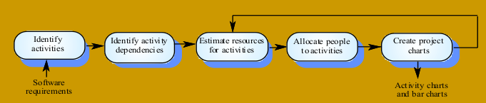
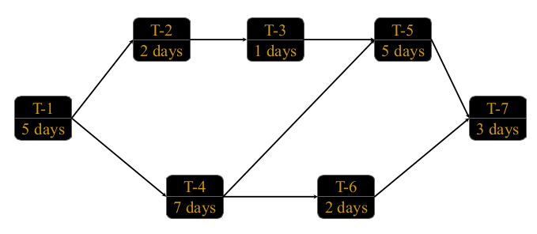
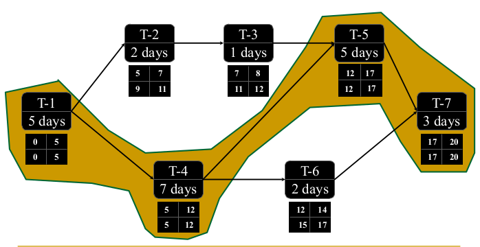
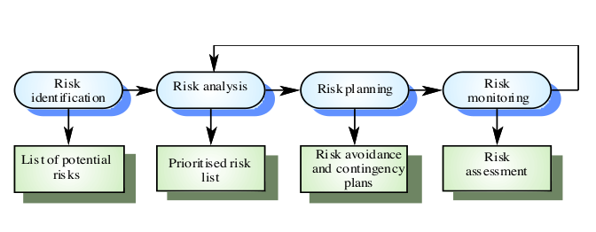

# Introduzione

**Software project management**: attività necessarie per assicurare lo sviluppo di un prodotto software nel rispetto delle *scadenze* fissate e rispondento a determinati *standard*.  
Questo prevede l'interazione di aspetti economici e tecnici.  

Un **progetto** è un insieme ben definito di attività che:  

* ha un *inizio*
* ha una *fine*
* realizza un *obiettivo*
* è realizzato da un'equipe di *persone*
* utilizza un certo insieme di *risorse*

Le figure in campo sono:  

* **Business manager**: definiscono i termini economici del progetto
* **Project managers**: pianificano, motivano, organizzano e controllano lo sviluppo
* **Practitioners**: hanno le competenze tecniche per realizzare il sistema
* **Customers**: specificano i requisiti del software da sviluppare
* **End users**: interagiscono col sistema una volta realizzato  

## Attività del project manager  

Le attività del project manager sono:  

* Stesura della *proposta* di progetto
* Stima del *costo* del progetto
* *Pianificazione* (**planning**) e *temporizzazione* (**scheduling**)
* *Monitoraggio* e *revisioni* del progetto
* Selezione e valutazione del *personale*
* Stesura di *rapporti* e presentazioni  

## Struttura del piano di progetto  

* Introduzione  
  + Overview del Progetto  
    - *Descrizione di massima del progetto e del prodotto.  *
  + Deliverables del Progetto  
    - *Tutti gli items che saranno consegnati, con data e luogo di consegna*
  + Evoluzione del Progetto  
    - *Piani per cambiamenti ipotizzabili e non*
  + Materiale di riferimento  
    - *Lista dei documenti cui ci si riferisce nel Piano di Progetto*
  + Definizioni e Abbreviazioni  
* Organizzazione del progetto  
  + Modello del Processo  
     - *Relazioni tra le varie fasi del processo  *
  + Struttura Organizzativa  
     - *Gestione interna, carta dell’organizzazione * 
  + Interfacce Organizzative  
     - *Relazioni con altre entità*  
  + Responsabilità di Progetto  
     - *Principali funzioni e attività;*  
     - *Di che natura sono?*  
     - *Chi ne è il responsabile ?  *
* Processi gestionali  
  + Obiettivi e Priorità  
  + Assunzioni, Dipendenze, Vincoli  
     - *Fattori esterni * 
  + Gestione dei rischi  
     - *Identificazione, Valutazione, Monitoraggio dei rischi * 
  + Meccanismi di monitoraggio e di controllo  
    - *Meccanismi di reporting, format, flussi di informazione,  revisioni  *
  + Pianificazione dello staff  
    - *Skill necessari (cosa?, quanto?, quando?)*
* Processi tecnici  
  + Metodi, Strumenti e Tecniche  
     - *Sistemi di calcolo, metodi di sviluppo, struttura del team, ecc.*  
     - *Standards, linee guida, politiche.*  
  + Documentazione del Software  
     - *Piano di documentazione, che deve includere milestones, e revisioni  *
  + Funzionalità di supporto al progetto  
     - *Pianificazione della qualità  *
     - *Pianificazione della gestione delle configurazioni *
* Pianificazione del lavoro, delle risorse umane e del budget.  
  +  Work Packages  
     - *Il progetto è scomposto in tasks; definizione di ciascun task * 
  + Dipendenze  
     - *Relazioni di precedenza tra funzioni, attività e task*  
  + Risorse Necessarie  
     - *Stima delle risorse necessarie, in termini di personale, di tempo di  computazione, di hardware particolare, di supporto software ecc.*  
  + Allocazione del Budget e delle Risorse  
     - *Associa ad ogni funzione, attività o task il costo relativo*  
  + Pianificazione  
     - *Deadlines e Milestones*

## Attività che coprono tutta la durata del progetto  

* Project management  
* Configuration Management  
* Documentation  
* Quality Control (Verifica e validazione)  
* Training 

# Pianificazione di un progetto e scheduling

**Scheduling di progetto**: divide il progetto in attività e tasks e stima il tempo e le risorse necessarie per completare ogni singola mansione.  
I task vengono organizzati in modo concorrente, per ottimizzare la forma lavoro. Si minimizzano le dipendenze tra i task per evitare ritardi dovuti all'attesa del completamento di un'altra mansione.  

## Problemi nello scheduling

* È difficile stimare la difficoltà dei problemi e il costo di sviluppo di una soluzione
* La produttività non è proporzionale al numero di persone che lavorano su un singolo task
  + Aggiungere personale in un progetto in ritardo può aumentare ancora di più il ritardo.  

## Rappresentazioni grafiche dello scheduling di un progetto

Vi sono diversi tipi di rappresentazione grafica dello scheduling del progetto. Tali rappresentazioni mostrano la suddivisione del lavoro in task. (I task non devono essere troppo piccoli: 1 o 2 settimane di lavoro).  

* Il grafo delle attività (**PERT**) evidenzia le dipendenze e il cammino critico.  
* Il grafico a barre mostra lo scheduling come calendario lavori.  
* Il diagramma di Gannt esprime la temporizzazione.  

Consideriamo, nel prossimi paragrafo, il segue grafo delle attività come esempio:  

### Diagramma PERT e *Critical Path Method*

Nel **PERT** (*Project Evaluation Review Technique*) ad ogni attività vengono identificate le seguenti stime:  

* **ES** (*earliest start time*)
  + Il minimo giorno di inizio dell'attività, a partire dal minimo tempo necessario per le attività che precedono
* **EF** (*earliest finish time*)
  + Dato *ES* e la durata dell'attività, *EF* è il minimo giorno in cui l'attività può terminare
+ **LF**: (*latest finish time*)
  + Il giorno massimo in cui il job deve finire senza che si crei ritardo per i job che dipendono da esso
+ **LS** (*latest start time*)
  + Dato *LF* e la durata del job, *LS* è il giorno massimo in cui quel job deve iniziare senza provocare ritardo per i job che dipendono da esso

Mediante il diagramma PERT è possibile risalire al **cammino critico** nel grafo delle attività, ovvero di quell'insieme di attività logicamente dipendenti tra di loro che collegano il nodo iniziale (attività di inizio) al nodo finale (attività di fine) e la cui somma delle durate è massima. Un ritardo in una di queste attività, implica il ritardo dell'intero progetto.  

Il cammino critico individuato, in questo caso, è il seguente:  

//figure  network attività critic

### Diagramma di Gannt  

## Gestione dei rischi  

La gestione dei rischi si occupa di identificare i rischi ed effettuare la stesura di piani per minimizzare il loro effetto su un progetto.  
Un rischio è una probabilità che possa verificarsa una qualche circostanza avversa. I rischi possono essere categorizzati in:  

* **Project risks**: incidono sulla pianificazione o sulle risorse
* **Product risks**: incidono sulla qualità o le prestazioni del software in sviluppo
* **Business risks**: incidono sull'organizzazione    

| **Rischio**                      | **Tipologia di rischio** | **Descrizione**                                                                          |
|:--------------------------------:|:------------------------:|:----------------------------------------------------------------------------------------:|
| Perdita dello staff              | Project risk             | Staff con esperienza lascia il progetto prima della sua terminazione                     |
| Mancanza di hardware             | Project risk             | Hardware essenziale al progetto non sarà consegnato in tempo                             |
| Cambio dei requisiti             | Project and product risk | Il numero di cambi ai requisiti è maggiore di quanto anticipato                          |
| Ritardo nelle specifiche         | Project and product risk | La specifica di interfacce essenziali non è disponibile per la data pianificata          |
| Taglia del sistema sottovalutata | Project and product risk | Le dimensioni del sistema sono state sottovalutate                                       |
| CASE tool under-performance      | Product risk             | Gli strumenti CASE di supporto al progetto non svolgono il loro lavoro quanto anticipato |
| Cambio di tecnologie             | Business risk            | Le tecnologie su cui si basa il sistema sono state soppiantate da nuove tecnologie       |
| Competizione                     | Business risk            | Un prodotto competitivo è stato rilasciato prima che il sistema sia completo             |

### Identificare i rischi  

| **Tipologia di rischio** | **Possibili rischi**                                                                                                                                                                  |
|:------------------------:|:-------------------------------------------------------------------------------------------------------------------------------------------------------------------------------------:|
| Technology               | The database used in the system cannot process asmany transactions per second as expected; Software components which should be reused containdefects which limit their functionality. |
| People                   | It is impossible to recruit staff with the skills required. Key staff are ill and unavailable at critical times. Required training for staff is not available.                        |
| Organisational           | The organisation is restructured so that differentmanagement are responsible for the project. Organisational financial problems force reductions in theproject budget.                |
| Tools                    | The code generated by CASE tools is inefficient.CASE tools cannot be integrated.                                                                                                      |
| Requirements             | Changes to requirements which require major designrework are proposed. Customers fail to understand the impact of requirementschanges.                                                |
| Estimation               | The time required to develop the software isunderestimated. The rate of defect repair is underestimated. The size of the software is underestimated.                                  |
