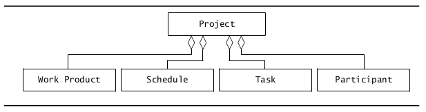
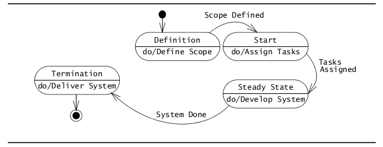
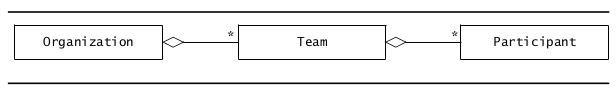
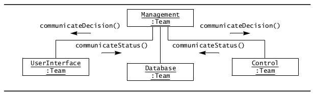
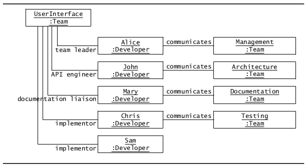
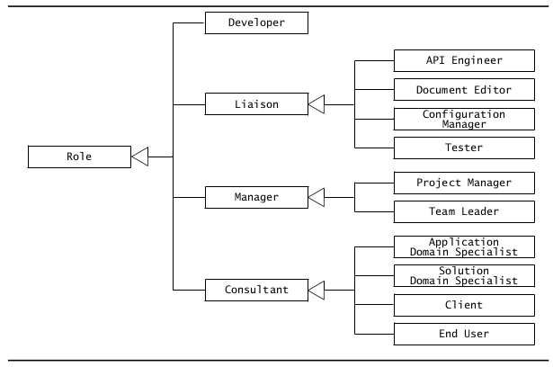
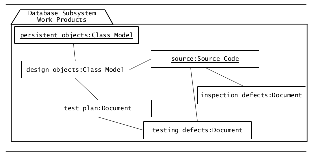
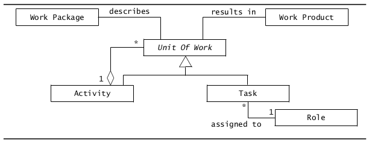
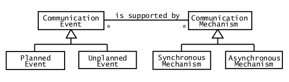
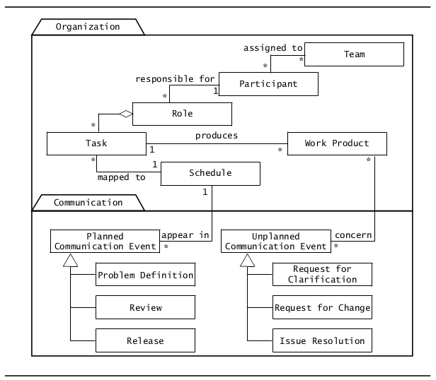

* TOC  
{:toc}

# Introduzione
Un **progetto** è un impegno di durata limitata preso al fine di raggiungere un determinato insieme di obiettivi che richiedono uno sforzo concentrato.  
Un progetto include:  

* Un insieme di *deliverables* ad un committente
* Una pianificazione
* Attività tecniche e manageriali richieste allo scopo di produrre e consegnare i *deliverables*
* Risorse consumate dalle attività (persone, budget)  

Il focus del **project management** è quello di amministrare le risorse, mantenere la contabilità, reagire ai cambianti e assicurarsi che gli obiettivi vengano raggiunti.   

Da un punto di vista dinamico, un progetto può essere in uno delle fasi raffiguranti nel seguente state diagram:  

## Organizzazione in un progetto

L'**organizzazione di un progetto** definisce le relazioni tra le risorse, in particolare tra i partecipanti, di un progetto.  
L'organizzazione di un progetto deve definire:  

* Chi decide (**decision structure**)
* Chi riporta il proprio stato a chi (**reporting structure**)
* Chi comunica con chi (**communication structure**)  

Il *reporting* fa da supporto al project management, tenendo traccia dello stato del progetto. (*Quale lavoro è stato completato? Quale lavoro è in ritardo? Quali problemi minacciano il progresso del progetto?*)    

Una organizzazione è **gerarchica** se le informazioni riguardanti lo stato del progetto e le informazioni riguardanti lo stato del progetto sono *unidirezionali*. Il flusso di informazioni in un'organizzazione gerarchica è illustrata nella seguente figura:  

Riportare lo stato di un progetto lungo una gerarchia non è sufficiente quando due team hanno bisogno di comunicare (*peer-to-peer communication*). A tal scopo, è necessaria una struttura di comunicazione: un partecipante di ogni team è addetto a facilitare la comunicazione di entrambi i team: tale partecipante è chiamato **liaision**.  

Una struttura di comunicazione basata sui liaison è illustrata nel seguente object diagram:  

### Ruolo in un progetto  

Un **ruolo** definisce un insieme di responsabilità. Esempi di ruoli sono:  

* Tester: scrive test, riporta failures, controlla se un bug fix indirizza un failure specifico
* System architect: garantisce consistenza nelle scelte di design e definisce interfacce ai sottosistemi. Formula strategia per il system integration
* Liaision: facilita la comunicazione tra 2 team  

 

Possibili mapping di ruoli tra partecipanti:  

* One to one: idel but rare
* Many to few: ogni membro del progetto prene diversi "cappelli". Pericolo di over-committment. Necessita di load balancing
* Many to too many: delle persone non hanno ruoli significativi. Mancanza di contabilità.

  
  ### Task
  
  Un **task** descrive il più piccolo quantitativo di lavoro tracciabile dal management.  
  Un task è tipicamente uno sforzo di 3-10 giorni lavorativi.  
  Un task è descritto da:  
  
  * Ruolo
  * Work product
  * Data inizio
  * Durata pianificata
  * Risorse richieste  

Un task è specificato da un **work package**, che comprende:  

* Descrizione del lavoro da svolgere
* Precondizioni per l'inizio
* Durata
* RIsorse richieste
* Work products da produrre, insieme ai suoi criteri di accettazione
* Rischi coinvolti

Un task deve avere dei **criteri di completamento**, che comprendono i criteri di accettazione del work product prodotto.  

Un **work product** è un risultato visibile di un task. I work products consegnati al committente sono detti **deliverables**   

I task sono decomposti in taglie che consentono il loro monitoraggio.   

Il seguente è un esempio di work product per il team addetto al sottosistema riguardante una base di dati:  

### Attività  

Una **attività** è una unità di lavoro *significativa*. Il completamento di un'attività porta al raggiungimento di una importanre *milestone* di progetto.  

Le attività sono di solito raggruppate in attività di livello più alto, denominate in maniera differente (Es. fase, step...)    

Le attività permettono la separazione degli ambiti (*separation of concerns*)  

Possono esserci relazioni di precedenza tra le attività (es. *A1 va eseguito prima di A2*)  

Esempi di attività nell'ingegneria del software:  

* Pianificazione
* Raccolta dei requisiti
* Analisi
* System design
* Object design
* Implementazione
* Testing
* Consegna  

# Comunicazione in un progetto  

Un ingegnere software deve imparare le cosiddette "soft skills":  

* **Collaborazione**: negoziare i requisiti col committente e con i membri del proprio team (e di altri team)
* **Presentazione**: capacità di presentare una parte significativa del sistema durante una revisione
* **Management**: facilitare un team meeting
* **Technical writing**: scrivere parte di documentazione del progetto

## Concetti  

* Eventi di comunicazione: scambio di informazioni con obiettivi e ambiti ben definiti  
  + Pianificati (weekly team meeting, review)
  + Non pianificati - event driven communication (problem report, request for change, clarification)
* Meccanismo di comunoicazione: strumento o procedura che può essere usata per trasmettere informazioni
  + Sincrona
  + Asincrona  

## Eventi di comunicazione
### Comunicazioni pianificate
Tra gli eventi di comunicazione pianificati:  

* **Definizione del problema**
  + Obiettivo: presenta gli obiettivi, i requisiti e i vincoli
  + Solitamente pianificat all'inizio di un progetto
* **Revisione di progetto**: si focalizza sui modelli di sistema
  + Obiettivo: valuta lo stato e revisiona il modello di sistema
  + Solitamente painificata intorno ai *milestones* di progetto e ai deliverables
  + Esempi: revisione analisi, revisione system design
* **Client review**: si focalizza sui requisiti
  + Obiettivo: informare il cliente, accordarsi sui cambi di requisiti
  + Il primo *client review* viene pianificato di solito dopo la fase di analisi
* **Walkthrough** (informale)
  + Obiettivo: aumentare la qualità dei sottosistemi
  + Pianificato per ogni team
  + Esempio: Uno sviluppatore presenta in modo informale un sottosistema ai membri del team (comunicazione peer-to-peer)
* **Inspection** (formale)
  + Obiettivo: conformità ai requisiti
  + Pianificato dal project management
  + Esempio: dimostrazione di un sistema finale al commitente (*client acceptance test*)
* **Status review**
  + Obiettivo: trovare deviazioni alle pianificazioni e correggerli o identificare nuovi problemi
  + Esempio: status section in regular wekly team meeting
* **Brainstorming**
  + Obiettivo: generare e valutare un grande numero di soluzioni per un problema
  + Esempio: discussion section in regular weekly team meeting
* **Rilascio**
  + Obiettivo: baseline the result of each software development activity
  + Esempi: Software project management plan, RAD, SDD, Beta version di un software, Final version di un software,, User manual
* **Postmortem review**
  + Obiettivo: descrivere le lezioni imparate
  + Pianificato alla fine di un progetto
### Comunicazioni non pianificate
* **Request for clarification**
  + L'ammontare di comunicazioni tra sviluppatori, clienti e utenti
  + Esempio: uno sviluppatore può chiedere un chiarimento riguardo una frase ambigua nel problem statement
    - *"When exactly would you like the System Design Document? The schedule claims it to be October 22, while the template says we have until November 7*".  
* **Request for change**
  + Un partecipare riporta un problema e propone una soluzione
  + Tali richieste sono spesso formalizzate quanto la taglia del progetto è significativa
* **Issue resolution**
  + Seleziona una singola soluzione a un problema per cui numerose soluzioni sono state proposte
  + Si usano *issues tracking systems* appositi per tenere traccia dei problemi e delle proposte
## Meccanismi di comunicazione
### Comunicazione sincrona
* **Segnali di fumo**
* **Conversazioni di corridoio**
  + Supporta: conversazioni non pianificate, *request for clarification*, *request for change*
  + Svantaggio: perdita di informazioni; frequenti fraintendimenti
* **Meetings**
  + Supporta: conversazioni pianificate, *client review*, *project review* , *brainstorming*, *issue resolution*
  + Efficace per la risoluzione dei problemi
  + Svantaggio: alto costo (persone, risorse), low bandwidth

### Comunicazione asincrona

* **E-mail**
  + Supporta: *release*, *change request*, *brainstorming*
  + Ideale per comunicazioni pianificate e annunci
  + Svantaggio: email prese fuori dal contesto possono essere fraintese
* **Newsgroup**
  + Supporta: *release*, *change request*, *brainstorming*
  + Adatta a discussioni tra persone che condividono un interesse comune
  + Economico (shareware available)
  + Svantaggio: access control primitivo (sei dentro o fuori)
* **Portale World Wide Web**
 + Supporta: *release*, *change request*, *inspections*
 + Svantaggio: non supporta facilmente documenti in rapida evoluzione

## Attività di comunicazione

Tipiche attività di comunicazione iniziali in un progetto software:  

* Understand problem statement
* Join a team
* Schedule and attend team status meetings
* Join the communication infrastructure

### Capire il problem statement
Il problem statement è sviluppato dal committente e descrive:  

* La situazione corrente
* La funzionalità che il nuovo sistema dovrebbe supportare
* L'ambiente in cui il sistema sarà impiegato (*deployed*)
* I *deliverables* aspettati dal cliente
* Date di consegna
* Criteri per acceptance test

### Unirsi a un team

Durante la fase di definizione del progetto, il project manager formi i team per ogni sottosistema. Aggiuntivamente, dei team inter-funzionali sono formati per supportare i team dei per i vari sottosistemi.  

Ogni team ha un team leader. Altri ruoli includono:  

* Configuration manager
* API-Liaison
* Technical writer
* Web master

Le responsabilità del team e le responsabilità di ciascun membro deve essere definito per assicurarsi il successo del team.  

### Prendere parte ai status meetings del team

I meeting periodici del team sono una parte importante di un progetto software.  
I meetings sono spesso percepiti come puro overhead.  

Tra i task importanti per il team leader:  

* Train the teams in meeting management
  + Announce angendas
  + Write minutes
  + Keep track of action items
* Show value of status meetings
* Show time-saving improvements  

### Unirsi all'infrastruttura di comunicazione  

Una buona infrastruttura di comunicazione è la spina dorsale di qualsiasi progetto software.  

Occorre imparare ad usare in maniera appropriata i meccanismi di comunicazioni: l'appropriatezza dei meccanismi può dipendere dalla cultura organizzativa.  

Domande da porsi:  

* *Are meetings scheduled in a calendar?*
* *Does the project have a problem reporting system?*
* *Do team members provide peer reviews in meetings or written form?*

## Relazioni tra concetti organizzativi e di comunicazione

