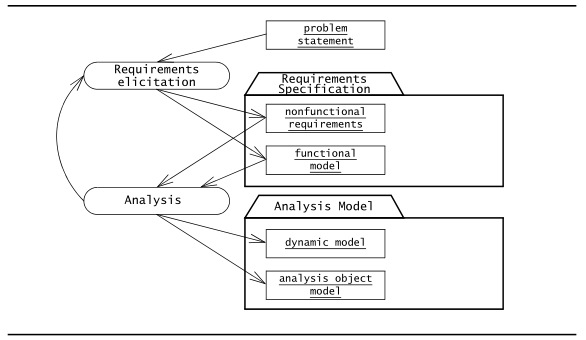

* TOC  
{:toc}

Informazioni maggiori, oltre che sul Bruegge, sono contenute nello **[standard ISO/IEC/IEEE 29148:2011 sull'ingegneria dei requisiti](https://edisciplinas.usp.br/pluginfile.php/1077344/mod_folder/content/0/iso-iec-ieee-29148-2011.pdf)** (in particolare la sezione 5.2).   

# Introduzione
## Fase preliminare al progetto: Identificare il problema
Per definire il punto di partenza, occorre identificare il problema.  

* **Identifica i confini del problema**
  + Quale problema deve essere risolto?
* **Identifica il contesto del problema**
  + *Dove è il problema?*
* **Identifica gli stakeholders**
  + *Di chi è il problema?*
* **Identifica gli obiettivi degli stakeholders **
  + *Perchè questo problema deve essere risolto?*
* **Colleziona degli scenari**
  + *Come può aiutare un sistema software?*
* **Identifica le tempistiche**
  + *Entro quando deve essere risolto?*
* **Identifica rischi e studia la fattibilità**
  + *Cosa può impedirci di risolvere questo problema?*

Il **[Problem Statement](https://en.wikipedia.org/wiki/Problem_statement)** è svilupato dal committente e dal project manager insieme come una descrizione del problema che il sistema dovrebbe affrontare. Tale documento rappresenta una comprensione reciproca del problema.  

(*Nota mia: in questo contesto lo [Statement of Work](https://www.projectmanager.com/blog/statement-work-definition-examples) è pressochè la stessa cosa ma contiene anche informazioni riguardo il progetto da svolgere*)  

Il *problem statement* descrive: 

* **Situazione corrente**
  + Il problema da risolvere, può includere la descrizione di uno o più scenari
    - Esempio: "*i tempi di risposta sono troppo lenti*", "*vorrei giocare a scacchi, ma non trovo giocatori del mio livello*"
  + Una nuova funzione da aggiungere
    - A causa di un *cambio nel dominio applicativo*: un nuovo processo di business è stato introdotto e per questo vi è la necessità di aggiungere una funzionalità
  + Una nuova soluzione
    - L'introduzione, ad esempio, di nuove tecnologie (Grazie a *technology enablers*) permette di ripensare e riprogettare una determinata funzionalità, portando a un *cambio nel dominio della soluzione*
  + In generale, una nuova opportunità di business, un potenziale risparmio di costi e risorse, una insoddisfazione nella situazione corrente
* **Obiettivi**
* **Requisiti**
  + Funzionali, non funzionali (tra cui anche i vincoli ossia gli *"pseudo requirements"*)
* **L'ambiente in cui il sistema sarà impiegato**
* **Deliverables da consegnare e date di consegna**
  + Costituiscono i "milestones"
* **Criteri di accettazione**
  + **Criteri per il testing di sistema**
    - Il testing di sistema non coinvolge l'implementazione: un sistema si può testare anche a partire dai suoi modelli di analisi  

Una volta definito il problem statement, occorre mappare questo in una **specifica dei requisiti** nella fase di **raccolta dei requisiti**.  
## Raccolta dei requisiti

La **raccolta dei requisiti** (*requirements elicitation*) si focalizza sul descrivere lo scopo del sistema. Il committente, lo sviluppatore e gli utenti identificano un problema e definiscono un sistema che indirizza tale problema: tale definizione è detta **specifica dei requisiti** (*requirements specification*) e serve da contratto tra il committente e gli sviluppatori.  

La specifica dei requisiti è strutturata e formalizzata durante la fase di **analisi**, che produce un **modello di analisi** (*analysis model*).  

I prodotti delle fasi di raccolta e analisi sono raffigurati nel seguente *activity diagram*:  

Le fasi di raccolta e analisi rappresentato le stesse informazioni: le due fasi differiscono solo nel linguaggio e nella notazione utilizzata:  

* la *specifica dei requisiti* (ottenuta nella fase di raccolta) è scritta in linguaggio naturale
  + la specifica dei requisiti supporta la comunicazione con gli stakeholder
* il *modello di analisi* (ottenuto nella fase di analisi) è espresso in una notazione formale o semiformale  
  + il modello di analisi supporta la comunicazione tra sviluppatori  

Entrambi sono considerati modelli del sistema ed entrambi rappresentano gli stessi aspetti del sistema: pertanto, è possibile eseguire le fasi di raccolta e analisi in maniera concorrente e iterativa.  

Le fasi di raccolta e l'analisi si focalizzano solo sul sistema dal *punto di vista dell'utente*: questo comprende le funzionalità di sistema, le interazioni utente-sistema, gli errori che il sistema rileva e gestisce e le condizioni ambientali in cui il sistema deve funzionare.  

La struttura del sistema, le tecnologie implementative scelte per costruire il sistema, la progettazione del sistema, le metodologie di sviluppo e altri aspetti *non direttamente visibli all'utente* **non** sono parte dei requisiti.  

# Concetti
## Requisiti
I requisiti definisco **capacità essenziali** del sistema. Se un un requisito viene rimosso, dovrebbe venirsi a creare una lacuna non colmabile da altri requisiti.  

I requisiti devono essere *atomici*: ogni requisito deve descrivere una singola capacità, senza congiunzioni.  

### Requisiti funzionali

I **requisiti funzionali** descrivono le interazioni tra l'utente e il suo ambiente in maniera indipendente dalla sua implementazione. L'ambiente include gli utenti e ogni altro sistema esterno con cui il sistema interagisce.  

Modelliamo i requisiti funzionali grazie al **modello dei casi d'uso**.  

I requisiti funzionali sono formulati come azioni. Ad esempio: *Pianificare un torneo*, *Notificare a un gruppo di interesse*.  
### Requisiti non funzionali

I **requisiti non funzionali** descrivono aspetti del sistema che non sono direttamente correlati al comportamento funzionale del sistema.  
I requisiti non funzionali includono un'ampia varietà di requisiti applicabili a diversi aspetti del sistema che spaziano dall'usabilità fino alle performance.  

I requisiti non funzionabili sono misurabili e/o percepibili.  

Il modello **FURPS+**, usato da *Unified Process* (*Jacobson et al., 1999*), fornisce le seguenti *categorie* di requisiti non funzionali:  

* **Usabilità**: è la facilità con cui un utente impara ad operare, preparare input e interpretare un output di un sistema (o componente).
  + I requisiti di usabilità includono, per esempio, le convenzioni adottate per l'interfaccia utente e il livello di documentazione utente
  + Spesso, i committenti affrontano i problemi di usabilità richiedendo agli sviluppatori di seguire certe linee guida per l'interfaccia utente (color schemes, loghi, fonts...)
  + Tale requisito deve essere *misurabile*.
    - Esempio: numero (esatto) di passi necessari per compiere un acquisto 
* **Affidabilità**: è la capacità del sistema (o componente) di eseguire le funzioni richieste sotto le condizioni stabilite per un lasso di tempo definito
  + I requisiti di affidabilità includono, ad esempio, il tempo medio accettabile per un *failure* e la capacità di rilevare determinati *faults* oppure la capacità di restitere a degli specifici attacchi
  + Questa categoria spesso comprende i requisiti di **attendibilità**, **robustezza** e **sicurezza**
    - *robustezza*: il grado in cui un sistema (o componente) riesce a funzionare correttamente in presenza di input non validi o condizioni ambientali stressanti
    - *sicurezza*: una misura dell'assenza di conseguenze catastrofische all'ambiente
  * **Prestazioni**: questi requisiti riguardano attributi *quantificabili* del sistema
      - Esempio: "il sistema deve supportare 10 tornei simulataneamente"
    + *tempo di risposta* (il tempo in cui il sistema reagisce a un input utente)
    + *throughput* (quantità di lavoro compiuto dal sistema in unità di tempo)
    + *disponibilità*: il grado in cui il sistema (o il componente) è operativo e accessibile quando richiesto
      - Esempio: il sistema deve essere inattivo (*down*) per non più di 5 minuti a settimana
* **Supportabilità**: riguarda la facilità di effettuare modifiche al sistema dopo il deploy
    - Esempio: "*l'operatore deve poter aggiungere nuovi giochi senza modificare il sistema esistente*"
  + include l'*adattabilità*: la capacità di modificare il sistema allo scopo di trattare concetti aggiuntivi del dominio applicativo
  + include anche la *manutenibilità*: l'abilità di modificare il sistema per trattare nuove tecnologie o difetti da fixare
  + altri cambiamenti possono ad esempio riguardare l'*internazionalizzazione*: l'aggiunta di una nuova lingua o formati di valuta
  + Lo standard **ISO 9126**, simile al modello FURPS+, sostituisce questa categoria con  la *manutenibilità* e la  *portabilità* (la facilità con cui un sistema può essere trasferito da un ambiente hardware/software a un altro)

Le categorie appena menzionate sono detti **quality requirements**.  

Il modello FURPS+ fornisce categorie aggiuntive di requisiti che sono tipicamente incluse sotto la voce dei requisiti non funzionali:  

* **Requisiti di implementazione**: sono vincoli riguardanti l'implementazione del sistema
  + Possono riguadare l'uso di specifici tool, linguaggi di programmazione o piattaforme hardware
* **Requisiti di interfaccia**: sono vincoli imposti da sistemi esterni
  + Possono riguardare sistemi legaci o formati di interscambio
* **Requisiti operazionali**: sono vincoli sull'amministrazione e la gestione del sistema quando è operativo
* **Requisti di packaging**: sono requisiti sulle modalità di consegna del sistema
  + Può riguardare, ad esempio, vincoli riguardanti il supporto per l'installazione
* **Requisiti legali**: riguardano aspetti delle licenze,  
regolamenti, certificazioni rispetto a standard di qualità, etc.

I requisiti che rientrano nelle categorie appena menzionate sono chiamati **vincoli** (*constraints*) o **pseudo-requisiti** (*pseudo-requirements*).  

Il budget e le tempistiche per la consegna non sono trattati come requisiti non funzionali, in quando riguardano il progetto. 

#### Sintassi dei requisiti, delle preferenze e degli obiettivi

(*Preso da standard 29148:2011*)  

I requisiti funzionali e non funzionali devono avere la seguente sintassi:  

* ``[Condition][Subject][Action][Object][Constraint]``.
  + **Esempio:** *Quando il segnale x è ricevuto (``Condition``), il sistema (``Subject``) deve impostare (``Action``) il bit relativo al segnale x ricevuto (``Object``) entro 2 secondi (``Constrant``)  
* ``[Condition][Subject][Action][Object][Constraint]``
  + Allo stato 1 (``Condition``), il Radar (``Subject``) deve rilevare (``Action``) bersagli (``Object``) nel raggio di 100 miglia nautiche (``Constraint``)
* ``[Subject][Action][Object][Constraint]``
  + Il sistema di fatturazione (``Subject``) deve mostrare (``Action``) le fatture in sospeso (``Object``) in ordine crescente in base alle fatture da pagare (``Constraint``)  

I requisiti devono avere il verbo **deve**.  
Le preferenze e gli obiettivi devono usare **dovrebbe**.  
I suggerimenti e i permessi devono usare **può**.  
I non-requisiti (come i  testi descrittivi) devono usare il verbo **essere**.  

È consigliato usare la **forma attiva**. È preferibile quindi scrivere "*deve rilevare [...]*" anzichè "*deve essere capace di rilevale [...]*".  

 È consigliato usare sempre **asserzioni positive**. È preferibile scrivere "*deve*" rispetto a "*non deve*".  
 

## Completezza, consistenza, chiarezza e correttezza

I requisiti sono continuamente *validati* dal committente e dagli utenti.  
La **validazione** è un passo critico al processo di sviluppo, dato che sia il committente che gli sviluppatori dipendono dalla specifica dei requisiti.  

La *validazione dei requisiti* prevede che le specifiche siano complete, consistenti, non ambigue e corrette:  

* La specifica dei requisiti è **completa** se tutti gli scenari possibili del sistema sono descritti, inclusi i comportamenti eccezionali
* La specifica dei requisiti è **consistenze** se non sono presente contraddizioni
* La specifica dei requsiti è **non ambigua** se esattamente un solo sistema è definito (non è quindi possibile, ad esempio, interpretare le specifiche in due o più modi diversi)
* La specifica dei requisiti è **corretta** se rappresenta accuratamente il sistema che il committente ha chiesto e che gli sviluppatori hanno intenzione di costruire

La *correttezza* e la *completezza* della specifica dei requisiti è spesso difficile da stabilire, soprattuto prima dell'effettiva esistenza del sistema.  
Dato che la specifica dei requisiti funge da base contrattuale tra il committente e gli sviluppatori, tali specifiche vanno revisionate attentamente da entrambe le parti. In aggiunta, le parti critiche del sistema dovrebbero essere prototipate o simulate per dimostrare la loro fattibilità e per ottenere un feedback dall'utente.  

Il seguente è un esempio di alcuni requisiti che non soddisfano le proprietà appena descritte:  

Al fine di avere una specifica dei requisiti *chiara* e *non ambigua*, occorre evitare l'uso di superlativi, linguaggio soggettivo ("*user friendly*", "*facile da usare*"), pronomi vaghi, avverbi e aggettivi ambigui ("*minimale*", "*significante*"). Alcuni termini specificati, oltre a diminuire la chiarezza, possono risultare anche *non verificabili* (vedi sezione successiva).  

La specifica dei requisiti non deve contenere scappatole ("*se possibile, [...]").  

## Realismo, verificabilità e tracciabilità

Altre proprietà auspicabili per la specifica dei requisiti sono i seguenti:  

* La specifica dei requisiti è **realistica** se il sistema può essere implementato entro i vincoli imposti
* La specifica dei requisiti è **verificabile** se il sistema, una volta costruito, consente di effettuare dei test ripetibili allo scopo di dimostrare che il sistema soddisfa i requisiti
  + Le seguenti sono istanze di requisiti non verificabili:
    - *Il prodotto deve avere una buona interfaccia*
    - *Il prodotto deve essere privo di errori*
    - *Il prodotto deve rispondere all'utente per 1 secondo il più delle volte*
* La specifica dei requisiti è **tracciabile** se ogni requisito può essere rintracciato per tutto il processo disviluppo fino alla corrispondente funzionalità di sistema e viceversa
  + La tracciabilità comprende anche la capacità di rintracciare le dipendenze tra i requisiti, le funzioni di sistema e gli artefatti intermedi
  + La tracciabiltà è critica per lo sviluppo di test e per valutare delle modifiche

### Mantenere la tracciabilità

L'approccio più semplice per mantenere la tracciabilità è quella di adoperare il **cross-referencing** tra i documenti, i modelli, codici e altri artefatti.  

I vari artefatti prodotti nelle varie fasi del processo di sviluppo vengono tracciatin un una **matrice di tracciabilità**: ogni riga identifica un requisito con tutti i relativi artefatti (elementi di analisi, elementi di design, implementazione, casi di test) lungo le colonne.  

Ogni elemento individuale (requisiti, componenti, classe, operazioni, casi di test) è individuato dal numero dell'elemento sorgente e dal numero dell'oggetto *target*.

## Greenfield Engineering, Reengineering e Interface Engineering

L'attività di raccolta dei requisiti può essere classificata in tre categorie, a seconda della sorgente dei requisiti.   

* Nel **greenfield engineering**, lo sviluppo parte da 0. Non vi è alcun sistema preesistente.
  + I requisiti sono estratti dagli utenti e dal committente.
  + Un progetto di tipo **greenfield engineering** è avviato dall'esigenza di un utente o dalla creazione di un nuovo mercato
* Un progetto di tipo **reengineering** prevede la riprogettazione e re-implementazione di un sistema esistente.
  + I requisiti del nuovo sistema sono estratti dal sistema già esistente
  + Un progetto di questo tipo è avviato dall'accesso a nuove tecnologie o da una riprogettazione dei processi aziendali
* **Interface engineering**: riprogettazione dell'interfaccia utente di un sistema utente. Il sistema legacy rimane intatto tranne che per la sua interfaccia (con utenti o altri sistemi)
  + Un progetto di questo tipo è scaturito da nuove esigenze di mercato o dall'introduzione di nuove tecnologie

In progetti di tipo *reengineering* e *greenfield engineering*, gli sviluppatori devono accumulare quante più informazioni possibile dal dominio applicativo. Tali informazioni possono essere trovare nei manuali delle procedure, nella documentazione distribuita ai nuovi impiegati e nelle interviste fatti ai committenti ai clienti. Le interviste, tuttavia, possono essere inutili se non vengono chieste le giuste domande: a tal fine, è consigliato acquisire una solida conoscenza del dominio applicativo primo di ricorrere all'approccio diretto.  

# Attività

In questa sezione sono discusse le attività che costituiscono la fase di raccolta dei requisiti.  

## Identificare gli attori

Gli attori rappresentano le entità esterne che interagiscono col sistema. Un attore può essere umano oppure un sistema esterno.  

Gli attori sono un'astrazione dei ruoli e non necessariamente devono essere direttamente mappabili a delle persone. La stessa persona può assumere diversi ruoli (e quindi accedere a diverse funzionalità) in tempi diversi.  

Il primo passo della raccolta dei requisiti consiste nell'**identificazione degli attori**. Questo serve a delimitare i confini del sistema ma anche a trovare tutte le prospettive che lo sviluppatore deve considerare per il sistema.  

Se il sistema deve essere distribuito per un'organizzazione già esistente (Ad esempio un'azienda), solitamente gli attori esistono già ancor prima dello sviluppo del sistema e corrispondono ai ruoli all'interno dell'organizzazione.  

Durante i primi passi di identificazione degli attori, può risultare difficile distinguere gli attori dagli oggetti: un database, ad esempio, può essere un attore in certi casi oppure può essere parte del sistema.  
Una volta definiti i confini del sistema, non ci deve essere più nessun problema a distinguere tra gli attori e i componenti del sistema.  

Con lo stereotype *«system»* si indicano gli attori di sistema.  
È possibile introdurre un attore chiamato "Tempo" per l'avvio di eventi pianificati.  

Quando si identificano gli attori, gli sviluppatori devono porsi le seguenti domande:  

* *Quali gruppi di utenti sono supportati dal sistema per svolgere il loro lavoro?*
* *Quali gruppi di utenti eseguono le funzionalità principali del sistema?*
* *Quali gruppi di utenti eseguono funzioni secondarie, come la manutenzione e l'amministrazione?*
* *Con quale hardware esterno o sistema software esterno dovrà interagire il mio sistema?*

Una volta definiti gli attori, il prossimo passo è quello di determinare le funzionalità accessibili a ciascun attore: queste informazioni possono essere estratte usando gli scenari e possono essere formalizzate usando gli use case.  

## Identificare gli scenari

Uno scenaro è una "*descrizione narrativa di cosa le persone fanno quando utilizzano un sistema software*". Uno scenario è una descrizione concreta, focalizzata e informale di una singola funzionalità del sistema dal punto di vista di un singolo attore.  

Gli scenari non vanno sostituiti con i casi d'uso, dato che si focalizzano su specifiche istanze di eventi concreti (al contrario dei casi d'uso, che si occupano di offrire una descrizione completa e generale).  
Gli scenari arricchiscono la raccolta dei requisiti, risultando uno strumento comprensibile a tutti gli stakeholder.  

Gli scenari possono avere diverse utilizzi durante le fasi del cliclo di vita del software. I seguenti sono alcune tipologie di scenari (*Carroll, 1995*):  

* **As-is scenarios**: descrivono una situazione corrente
  + Utilizzati in progetti *re-engineering*, questi scenari possono essere validati per la correttezza e accuratezza insieme agli utenti
* **Visionary scenarios**: descrivono un sistema futuro
  + Questi fungono da punto di riferimento per gli sviluppatori ma anche come mezzo di comunicazione per raccogliere requisiti dagli utenti
  + Possono essere visti come dei prototipi poco costosi
* **Evauation scenarios**: descrivi i compiti degli utenti rispetto al rispetto da valutare
  + Lo sviluppo collaborativo di questi scenari da parte degi utenti e da parte degli sviluppatori migliora la definizione delle funzionalità testate da questi scenari
* **Training scenarios**: introducono i nuovi utenti al sistema
  + Sono istruzioni passo per passo che guidano l'utente

Le seguenti domande possono essere poste per identificare gli scenari:  

* *Quali sono i task che l'attore vuole che il sistema svolga?"
* *A quali informazioni vuole accedere l'attore? Chi crea tali dati? Questi dati possono essere modificati o rimossi, e da chi?*
* *Di quali cambiamenti esterni l'attore deve informare il sistema? Quanto spesso? Quando?*
* *Di quali eventi il sistema deve informare l'attore? Con quanta latenza?"*

Gli sviluppatori usano documenti esistenti riguardo il dominio applicativo per poter rispondere alle domande poste sopra. Tali documenti includono i manuali utenti di sistemi precedenti, standard della compagnia, note degli utenti, cheat sheets, interviste agli utenti e al committente.  

Gli sviluppatori dovrebbero scrivere gli scenari usando i termini del dominio applicativo. Quando gli sviluppatori acquisiscono sempre più conoscenza del dominio applicativo, è possibile iterare sugli scenari per raffinarli e aggiungere un livello di dettaglio maggiore.  

Disegnare mock-ups di interfacce aiuta a trovare omissioni nelle specifiche e aiuta a costruire un'immagine più concreta del sistema.  

L'importanza e l'enfasi date alle fasi di identificazione degli attori e degli scenari consente fanno sì che gli sviluppatori acquiscano conoscenza del dominio applicativo. Una volta che gli sviluppatori hanno identificato e descritto gli attori e gli scenari, questi possono formalizzare gli scenari in *use cases*.  

### Scrittura degli scenari

Uno use case è un'astrazione che descrive tutti i possibili senari che coinvolgono le funzionalità descritte. Uno **scenario** è un'istanza di uno use case che descrive un concreto insieme di azioni.  

Gli scenari sono usati come esempio per illustrare casi comuni; il loro obiettivo è la *comprensibilità*.  
Gli use case, invece, sono usati per descrivere tutti i possibili casi; il loro obiettivo è la *completezza*.  

Descriviamo uno scenario usando un template con 3 campi:  

* **Nome** dello scenario a cui possiamo riferirci senza ambiguita.
  + Deve essere _sottolineato_ per indicare che si tratta di un'istanza.
* **Istanze di attori partecipanti** indica le occorrenze di attori coinvolte in questo scenario
  + Devono essere _sottolineati_ per indicare che si tratta di istanze
* **Flusso degli eventi** di un oscenario per descrivere la sequenza ad ogni passo  

## Identificare i casi d'uso

Uno *scenario* è un'istanza di *use case*.  
Uno *use case* specifica tutti i possibili scenari per un dato pezzo di funzionalità.  
Uno *use case* è avviato da un attore. Dopo il suo avvio, uno use case può interagire anche con altri attori.  
Uno **use case** rappresenta un flusso completo di eventi attraverso il sistema che scaturiscono dal suo avvio.  

Gli *use cases*, come gli scenari, possono essere scritti in vari livelli di dettaglio.  

Generalizzare gli scenari e *identificare* gli use case di alto livello che il sistema deve supportare consente agli sviluppatori di definire l'ambito (*scope*) del sistema.  

Come prima cosa, gli sviluppatori danno un nome ai casi d'uso, gli associano degli attori iniziali e forniscono una descrizione ad alto livello dei casi d'uso.  

Il *nome* di un caso d'uso deve essere una frase che comincia con un verbo e che denota quello che l'utente sta cercando di compiere. (esempio: *Report Emergency*). Il verbo deve essere dal punto di vista dell'utente e non del sistema.  

Associare degli attori inziali ai casi d'uso permette agli sviluppatori di chiarire i ruoli dei diversi utenti.  

Per una descrizione testuale del caso d'uso, si può usare un template composto da 6 campi adattato dal *[[Constantine & lockwood, 2001](https://www.researchgate.net/publication/2350151_Structure_and_Style_in_Use_Cases_for_User_Interface_Design)]*:  

* **Nome del caso d'uso**, univoco in tutto il sistema e non ambiguo
* **Attori partecipanti** al caso d'uso
* **Entry conditions** per descrivere le condizioni che devono essere soddisfate prima che il caso d'uso sia avviato
* **Flusso di eventi**: descrive le sequenze di interazioni del caso d'uso, numerate per riferimento.
  + I casi comuni (ossia quelli previsti dall'utente) e i casi eccezionali (ossia gli imprevisti, come errori e condizioni insolite) vanno descritte separatamente in diversi use case per chiarezza
  + Organizziamo i passi nel flusso degli eventi in 2 colonne: la colona di sinistra rappresenta gli step effettuati dall'attore, mentre la colonna di destra rappresenta gli step effettuati dal sistema. Ogni coppia di passi attore-sistema rappresenta un'interazione
* **Exit conditions**: descrivono le condizioni soddisfatte dopo il completamento del caso d'uso e l'impatto che il caso d'uso ha sul sistema e/o sull'ambiente
* **Special requirements**: permette agli sviluppatori di raccogliere *requisiti non funzionali* nel contesto di una specifica funzionalità.
  + Sono requisiti che non sono correlati alle funzionalità del sistema. Questi includono i vincoli sulle performance del sistema, la sua implementazione, la piattaforma hardware su cui gira e cosi via.

Un esempio di caso d'uso è il seguente:  

I casi d'uso sono scritti in linguaggio naturale. Questo permette agli sviluppatori di usare i casi d'uso per le comunicazioni con il committente e gli utenti, che solitamente non hanno una conoscenza estensiva delle notazioni usate nell'ingegneria del software. L'uso del linguaggio naturale consente anche partecipanti da altre discipline di comprendere i requisiti del sistema. Infine, l'uso del linguagio naturale consente agli sviluppatore ci catturare cose - in particolare i requisiti speciali, che non possono essere facilmente coperti mediante i diagrammi. 

### Linee guida per la scrittura dei casi d'uso

Scrivere casi d'uso è un mestiere (*craft*). Un analista impara  con l'esperienza a scrivere casi d'uso migliori. Di conseguenza, analisti diversi tendono a sviluppare diversi stili di stesura, che rende difficile la produzione di una specifica dei requisiti consistente. A tal scopo gli analisti adottano delle linee guida per la stesura dei casi d'uso. Le seguenti sono delle semplici linee guida che un novizio può adottare per scrivere i casi d'uso (*Cockburn, 2001*):  

* I casi d'uso devono avere come nome una frase che comincia con un verbo e che indica quello che l'utente ha intenzione di compiere
  + ``ReportEmergency``, ``OpenIncident``
  + I verbi devono corrispondere ad azioni dal punto di vista dell'utente, non del sistema
* Il primo passo nel flusso degli eventi corrisponde generalmente al trigger del caso d'uso
* Gli attori devono avere come nome una frase nominale
  + ``Fieldofficer``, ``Dispatcher``, ``Victim``
* Il confine del sistema deve essere chiaro. I passo compiuti dal sistema e i passi compiuti dall'attore devono essere ben distinti
* I passi nel flusso degli eventi devono essere formulati nella forma attiva
  + In questo modo viene esplicitato chi compie il passo
* La relazione causale tra passi successivi deve essere chiara
* Uno use case deve descrivere una transazione utente completa
  + Questo può andare, ad esempio dall'avvio dell'interazione fino alla ricezione di un feedback da parte del sistema
* Le eccezioni vanno descritte separatamente
* Uno use case non dovrebbe descrivere l'interfaccia utente del sistema
  + Questo distoglie l'attenzione dai passi attuati dall'utente
  + Un mock-up grafico è più adatto a tale scopo
* Uno use case non deve superare le due o tre pagine
  + Altrimenti, si consideri l'utilizzo di una relazione *«include»* o *«extend»*

Il seguente è un esempio di use case che viola le linee guida appena menzionate:  

## Raffinare i casi d'uso

L' uso degli scenari e dei casi d'uso per definire le funzionalità di un sistema mira alla creazione di requisiti che vengono poi validati dagli utenti nelle prime fasi dello sviluppo.  
Quanto più si è lontani dall'inizio del processo di sviluppo, più il costo di un cambio nella specifica dei requisiti (e quindi dell'aggiunta di funzionalità non previste) aumenta. A tal proposito, gli sviluppatori devono sforzarsi di affrontare la maggior parte dei problemi riguardanti i requisiti nelle prime fasi di sviluppo.  

Nel processo di sviluppo, molti use cases vengono riscritti molteplici volte, altri use cases vengono raffinati in maniera sostanziale mentre altri ancora vengono completamente scartati.  

Per risparmiare tempo, la maggior parte del "lavoro esplorativo" può essere compiuto usando scenari e mock-up di interfacce.  

Le seguenti euristiche possono essere usate per scrivere gli scenari e i casi d'uso:  

* Utilizza gli scenari per comunicare con gli utenti e per validare le funzionalità
* Come prima cosa, raffina un singolo scenario per capire le supposizioni dell'utente riguardo il sistema
  + L'utente potrebbe essere familiare con un sistema simile. in tal caso, adottare le convenzioni di quella specifica interfaccia utente potrebbe rendere il sistema più utilizzabile
* Successivamente, definisce molti scenari in maniera non molto dettagliata per definire l'ambito (*scope*) del sistema. Valida questi scenari con l'utente
* Usa i *mock-ups* esclusivamente come supporto visuale
  + La progettazione dell'interfaccia utente andrebbe fatta come task separato dopo che la funzionalità è sufficientemente stabile
* Presenta all'utente molteplici alternative differenti
  + Valutare le differenze amplia l'orizzonte dell'utente e le sue prospettive
  + Generare differenze forza gli sviluppatori a "pensare fuori dagli schemi"
* Raffina e dettaglia quando il sistema e le preferenze degli utenti sono ben compresi; valida il risultato con l'utente

Questa attività si focalizza sulla *completezza* e sulla *correttezza*. Gli sviluppatori identificano funzionalità non coperte dagli scenari, per poi documentarle raffinando gli use case o aggiungendone di altri. Gli sviluppatori descrivono casi rari o eccezionali dal punto di vista degli attori.  

Mentre la fase di identificazione degli use case si focaizza sullo stabilire i confini del sistema, la fase di raffinamento dei casi d'uso offre maggior dettaglio sulle funzionalità offerte dal sistema e dai suoi vincoli.  

## Identificare relazioni e produrre Use Case Diagram
Le relazioni tra gli attori e gli use case permettono agli sviluppatori e agli utenti di ridurre la complessità dei modelli e aumentarne la comprensibilità.  

Una volta individuati e descritti i casi d'uso, occorre individuare le relazioni che occorrono tra i vari casi d'uso (o anche tra gli attori) e "fattorizzare" gli elementi comuni per diminuire la ridondanza (senza però frammentare troppo il modello): uno **use case diagram** mette in risalto le relazioni tra i vari casi d'uso e le interazioni degli attori col sistema.  

(**Informazioni sui costrutti utilizzati negli UML use case diagrams qui: [[Modellare con UML]]**)   

Nella rappresentazione testuale di uno use case, rappresentiamo *extend* come entry condition dello use case **che estende** (**non** nello use case esteso.).  

Possiamo rappresentare la relazione *include* in una descrizione testuale dello use case in 2 modi:  

* se lo use case può essere incluso in qualunque punto del flusso degli eventi, allora possiamo indicare l'inclusione nei "*Special requirements*"
* Se lo use case incluso è invocato durante un evento particolare, indichiamo l'incusione nel flusso degli eventi

Nella rappresentazione testuale, gli use case specializzati ereditano gli attori e le condizioni (entry e exit) dal caso generale.  

## Identificare gli oggetti di analisi iniziali

Uno dei primi ostacoli che gli sviluppatori e gli utenti incontrano durante la loro collaborazione riguarda l'utilizzo di terminologie differenti. Anche se col tempo gli sviluppatori imparano la terminologia ell'utente, questa problematica è riscontrabile nuovamente quando nuovi sviluppatori vengono aggiunti al progetto.   

Per stabilire una terminologia chiara, gli sviluppatori identificano gli **oggetti partecipanti** per ogn icaso d'uso. Gli sviluppatori dovrebbero identificare, denominare e descrivere univocamente tali oggetti e inserirli in un **glossario** (detto anche *data dictionary*). La costruzione del glossario costituisce in realtà il primo passo verso l'analisi ([[Analisi]]).  

Il glosario è incluso nella specifica dei requisiti e, successivamente, nei manuali utente.  
Gli sviluppatori mantengono il glossario aggiornato con l'evolersi della specifica dei requisiti.  

I benefici di un glossario sono molteplici:  

* nuovi sviluppatori sono esposti a un insieme *consistente* di definizioni
* un singolo termine è usato per ogni concetto, sia per gli sviluppatori che per gli utenti
* ogni termine ha un significato ufficiale chiaro e preciso

L'identificazione degli *oggetti partecipanti* risulta in un iniziale **modello a oggetti di anlisi** (*analysys object model*). L'identificazione degli oggetti partecipanti durante la raccolta dei requisiti costituisce un primo psso verso il completamento del *modello a oggetti di analisi*.  

Il *modello a oggetti di analisi* **non** è di solito usato come mezzo di comunicazione tra sviluppatori e utenti, in quanto questi ultimi in genere non hanno familiarità con i concetti dell'OO. Tuttavia, la descrizione degli oggetti (es. le definizioni dei termini nel glossario) e i loro attributi potrebbero essere visualizzati e revisionati dagli utenti. Questa attività è approfondita in [[Analisi]]  

Alcune euristiche per **identificare** gli oggetti di analisi iniziali:

* Termini che gli sviluppatori o gli utenti devono chiarire per capire uno use case
* Nomi ricorrenti negli use case
* Entità del mondo reale che il sistema deve tracciare
* Processi del mondo reale che il sistema deve tracciare
* Casi d'uso
* *Data sources* e *Data sinks*
  + Es. database o una stampante
* Artefatti con cui un utente interagisce
* **Nota**: utilizzare sempre termini del dominio applicativo

Durante la raccolta dei requisiti, gli oggetti partecipanti sono generati per ogni caso d'uso. Se due casi d'uso si riferiscono allo stesso concetto, allora l'oggetto corrispondente dovrebbe essere lo stesso. Se due oggetti condividono lo stesso nome ma non corrispondono allo stesso concetto, allora uno di questi va rinominato in modo tale da enfatizzare la differenza. Questa consolidazione elimina ogni ambiguità nella terminologia usata.  

Una volta identificati e consolidati gli oggetti partecipanti, gli sviluppatori possono porsi le seguenti domande per assicurarsi che l'insieme degli oggetti partecipanti sia completo:  

* *Quale use case crea questo oggetto?*
  + Esempio: *durante quali use case i valori di questo oggetto attributo entrano nel sistema?*
* *Quali attori accedono a questa informazione?*
* *Quale use case modifica e distrugge questo oggetto?*
  + Esempio: *quale use case modifica o rimuove questa informazione?*
* *Quale attore avvia questo use case?*
* *Questo oggetto è necessario?*
  + Esempio: *esiste almeno uno use case che dipende da questa informazione?*

## Identificare i requisiti non funzionali  
*Per la definizione di requisiti funzionali vedi la sezione sopra "Requisiti non funzionali".  *

I requisiti non funzionali sono definiti nello stesso momento dei requisiti funzionali dato che hanno un grande impatto sullo sviluppo e costo del sistema.  

> For example, consider a mosaic display that an air traffic controller uses to track planes. A mosaic display system compiles data from a series of radars and databases (hence the term “mosaic”) into a summary display indicating all aircraft in a certain area, including their identification, speed, and altitude. The number of aircraft such a system can display constrains the performance of the air traffic controller and the cost of the system. If the system can only handle a few aircraft simultaneously, the system cannot be used at busy airports. On the other hand, a system able to handle a large number of aircraft is more costly and more complex to build and to test. 

L'insieme di requisiti non funzionali che raccolti solitamente include requisiti che vanno in conflitto tra loro (**Esempio**: un meccanismo accurato e allo stesso tempo economico da sostituire). A tal proposito , il committente e lo sviluppatore *prioritizzano* i requisiti non funzionali.  

Gli analisti adoperano solitamente una *classificazione* dei requisiti non funzinali (ad esempio lo schema FURPS+) per poter generare una "check list" di domande da porre per aiutare sviluppatori e committenti a concentrarsi sui requisiti non funzionali. Dato che a questo punto sono stati già identificati gli attori, è possibile suddividere le domande della "check list" in base ai ruoli per poterli chiedere agli appositi rappresentati.  

La seguente figura mostra delle domande per ogni categoria FURPS+:  

Altre domande sono le seguenti:  

* **User interface and human factors**
  + *What type of user will be using the system?*
  + *Will more than one type of user be using the system?*  
  + *What training will be required for each type of user?*
  + *Is it important that the system is easy to learn?*
  + *Should users be protected from making errors?*
  + *What input/output devices are available*
* **Documentation**
  + *What kind of documentation is required?*
  + *What audience is to be addressed by each document?*
* **Hardware considerations**
  + *What hardware is the proposed system to be used on?*
  + *What are the characteristics of the target hardware,including memory size and auxiliary storage space?*
* **Performance characteristics**
  + *Are there speed, throughput, response time constraints on the system?*
  + *Are there size or capacity constraints on the data to be processed by the system?*
* **Error handling and extreme conditions**
  + *How should the system respond to input errors?*
  + *How should the system respond to extreme conditions?*
* **System interfacing**
  +  *Is input coming from systems outside the proposed system?*
  + *Is output going to systems outside the proposed system?*
  + *Are there restrictions on the format or medium that must be used for input or output?*
* **Quality issues**
  + *What are the requirements for reliability?*
  + *Must the system trap faults?*
  + *What is the time for restarting the system after a failure?*
  + *Is there an acceptable downtime per 24-hour period?*
  + *Is it important that the system be portable?*
* **System Modifications**
  + *What parts of the system are likely to be modified?*
  + *What sorts of modifications are expected*?
* **Physical Environment**
  + *Where will the target equipment operate*?
  + *Is the target equipment in one or several locations*?
  + *Will the environmental conditions be ordinary?*
* **Security Issues**
  + *Must access to data or the system be controlled?*
  + *Is physical security an issue?*
* **Resources and Management Issues**
  + *How often will the system be backed up?*
  + *Who will be responsible for the back up?*
  + *Who is responsible for system installation?*
  + *Who will be responsible for system maintenance?*

# Requirements Analysis Document

I risultati delle fasi di raccolta e analisi sono documentate nel *Requirements Analysis Document* (**RAD**). Questo documento descrive completamente il sistema in termini di requisiti funzionali e non funzionali.  

Il RAD include la **specifica dei requisiti** e il **modello di analisi**.  

I lettori del RAD includono il committente, gli utenti, i gestori del progetto, gli analisti di sistema e i progettisti di sistema.  

La prima parte del documento, che include i casi d'uso e i requisiti non funzionali, è scritta duarante la fase di *Raccolta dei requisiti*. La formalizzazione delle specifiche in termini di *modello ad oggetti* è scritta durante la fase di *analisi*.  

Il seguente è un esempio di template per il RAD per la fase di Raccolta dei requisiti (le sezioni in corsivo sono scritte durante la fase di [[Analisi]]):  

* **Introduzione**: ha lo scopo di fornire una breve panoramica delle funzionalità del sistema, dei motivi legati al suo sviluppo, del suo ambito e dei riferimenti al contesto di sviluppo (es. riferimenti al *problem statement* scritto dal cliente, riferimenti a sistemi esistenti, studi di fattibilità)
  + L'introduzione include anche gli obiettivi e i criteri di successo del progetto
* **Sistema corrente**: descrive l'attuale situazione
  + Se il sistema deve sostituire un sistema già esistente, la sezione descrive le funzionalità e le problematiche di tale sistema
  + Altrimenti, la sezione descrive come i compiti supportati dal nuovo sistema sono compiuti attualmente
* **Sistema proposto**: documenta la raccolta dei requisiti e il modello di analisi del nuovo sistema. Questo è diviso in quattro sottosezioni.  
  + **Panoramica**: presenta una panoramica funzionale del sistema
  + **Requisiti funzionali**
  + **Requisiti non funzionali** e le sue sottocategorie
  + **Modelli di sistema**: descrive gli scenari, gli use case, il modello a oggetti e i modelli dinamici per il sistema.
    - Questa sezione contiene le specifiche funzionali complete, inclusi i mock-up che illustrano le interfacce utente e i path navigazionali.
    - **Object model** e **Dynamic model** sono scritti durante l'analisi
* **Glossario**  

Il RAD dovrebbe essere scritto dopo che il modello dei casi d'uso diventi stabile: in questo modo, il numero di modifiche ai requisiti è minima. Tuttavia, delle modifiche ai requisiti possono sempre verificarsi durante il ciclo di vita del software.  
# Negoziare le specifiche con il cliente: Joint Application Design

La **progettazione congiunta di applicazioni** (*Joint Application Design*) è un processo sviluppato da IBM per la raccolta dei requisiti. La sua efficacia consiste nel fatto che il lavoro di raccolta è fatto in una singola seduta.  

Utenti, committenti, sviluppatori e apposito personale qualificato (*JAD facilitators*) si riuniscono in una stanza allo scopo di presentare il loro punto di vista, ascoltare quello degli altri partecipanti, trattare e giungerea una soluzione accettabile per tutti.  

L'esito della seduta, dettato dal **JAD document**, è una completa specifica dei requisiti che include le definizioni dei dati, flussi di lavoro e descrizione delle interfacce.  

Dato che il documento finaly è sviluppato insieme agli stakeholders, il JAD finale rappresenta un accordo tra utenti, committenti e sviluppatori, e pertanto minimizza le modifiche ai requisiti più avanti nel processo.  

Il JAD è composto da 5 attività, come mostrato nel seguente activity diagram:  

1. **Project definition**: Il *JAD facilitator* intervista il project manager e il committente per determinare gli obiettivi e l'ambito del progetto.
  + I risultati dell'intervista vengono collezionati nel *Management Definition Guide*
2. **Research**: Il *JAD facilitator* intervista gli utenti, ottiene informazioni sul dominio applicativo, e descrive un primo insieme di casi d'uso ad alto livello. Il *JAD facilitator* stila anche una lista di problemi da affrontare durante la sessione. 
  + Il risultato di questa attività consiste in una *agenda di sessione* e un *Preliminar Specification* che contiene i flussi di lavoro e le informazioni di sistema
3. **Preparation**: Il *JAD facilitator* prepara la sessione. Il facilitator crea un *Working Document*, che contiene una bozza del documento finale, un'agenda di sessione e eventuali documenti aggiuntivi che rappresentano informazioni raccolte durante l'attività di *Research*. Il JAD facilitator seleziona anche un sottoinsieme rappresentativo delgi stakeholder per le decisioni vincolanti
4. **Session**: il *JAD facilitator* guida il team nella crazione della specifica dei requisiti. Il team definisce e si accorda sugli scenari, use cases e mock-up delle interfacce. Questa fase dura tipicamente dai 3 ai 5 giorni. Tutte le decisioni vengono documentate.
5. **Final document**: Il *JAD facilitator* prepara il documento finale, rivedendo i documenti di lavoro per includere tutte le decisioni prese durante la sessione. Il documento è rivisto durante la sessione (1 o 2 ore) e completato.  

# Appendice: User Stories

Le **user stories** sono versioni informali e ad alto livello dei requisiti funzionali.  

Le *user stories* sono usate nelle metodologie Agile e descrivono il tipo di utente (**who**), quello che vogliono (**what**) e a che scopo (**why**): sono quindi semplici frasi in linguaggio naturale che seguono la struttura "*as a (who?), i can do (what?) in order to (why?)*".  

Queste frasi sono piccole (possono essere scritte in un post-it) e data la loro semplice struttura possono essere scritti direttamente dagli stakeholders.  

Maggiori informazioni sono contenute a [questo link](http://www.agilemodeling.com/artifacts/userStory.htm), nel capitolo 16 "*Methodologies: Putting It All Together* del Bruegge e nel capitolo del Summerville riguardo la metodologia Agile.  