* TOC  
{:toc}

# Introduzione

Il *System design*, l'*object design* e l'*implementazione* costituiscono la costruzione del sistema.  
Durante queste tre attività, gli sviluppatori colmano il gap tra la specifica dei requisiti e il sistema da consegnare agli utenti. Il *System Design*  è il primo passo in questo processo e si focalizza sul decomporre il sistema in parti gestibili.  

Durante l'analisi e raccolta dei requisiti, ci concentriamo sullo scopo e le funzionalità del sistema. (Dominio applicativo)    
Durante il System Design, ci concentriamo sui processi, sulle strutture dati e sui componenti hardware e software necessari all'implementazione. (Dominio di implementazione)    
La sfida del System Design è che verranno riscontrati tanti criteri contrastanti e tanti vincoli durante la decomposizione. Non si possono anticipare tutte le decisioni relative alla progettazione non avendo una chiara idea del dominio soluzione.  

Il system design è quindi la trasformazione del modello di analisi nel modello di progettazione del sistema.  

## Panoramica

Il modello dei requisiti, risultante dalla fase di analisi, è descritto dai seguenti prodotti: 

* Un insieme di *requisiti non funzionali* e *vincoli*
  + Tempo di risposta massimo, throughput minimo, affidabilità, piattaforma del sistema operativo, …
* Uno *use case model*, che descrive le funzionalità del sistema dal punto di vista degli attori
* Un *object model*, che descrive le entità manipolate dal sistema
* Un *sequence diagram* per ogni *use case*, che mostra la sequenza di interazioni tra oggetti partecipanti nello use case.

Il modello di analisi descrive il sistema completamente dal punto di vista degli attori e serve da base di comunicazione tra sviluppatori e committenti. Il modello id analisi non contiene informazioni sulla struttura interna del sistema, il suo hardware o le sue configurazioni.  

Il **system design**, invece, risulta nei seguenti prodotti:  

* **Design goals**, che descrivono le qualità del sistema che gli sviluppatori dovrebbero ottimizzare
* **Software architecture**, che descrive la decomposizione in sottosistemi in termini di:
  + responsabilità tra i sottosistemi
  + dipendenze tra i sottosistemi
  + mapping sottosistema-hardware
  + decisioni importanti quali control flow, access control e data storage
* **Boundary use cases** (Casi limite): descrivono l'avvio, lo spegnimento e la gestione errori del sistema

I **design goals** derivano dai requisiti non funzionali. I *design goals* sono gli obiettivi che guidano le decisioni degli sviluppatori quando sono riscontrati dei trade-off.  

La **decomposizione in sottosistemi** costituisce il "grosso" del system design: gli sviluppatori dividono il sistema in parti gestibili al fine di affrontare la complessità. Ogni sottosistema è assegnato a un team e realizzato indipendentemente.  

Il seguente *activity diagram* mostra le attività del *system design*:  

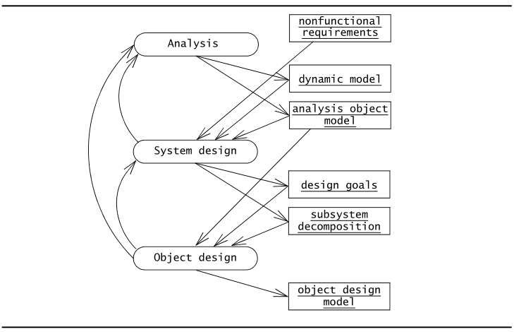

# Concetti

## Sottosistemi e classi

Allo scopo di ridurre la complessità del dominio applicativo, identifichiamo in essa parti piùù piccole chiamate "classi" e le organizziamo all'interno di packages.  

Allo stesso modo, per ridurre la complessità del *dominio (della) soluzione*, decomponiamo il sistema in parti più semplici detti **sottosistemi**, che sono costituiti da un certo numero di *classi del dominio soluzione*.  

Un **sottosistema** è una parte sostituibile del sistema con interfacce ben definite e che incapsula lo stato e il comportamento delle classi che contiene.  

Un sottosistema tipicamente corrisponde alla quantità di lavoro che un singolo sviluppatore (o un singolo team di sviluppo) può affrontare. Decomponendo il sistema nei suoi relativi sottosistemi indipendenti, team di sviluppo simultanei possono lavorare su singoli sottosistemi col minimo "overhead da comunicazione".  

Nel caso di sottosistemi complessi, applichiamo **ricorsivamente** questo principio e decomponiamo il sottosistema in ulteriori sottosistemi più semplici. Il seguente *class diagram* mostra la struttura di un sistema:  

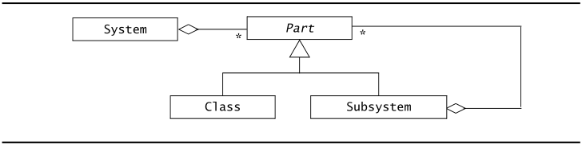

La decomposizione in sottosistemi è rappresentata mediante *UML component diagrams*. Un esempio di decomposizione in sottosistemi è la seguente:  

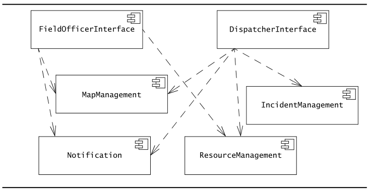

Nei *component diagrams*, i **componenti** sono raffigurati da rettancoli con l'icona del componente in alto a destra. Le **dipendenze** sono raffigurate da freccie tratteggiate.  

I componenti rappresentati in UML possono essere:  

* **componenti logici**: corrispondono a un sottosistema che non ha un equivalente al run-time esplicito
  + Ad esempio, singoli componenti di business uniti in un singolo layer logico applicativo al run-time
* **componenti logici**: corrispondono a sottosistemi con un equivalente al run-time esplicito
  + Ad esempio, un database server

Vi sono linguaggi che forniscono costrutti appositi per modellare i sottosistemi (es. i ``package`` in Java). In altri linguaggi (come C o C++), non sono presenti costrutti espliciti di questo tipo, e per questo gli sviluppatori usano apposite convenzioni per raggruppare le classi (directories, namespaces).  

## Servizi e interfacce di sottosistema

Un sottosistema è caratterizzato dai servizi che fornisce agli altri sottosistemi.  

Un **servizio** è un insieme di operazioni correlate che condividono uno scopo comune.  
Un sottosistema che fornisce servizi di notifica, ad esempio, definisce le operazioni per inviare notifiche, consultare canali di notifica, iscrivere e disiscrivere ai canali.  

L'insieme delle operazioni di un sottosistema che sono disponibili agli altri sottosistemi costituisce l'**interfaccia di sottosistema**. L'interfaccia di sottosistema include il *nome* delle operazioni, i loro *parametri* (con i rispettivi *tipi*) e i *valori di ritorno*.  

La fase di *system design* si focalizza sul definire i servizi offerti da ogni sottosistema. (La fase di *Object design*, più avanti, si focalizzerà sulle API, che raffinano e estendono le interfacce di sottosistema)  

Le interfacce *fornite* e le interfacce *richieste* possono essere rappresentate in UML col costrutto **assembly connector** (Detto anche *ball-and-socket connector*):  

* l'interfaccia *fornita* è raffigurata con una sfera col suo nome affianco
* l'interfaccia *richiesta* è raffigurata come una presa (*socket*)
* la dipendenza tra due sottosistemi è raffigurata mediante la connessione tra la corrispondente sfera e la corrispondente presa nel *component diagram*  

Un esempio di *component diagram* che utilizza il costrutto *ball-and-socket* è il seguente:  

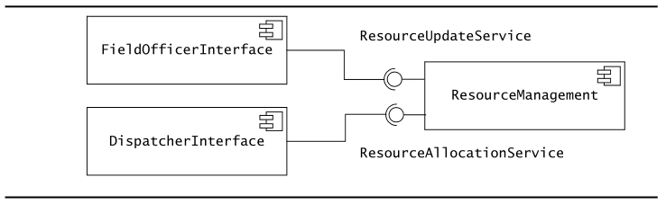

La notazione *ball-and-socket* viene utilizzata quando la decomposizione in sottosistemi diventa abbastanza stabile. Durante i primi passi del *system design*, potremmo non avere ancora una chiara visione riguardo l'allocazione delle funzionalità nei sottosistemi: in tal caso possiamo usare la notazione "*dipendenza*" mostrata nella sezione precedente, raffigurata da una freccia tratteggiata.  

La definizione di un sottosistema in termini dei suoi servizi ci aiuta a focalizzarti sulle sue interfacce anzichè sulle sue implementazioni. Quando si scrivono le interfacce di sottosistema, occorre minimizzare il numero di informazioni fornite riguardo l'implementazione. (Ad esempio, un'interfaccia di sottosistema non deve riferirsi a strutture dati interne come linked lists, arrays, hash tables). Questo ci permette di minimizzare l'impatto delle modifiche in cambio di revisioni alle implementazioni di un sottosistema.  

Più in generale, vogliamo minimizzare l'impatto delle modifiche cercando di minimizzare le dipendenze tra i sottosistemi. 

## Coesione e accoppiamento
L'**accoppiamento** (*coupling*) è il numero di dipendenze tra due sottosistemi.  
Se sue sottosistemi sono **debolmente accoppiati** (*loosely coupled*), questi sono relativamente indipendenti, di conseguenza le modifiche ad un sottosistema hanno un impatto minimo sull'altro.  
Se due sottosistemi sono **fortemente accoppiati** (*strongly coupled*), le modifiche apportate ad un sottosistema impattano molto probabilmente con l'altro sottosistema.  
Una proprietà desiderabile di una decomposizione in sottosistemi è che i sottosistemi siano tanto *debolmente accoppiati* quanto ragionevole. Questo minimizza l'impatto di errori (o modifiche future) in un sottosistema nell'altro sottosistema.  

Ridurre l'accoppiamento non è fine a se stesso. il fine ultimo è quello di ridurre la complessità e vi possono essere casi in qui un accoppiamento ridotto può portare a complessità aggiuntiva. Infatti, riducendo il *coupling*, gli sviluppatori possono introdurre dei **layer di astrazione superflui** che impiegano tempo di sviluppo (per gli sviluppatori) e tempo di esecuzione (per la macchina).  
L'alto accoppiamento diventa un problema solo se sono previste modifiche nei sottosistemi.  

Il seguente *component diagram* mostra un esempio di riduzione del coupling tra i sottosistemi. La prima alternativa mostra una situazione dove tutti i sottosistemi accedono al database direttamente, mentre la seconda alternativa "copre" il database" da un sottosistema aggiuntivo che funge da "layer di astrazione". La supposizione dietro questa scelta di design sta nella supposizione che il sottosistema ``Storage`` abbia un'interfaccia più stabile di ``Database``:  

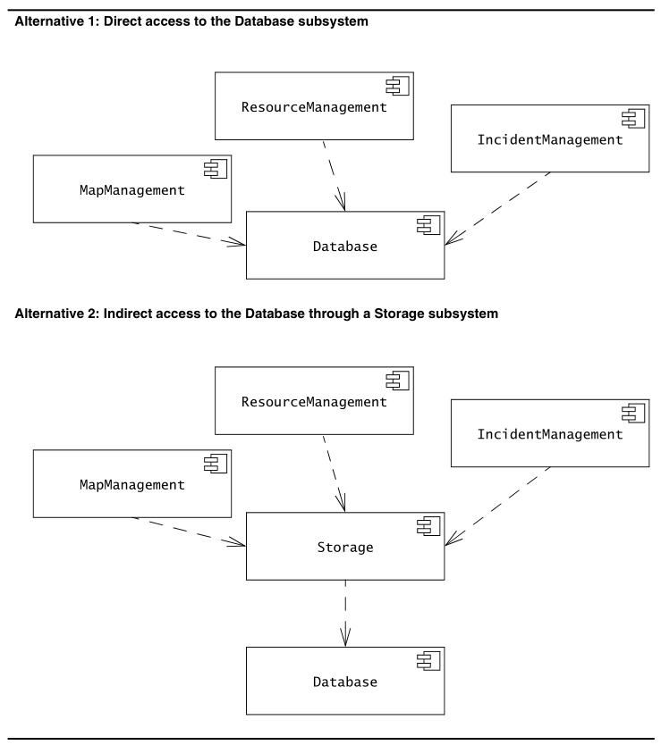

La **coesione** è il numero di dipendenze all'interno di un sottosistema.  
Se un sottosistema contiene tanti oggetti correlati tra loro e che eseguono task simili, allora la sua coesione è alta.
Se un sottosistema contiene tanti oggetti non correlati tra loro, allora la sua coesione è bassa.  

Una proprietà desiderabile di una decomposizione in sottosistemi è che i suoi sottosistemi abbiano una **alta coesione**.  

Il seguente *component diagram* mostra un esempio di sottosistema con bassa coesione:  

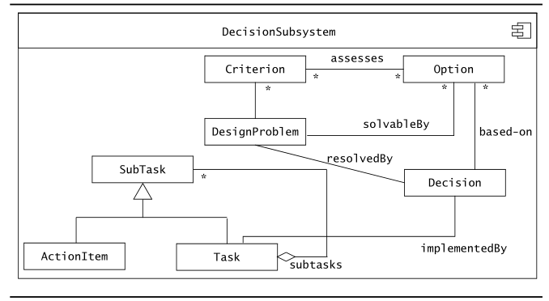

Nella figura sopra possiamo osservare come il *class model* possa essere partizionato in due sottografi. I sottosistemi risultanti sono i seguenti:  

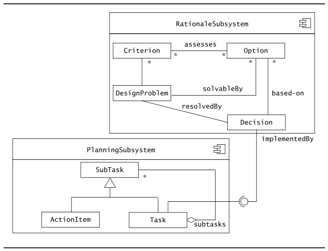

La decomposizione risultante ci permette di sviluppare (e riusare) i sottosistemi in maniera indipendente. I sottosistemi risultanti presentano una coesione più alta e l'accoppiamento tra loro risulta basso (dato che vi è solo un'associazione tra i 2 sottosistemi).  

In genere, vi è un trade-off tra coesione e accoppiamento: possiamo aumentare la coesione decomponento il sistema in sottosistemi più piccoli, ma questo porta ad un aumento dell'accoppiamento dato che il numero di interfacce cresce.  

Una buona **regola empirica** da adottare è quello di affrontare $$7\pm2$$ concetti per ciascun livello di astrazione: se vi sono più di 9 sottosistemi ad un dato livello di astrazione oppure se un sottosistema fornisce più di 9 servizi, occorre considerare una revisione della decomposizione.  

Per lo stesso motivo, il numero di layers non deve essere più di $$7\pm 2$$. Infatti, un buon system design è in genere compiuto con soli 3 layer.  

## *Layers* e partizioni

Una **decomposizione gerarchica** di un sistema produce un set ordinato di layers.  
Un **layer** è un raggruppamento di sottosistemi che forniscono servizi correlati, possibilmente realizzati usando servizi da un altro layer.  
I layer sono ordinati in modo tale che ogni layer può dipendere solo dai layer sottostanti e non ha conoscenza dei layer soprastanti. Il layer che non dipende da nessun altro è detto **bottom layer**, mentre il layer non usato da nessun altro è detto **top layer**.  

Un esempio di decomposizione distribuita in 3 layer:  

In una **architettura chiusa**, ogni layer può accedere solo al layer inferiore adiacente ad esso. In una **architettura aperta**, ogni layer può accedere a qualsiasi layer inferiore ad esso.  

Le architetture **chiuse** hanno delle proprietà desiderabili: queste portano ad un basso accoppiamento tra i sottosistemi, e i sottosistemi possono così essere integrati e testati in maniera incrementrale.  
Ogni livello, tuttavia, introduce un overhead di velocità e di spazio che potrebbe rendere difficile il soddisfacimento di requisiti non funzionali. Inoltre, aggiungere funzionalità al sistema nelle fasi "tardive" del processo di sviluppo può rivelarsi difficile, soprattutto se le aggiunte non erano state previste.  

Nella pratica, raramente un sistema viene decomposto in più di 3 o 5 layers.  

Un altro approccio per affrontare la complessità è quello di **partizionare** il sistema in *peer subsystems*, ossia *sottosistemi alla pari*, ognuno responsabile per una diversa classe di servizi. Ogni sottosistema dipende debolmente dagli altri, ma il più delle volte opera in maniera "indipendente".  

La decomposizione in sottosistemi è in genere il risultato sia del *partizionamento* che del *layering*.   

Un approccio è quello di partire da sottosistemi di alto livello per poi ricorsivamente decomporli in sottosistemi di più basso livello fino a raggiungere sottosistemi implementabili da un singolo sviluppatore (o da un singolo team) senza però risultare in un aumento di complessità.  

In generale, una decomposizione in sottosistemi è il risultato sia di un'opera di layering che di un opera di partitioning. Come prima cosa partizioniamo il sistema in sottosistemi di alto livello facendo sì che ogni sottosistema operi in nodi hardware diversi oppure che ogni sottositema abbia una responsabilità ben definita (*separation of concerns*): ogni sottosistema risultante, se abbastanza complesso, viene poi decomposto in layer di più basso livello fin quanto non diventano abbastanza semplici da essere implementati da un singolo sviluppatore (o team).  

Ogni sottosistema aggiunge overhead dato dall'interfacciamento con altri sottosistemi. Troppo layering o partitioning può aumentare la complessità.  

### Esempi

Un esempio di architettura chiusa è il modello **OSI**, composto da 7 layer di cui ognuno è responsabile per l'esecuzione di funzioni ben definite e fruisce dei servizi offerti dal layer immediatamente inferiore.  

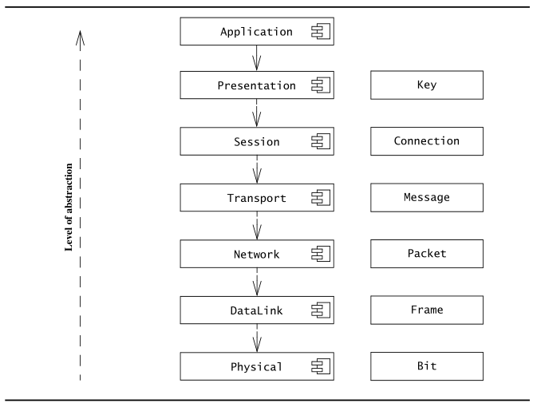

In precedenza, solo i 4 layer inferiori del modello OSI (dal layer fisico fino al trasporto) erano ben standardizzati. Gli sviluppatori di applicazioni dovevano quindi riempire il gap tra il layer di *Trasporto* col layer di *Applicazione*. Col numero sempre crescente di applicazioni distribuite, questo gap ha motivato lo sviluppo di middleware come CORBA e Java RMI. CORBA e Java RMI permettono l'accesso ad oggetti remoti in maniera trasparente, come se fossero oggetti locali, implementando quindi di fatto i layer di *Presentazione* e di *Sessione*. Il seguente è quindi un altro esempio di architettura chiusa*:  

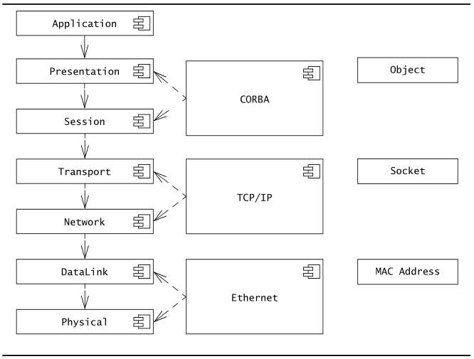

Un esempio di architettura aperta è dato dallo *Swing user interface toolkit for Java*:  

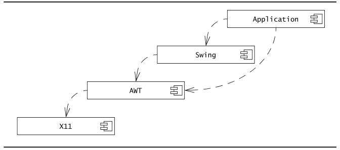

## Stili architetturali
Con l'aumentare della complessità dei sistemi, la specifica della decomposizione in sottosistemi è critica. È difficile modificare o correggere una scarsa decomposizione una volta che lo sviluppo è iniziato, dato che molte interfacce dei sottosistemi dovrebbero cambiare di conseguenza. A tal proposito, il concetto di **architettura software** è emerso.  

Una architettura software include la decomposizione del sistema, il flusso di controllo globale, la gestione delle boundary conditions e i protocolli di comunicazione tra sottosistemi.  

In questa sezione sono descritti degli stili architetturali che possono essere usati come base per le architetture dei diversi sistemi.  

### Repository

Nello **stile architetturale a repository**, i sottosistemi accedono e modificano una struttura centrale detta *repository*.  

I sottosistemi sono relativamente indipendenti (*loosely coupled*) dato che interagiscono solo attraverso il repository.  

Il flusso di controllo può essere dettato dal repository (ad esempio: trigger sui dati che invocano altri sottosistemi) oppure dai sottosistemi (ad esempio: flusso di controllo indipendente e sincronizzazione mediante lock nel repository)  

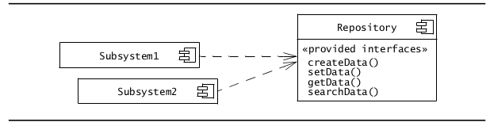

I repository sono usati tipicamente per i DBMS: la centralità dei dati facilita il controllo di problemi di concorrenza e integrità tra i sottosistemi.  

I repository sono usati tipicamente anche dai *compilatori* e dai *software development environment*: i diversi sottosistemi di un compilatore accedono e aggiornano un *albero di parsing* centrale e una *tabella dei simboli*. I debugger e gli editor sintattici possono anche loro accedere a questa tabella dei simboli.  

I sottosistemi a repository possono implementare il controllo di flusso globale: nel caso del compilatore, ogni sottosistema invoca il repository centrale, mentre quest'ultimo si occupa di serializzare le chiamate concorrenti.    

Al contrario, può essere un repository a invocare gli altri sottosistemi in base allo stato della struttura dati centrale: sistemi di questo tipo sono detti **sistemi blackboard**.    

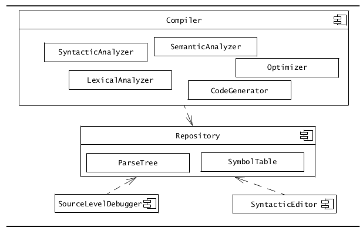

I repository sono adatti per applicazioni con task di elaborazione dati che cambiano di frequente. Una volta che un repository centrale è stato definiti, nuovi servizi possono essere definiti facilmente nella forma di sottosistemi aggiuntivi.  

Lo svantaggio principale dei sistemi a repository sta nel fatto che il repository centrale può diventare facilmente un collo di bottiglia. Inoltre, il coupling tra ogni sottosistema e il repository è alto, pertanto è difficile cambiare il repository senza impattare su tutti i sottosistemi.  

### Model/View/Controller
Nello stile architetturale *Model/View/Controller* (**MVC**), i sottosistemi sono classificati in 3 diversi tipi: 

* il sottosistema **model** manientene la conoscenza del dominio applicativo
  + fornisce quindi i metodi per accedere ai dati utili all'applicazione
  + non dipende dai sottosistemi *view* e *controller*. I cambiamenti nel suo stato sono rilevati mediante un protoccolo di *subscribe/notify*
* il sottosistema **view** visualizza all'utente gli oggetti del dominio applicativo (ossia i dati contenuto nel model) e si occupa dell'interazione con gli utenti
* il sottosistema **controller** è responsabile della sequenza di interazioni con l'utente
  + riceve i comandi dell'utente (in genere attraverso il view) e li attua modificando lo stato degli altri due componenti  

L'MVC è un caso speciale di repository dove il *model* implementa la struttura dati centrale mentre gli oggetti *control* dettano il flusso di controllo.  

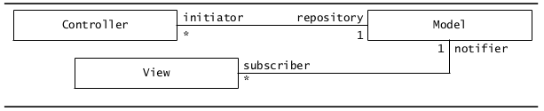  
Il motivo per cui si separano *Model*, *View* e *Controller* è che le interfacce utenti sono soggette a cambiamenti più spesso di quanto avviene per la conoscenza del dominio. (il *model*). MVC è appropriato per sistemi interattivi, specialmente quando si utilizzano viste multiple dellos tesso model. Tuttavia, MVC introduce lo stesso collo di bottiglia visto per lo stile repository.  

Il seguente *communication diagram* mostra una sequenza di eventi nello stile architetturale MVC:  

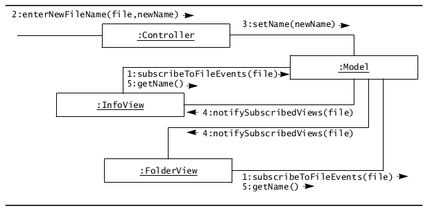

MVC è un *pattern architetturale* molto diffuso nello sviluppo di interfacce grafiche di sistemi software OO. Originariamente impiegato dal linguaggio *Smalltalk*, è stato poi sposato da numerose tecnologie come ad esempio i framework *Java Swing*, *JSF* e *Struts*  

### Client/Server  

Nello stile architetturale *client/server/, un sottosistema *server* fornisce servizi a istanze di altri sottosistemi detti *client*, responsabili per l'interazione con l'utente.  
La richiesta di un servizio è tipicamente fatta via un meccanismo di *chiamata di procedura remote* o da un *common object broker* (es. CORBA, Java RMI, HTTP).  
Il flusso di controllo nei client e nei server è indipendente eccetto per la sincronizzazione per la gestione delle richieste e delle risposte.  

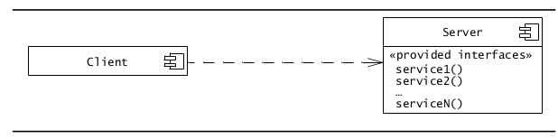

Un sistema di informazioni con un database centrale è un esempio di *client/server*. In questo caso, lo stile architetturale *Client/server* è un caso particolare di stile repository in cui la struttura dati centrale è gestita da un processo.  

Il client in genere si occupa dell'interazione utente, di collezionare i dati, effettuare un elaborazione preliminare prima di inviarli al server e iniziare la transazione.  

Il server si occupa di ricevere i dati, eseguire la transazione e garantire l'integrità dei dati, la sicurezza del database e la concorrenza delle operazioni.  

In un'architettura *client/server* un client può accedere anche a più di un server: il *World Wide Web* è un'istanza di architettura *client/server* e permette ai client di accedere a dati di migliaia di server diversi.  

Lo stile architetturale *client/server* si presta bene a sistemi distribuiti che gestiscono grandi quantitativi di dati.  

Tuttavia, talvolta può essere necessario un meccanismo di comunicazione "tra pari" (*peer-to-peer*). A tal proposito, vi è una generalizzazione dello stile *client/server* detta **architettura peer-to-peer**  

### Peer-to-peer

Lo stile architetturale *peer-to-peer* è una generalizzazione del *client/server* in cui i sottosistemi agiscono sia da client che da server (ossia, i sottosistemi possono richiedere e offrire servizi).  
Il flusso di controllo all'interno di ogni sottosistema è indipendente tranne che per la sincronizzazione delle richieste.   

Un esempio di *peer-to-peer* è un database che accetta richieste dall'applicazione e notifica l'applicazione quando certi dati sono cambiati.    

I sistemi *peer-to-peer* sono più difficili da progettare dei sistemi *client/server* in quanto introducono la possibilità di deadlocks e complicanze col flusso di controllo.  

### Three-tier  

Lo stile architetturale *Three-tier* organizza i sottosistemi in 3 layer.  

* L'*interface layer* include tutti gli oggetti boundary che interagiscono con l'utente
  + finestre, form, pagine web, …
* L'*application logic layer* include tutti gli oggetti *control* e *entity*
  + Questo layer realizza le elaborazioni, le regole di verifica e la notifica richiesta dall'applicazione
* Lo *storage layer* realizza la memorizzazione, il recupero e l'interrogazione di oggetti persisenti  

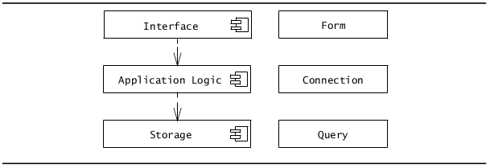  

Il layer di *storage*, in modo analogo ad un sottosistema *Repository*, può essere condiviso da diverse applicazioni che operano suglis tetti dati.  
Inolte, la separazione dei layer di interfaccia e di logica applicativa permettono lo sviluppo di diverse interfacce grafiche per la stessa logica applicativa.  

### Pipeline  

Nell'*architettura a flusso di dati* (*pipeline*) i sottosistemi processano i dati ricevuti da un insieme di input e inviano i risultati ad altri sottosistemi via un insieme di output. I sottosistemi sono chiamati "*filtri*" mentre le associazioni tra i sottosistemi sono chiamate "*pipe*".  
Ogni filtro conosce solo il contenuto e il formato dei dati ricevuti sulle *pipe* in input. Ogni filtro è eseguito in maniera concorrente: la sincronizzazione è compiuta dalle *pipe*.  

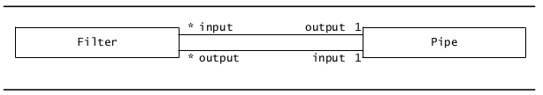   
L'esempio migliore di architetture *pipeline* è dato dalla Shell UNIX.  

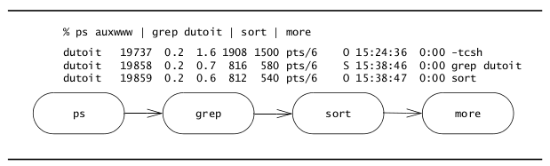  
L'architettura a *pipeline* si presta particolarmente bene a sistemi che applicazioni trasformazioni a flussi di dati senza interventi da parte dell'utente. Questa architettura non è adatta a sistemi che richiedono interazioni complesse tra i componenti (come i sistemi interattivi)   

# Attività (dagli oggetti di analisi ai sottosistemi)
Il system design consiste nel trasformare il modello di analisi nel *design model* (modello di progettazione) che tiene conto dei requisiti non funzionali descritti nel RAD.  

## Ottenere il modello di analisi

Innanzitutto partiamo con l'ottenere il modello di analisi: prendiamo i casi d'uso e, secondo le tecniche nel capitolo sull'analisi dei requisiti ([[Analisi]]) individuiamo gli oggetti di analisi. Quello che otteniamo è il modello di analisi come il seguente:  

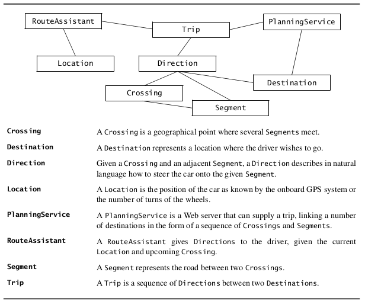  

## Definire i Design Goals  

La definizione degli *obiettivi di design* è il primo passo verso il system design. Esso identifica le qualità su cui il nostro sistema dovrebbe focalizzarsi.  

Molti obiettivi di design possono essere dedotti dai requisiti non funzionali o dal dominio applicativo. Altri obiettivi di design, invece, vanno raccolti dal committente. Tali obiettivi di design vanno in ogni caso specificati in maniera esplicita.  

Il seguente è un esempio di design goal specificati in funzione dei requisiti non funzionali raccolti durante le fasi precedenti:  

    
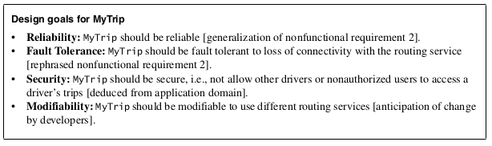   
### Categorie di Design Goals  
Possiamo stabilire gli obiettivi di design in base a molti criteri. I criteri possono essere suddivisi in cinque gruppi: *performance*, *dependability* (affidabilità), *cost*, *maintenance* e *end-user criteria*  

I criteri riguardanti le performance, l'affidabilità e i criteri dell'utente finale sono solitamente specificati nei requisiti o dedotti dal dominio applicativo.  
I criteri riguardanti il costo e la manutenzione sono dettati dal cliente e dal fornitore.  

#### Criteri di Performance  

I *criteri di performance* includono i requisiti di velocità e di spazio imposti sul sistema.   
*Il sistema dovrebbe essere reattivo, o deve massimizzare il numero di task compiuti? Vi è spazio in memoria disponibile per ottimizzazioni di velocità, oppure la memoria dovrebbe essere usata con parsimonia?*    

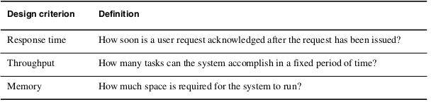    

#### Criteri di affidabilità  

I *criteri di affidabilità* determinano quanto sforzo dovrebbe essere speso nel minimizzare i crash di sistema e le sue relative conseguenze.  

*Quanto spesso il sistema può crashare? Quanto deve essere disponibile il sistema agli utenti? Il sistema deve tollerare situazioni di errore e di failure? Vi sono rischi alla sicurezza associati con l'ambiente di sistema? Vi sono rischi alla sicurezza associati con i crash di sistema?*  

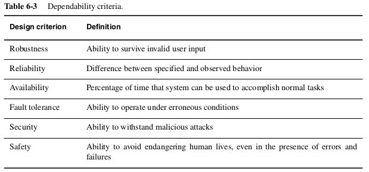    

#### Criteri di costo  

I *criteri di costo* includono il costo per sviluppare il sistema, per il suo *deploy*, e per amministrarlo. I criteri di costo non includono solo considerazioni di tipo progettuale ma anche considerazioni di carattere *manageriale*.  
Quando un sistema ne rimpiazza uno vecchio, il costo per assicurare la retrocompatibilità o il costo per effettuare una transizione completa vanno tenuti in considerazione. Vanno tenuti in considerazione i trade-off anche in termini di costi di sviluppo, di *formazione degli utenti finali*, dei costi di transizione, dei cosi di manutenzione…  

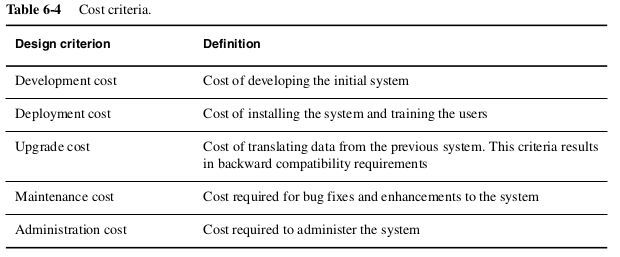 

  
#### Criteri di manutenzione  

I *criteri di manutenzione* determinano quanto è difficile modificare il sistema dopo il suo impiego.  
*Quanto facilmente dovrebbero essere aggiunte nuove funzionalità? Quanto facilmente dovrebbero essere revisione delle funzioni esistenti? Può il sistema essere adattato ad un diverso dominio applicativo? Quanto sforzo sarà richiesto per portare il sistema ad una diversa piattaforma?*  

Questi criteri sono difficili da ottimizzare e pianificare, dato che rararemente si è a conoscenza dell'esito del progetto e di quanto a lungo il sistema sarà operativo.  

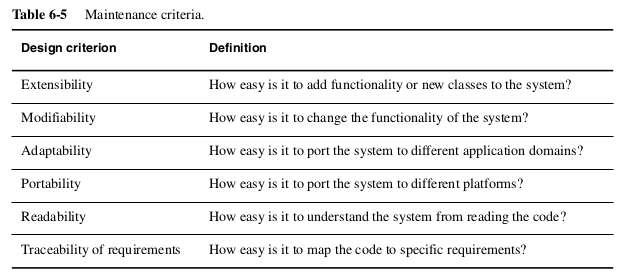   
#### Criteri dell'utente finale

Gli *end user criterion* includono le qualità desiderabili dal punto di vista dell'utente finali non ancora coperte dai criteri delle altre categorie.  

*Il software è difficile da usare o da imparare? Possono gli utenti svolegere i task necessari sul sistema*    

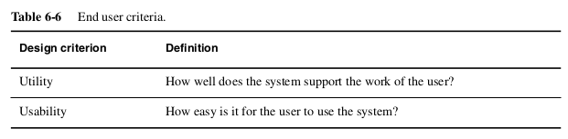   
### Prioritizzare design goal e giungere a compromessi

Quando si definiscono i design goals, solo una piccola porzione di quei criteri può essere simultaneamente tenuta in considerazione. Sarebbe irrealistico sviluppare un software che sia allo stesso tempo sicuro, veloce ed economico.  

Tipicamente, gli sviluppatori devono *prioritizzare* gli obiettivi di design goals e giungere a compromessi tra gli obiettivi posti in gioco (ma anche tra gli obiettivi di carattere manageriale, dato che ci sono delle tempistiche e dei budget da rispettare).  

La seguente tabella elenca i possibili trade-off:  

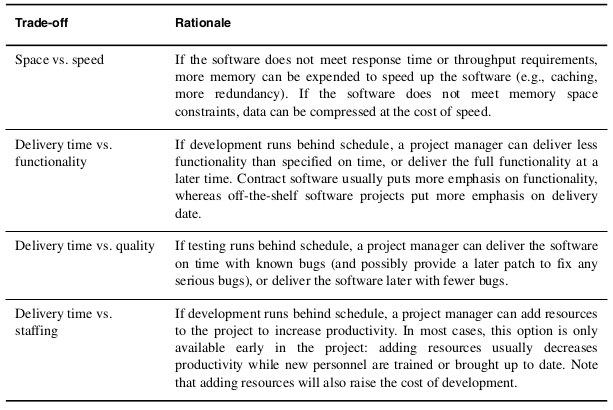 
  
Gli obiettivi di carattere manageriale possono essere scambiati con obiettivi di natura tecnica (es. tempi di consegna vs funzionalità aggiuntive). Una volta che si ha una chiara idea degli obiettivi di design, si può procedere con una prima progettazione della decomposizione in sottosistemi.  
  
## Identificare i sottosistemi: alcune euristiche

Individuare i sottosistemi durante la fase di progettazione è simile a trovare gli oggetti di analisi durante la fase di [[Analisi]]. Alcune tecniche di identificazione degli oggetti, come le euristiche di Abbott, sono applicabili all'identificazione dei sottosistemi.  

La decomposizione in sottosistemi è costantemente revisionata ogni volta che nuove problematiche vengono indirizzate: possono esserci accorpamenti, decomposizioni, nuove aggiunte tra i sottosistemi…  

La decomposizione in sottosistemi iniziale dovrebbe derivare dai requisiti *funzionali*.  

Ad esempio, nel modello di analisi risultante dalla fase di analisi, possiamo individuare tutti gli oggetti in comune in determinati casi d'uso e associarli ad un apposito sottosistema.   
Nel seguente esempio (Riconducible al modello di analisi di esempio visto sopra) possiamo vedere un sottosistema ``PlanningSubsystem`` contenente l'insieme di oggetti fortemente accoppiati legati all'oggetto ``Trip``, usato in alcuni use case (omessi in questa pagina). Gli altri oggetti sono stati associati ad un altro sottosistema, ``RoutingSubsystem``. In questo modo vi è solo un'associazione che attraversa i confini dei due sottosistemi.  

Un'altra euristica per l'identificazione dei sottosistemi è quella di mantenere insieme gli oggetti correlati funzionalmente. Un punto di partenza è quello di assegnare gli ogetti partecipanti identificati in ogni use case ad un sottosistema dedicato. Alcuni gruppi di oggetti risultano condivisi tra i sottosistemi e usati per la communicazione tra questi: è possibile decidere se creare un apposito sottosistema "di intramezzo" oppure assegnare l'oggetto comune al sottosistema che lo crea.  

Le seguenti sono alcune euristiche per il raggruppamento degli oggetti nei sottosistemi:  

* Assegna gli oggetti identificati in uno use case nello stesso sottosistema
* Crea un sottosistema dedicato per oggetti usati per muovere dati tra i sottosistemi
* Minimizza il numero di associazioni che attraversano i confini dei sottosistemi
* Tutti gli oggetti nello stesso sottosistema devono essere correlati funzionalmente    

Una volta raggruppati tutti gli oggetti correlati in un sottosistema, è possibile introdurre un oggetto di **facciata** (*façade pattern*) per creare un'interfaccia unificata nel sottosistema, nascondere le classi interne e ridurre il coupling tra i sottosistemi:  

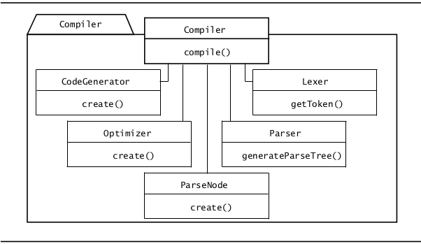 

## bzbzbbzbz
Il system design è costituito dalle seguenti attività:  

* **Identificare gli obiettivi di design**
  + Gli sviluppatori identificano quali caratteristiche di qualità dovrebbero essere ottimizzate e definiscono le priorità di tali caratteristiche
* **Progettazione della decomposizione del sistema in sottosistemi**
 + Basandosi sugli use case e i modelli di analisi, gli sviluppatori decompongono il sistema in parti più piccole. Utilizzano stili architetturali standard
* **Raffinare la decomposizione in sottosistemi per rispettare gli obiettivi di design**
  + La decomposizione iniziale di solito non soddisfa gli obiettivi di design. Gli sviluppatori la raffinano finchè gli obiettivi non sono soddisfatti  

