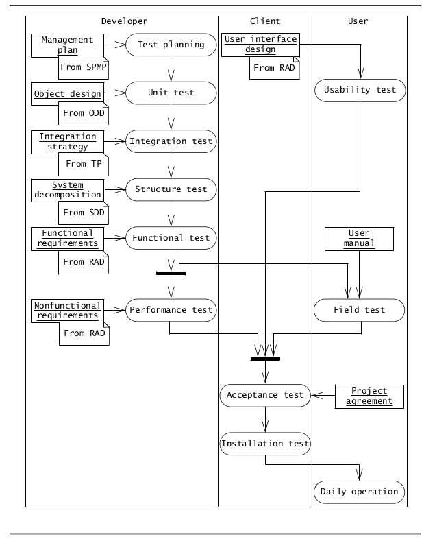
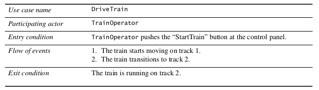
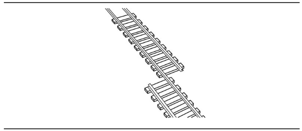
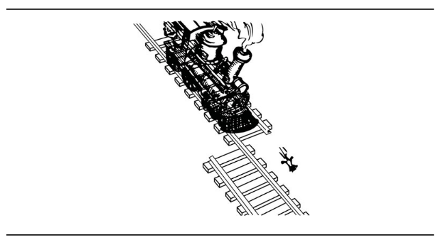
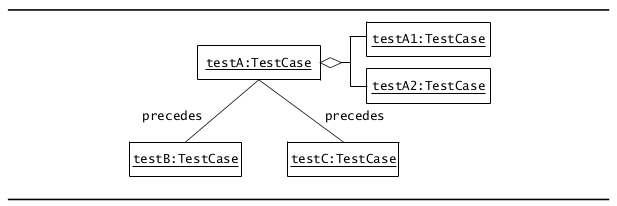
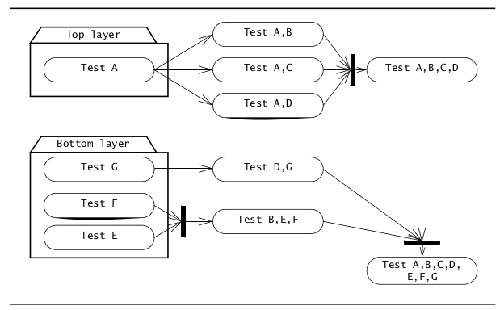
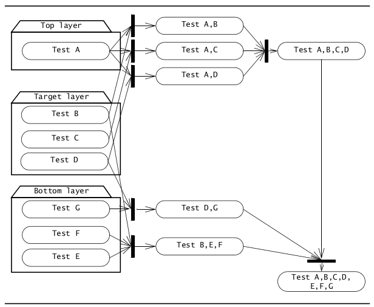
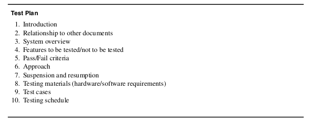
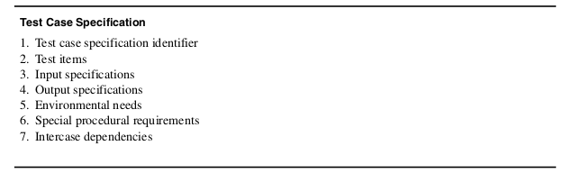

* TOC  
{:toc}

#  Introduzione

Il **Testing** è il processo che consiste nel trovare differenze tra il comportamento aspettato specificato dai modelli di sistema e il comportamento osservato nel sistema implementato.  

L'obiettivo del testing è progettare test che rivelino i problemi e i difetti del sistema. Il testing è un'attività distruttiva; le attività precedenti sono attività costruttive. Di conseguenza, il testing è un'attività mirata principalmente agli sviluppatori non direttamente coinvolti nella costruzione del sistema.  

L'**affidabilità** è la misura del successo con cui il comportamento osservato corrisponde al comportamento previsto. L'**affidabilità software** è la probabilità che un sistema software non causi *system failure* per un lasso di tempo specificato e sotto determinate condizioni.  

Il **failure** è una deviazione del comportamento osservato rispetto al comportamento previsto.  

Un **errore** (o *stato erroneo*) significa che il sistema si trova in uno stato tale da portare al sistema verso un *failure* nelle successive elaborazioni.  

Un **fault** (o *defect* o *bug*) è la causa algoritmica (o meccanica) di uno *stato erroneo*.  

Il **testing** è lo sforzo sistematico di trovare *fault* in modo pianificato nel software implementato.  
L'obiettivo del testing è massimizzare il numero di *fault* scoperti al fine di poterli correggere per massimizzare l'affidabilità del sistema. Paradossalmente, un caso di test potrebbe dirsi di essere effetuato con "successo" se sono trovati dei fault, avendo perseguito il suo obiettivo principale.  

Un sistema software è rilasciato quando i tentativi di "sabotaggio" (testing) mostrano un certo livello di confidenza tale che il sistema software faccia esattamente quello che dovrebbe fare. Vi sono molte tecniche per aumentare l'affidabilità di un sistema software:  

* **Fault avoidance**: tecniche che provano a rilevare i *fault* staticamente
  + Ossia, senza dover esecuire nessun modello di sistema (in particolare, il *code model*)
  + Mira a prevenire l'inserimento di fault nel sistema prima che questo venga rilasciato
  + Include metodologie di sviluppo, configuration management e verifica
* **Fault detection**: tecniche del genere, come il debugging e il testing, sono rispettivamente esperimenti *non controllati* e *controllati*.
  + Mirano a identificare stati erronei e fault prima del rilascio del sistema, ma non a recuperare il sistema dai failure causati da questi
  + Tecniche di questo tipo sono applicate durante lo sviluppo (o dopo il rilascio del sistema in alcuni casi)
    - Una black box in un aereoplano che logga gli ultimi minuti è un esempio di tecnica *fault detection*
* **Fault tolerance**: suppone che il sistema venga rilasciato con dei *fault* e che i *system failure* scaturiti da questi si possano "riparare" a runtime.
  + Esempio: sistemi a moduli rodndanti

In questio capitolo ci si focalizza su tecniche *fault detection*, che includono il *Review* e il *Testing*.  

Il **Review** è l'ispezione manuale di parti del sistema senza dover eseguire il sistema. Vi sono due tipo di *review*:  

* **code walkthrough**: lo sviluppatore presenta in modo informale le API, il codice e la documentazione associataal team di revisione. Il team di revisione espone commenti sul mapping tra analisi e dell'object design rispetto al codice usando i casi d'uso e i diagrammi di analisi.
* **inspection**: simile al *walkthrough*, ma la presentazione della componente è formale: allo sviluppatore non è consentito presentare il codice, ma sarà il team stesso a valutare l'artefatto nel rispetto dei requisiti funzionali e non funzionali esposti. Lo sviluppatore sarà presente solo nel caso di chiarimenti su definizioni e utilizzi di determinate strutture dati o algoritmi  

Il **debugging** parte dall'assunto che i fault possano essere trovati a partire da un failure non pianificato. Lo sviluppatore muove il sistema in una serie successiva di stati, fino ad arrivare e ad identificare lo *stato erroneo*. Una volta identificato lo stato, il *fault* meccanico/algoritmico che ha causato tale *failure* deve essere determinato.  
Ci sono due tipi di *debugging*:  

1. **Correctness debugging**: trovare ogni deviazione tra requisiti funzionali e comportamento osservato
2. **Performance debugging**: affronta la deviazione tra proprietà osservate e requisiti non funzionali.  

Il **testing** è una tecnica di rilevazione dei *fault* che mira a creare *failure* o *stati erronei* in modo pianificato. Questo consente allo sviluppatore di rilevare *failure* nel sistema prima che questo venga rilasciato.  
Tale definizione implica che un *successful test* sia un test che abbia identificato un *fault*. Un'altra definizione usata spesso di testing è quella di *dimostrare che non vi sono fault*: questa definizione sarà usata solo dopo aver sviluppato il sistema, quando occorre dimostrare che il sistema consegnato rispetta tutti i requisiti imposti.  
Se usassimo la seconda definizione ogni volta, scriveremmo casi di test con bassa probabilità di fallire.  

La caratteristica di un buon *test model* è quella di contenere casi di test che identifichino i *fault*. I test dovrebbero includere un'ampia gamma di valori di nput, includi input nonvalidi e casi limite.  

Il seguente activity diagram mostra una panoramica delle attività nella fase di testing:  

  

# Concetti  

## Fault, stati erronei, failure  

Per poter parlare di stati erronei, failure o fault occorre innanzitutto conoscere il comportamento desiderato in modo tale da poterlo distinguere dal comportamento osservato.   

Nella pratica, dato il seguente Use Case:  

Il seguente è un esempio di *fault*:  

Che porta al seguente stato erroneo:  

Casi di **fault algoritmici** possono essere: condizione if sbagliata, uscire da un while troppo presto…  Questi sono *fault* specifici dell'implementzione; esistono anche fault che avvengono durante l'analisi e la progettazione (es. struttura dati specificata nell'object design non idonea, throughput non rispetta requisiti non funzionali).  

Un **fault meccanico** è un fault determinato da fattori esterni: un terremoto, un errore nel sistema host, nella macchina virtuale, perdita di corrente elettrica. Anche se uno sviluppatore dovesse implementare tutto correttamente, vi è sempre possibilità che un *fault meccanico* possa avvenire.   

Da notare la stretta correlazione tra *failure* e *fault*: un *failure* di un componente elettrico può portare a un *fault* nel sistema.  

## Casi di test  

Un **caso di test** è un insieme di dati in input e risultati attesi esercitati allo scopo di causare *failures* e rilevare *faults*.  

Un caso di test ha 5 attributi:  

* *nome*: consente di distinguere il caso di test
  + una euristica per denominare i test è quella di denominarli in base ai requisiti da testare o al componente da testare
    - es: ``test_deposit`` per testare ``deposit()`` o ``test_AB`` per testare ``A`` e ``B``
* *location*: descrive dove può essere trovato il caso di test
  + corrisponde a un percorso o un URL per l'eseguibile e i suoi input
* *input*: descrive l'insieme di dati in input (o comandi) inseriti dall'attore per il test case
  + i dati in input sono inseriti da un *tester* o da un *test driver*
* *oracolo*: descrive il comportamento atteso dal caso di test, ossia ai dati in output o comandi che corrispondono a una corretta esecuzione della componente testata
* *log*: output prodotto dal test  

Una volta identificati e descritti i casi di test, vengono identificare le relazioni tra questi.  

  

Nell'esempio sopra, viene eseguito prima ``testA`` che consiste nei test ``testA1``e ``testA2`` (*UML aggregation*), poi vengono eseguiti ``testB`` e ``testC``, per la relazione *precedes*.  

I casi di test sono classificati in *blackbox tests* e *whitebox tests*, a seconda di quali aspetti del system model vengono testati:  

* **Blackbox test**: sul comportamento di input/output del componente.
  + Non si ha a che fare con gli aspetti interni del componente, nè col comportamento o la struttura di tali componenti
* **Whitebox test**: si focalizza sulla struttura interna della componente
  + Ci si assicura che, indipendentemente dal particolare comportamento input/output, venga testato ogni stato nel modello dinamico dell'oggetto e ogni interazione tra gli oggetti
  + I dati in input richiesti per il white box test vanno oltre i dati derivabili dai requisiti

Il *test di unità* combina entrambe le tecniche di testing: blackbox testing per testare le funzionalità della componente e whitebox testing per testare la struttura e gli aspetti dinamici della componente.  

### Test stubs e driver  

Eseguire casi di test su single componenti o combinazioni di componenti richiede che queste siano isolate dal resto del sistema.  

I *test driver* e i *test stubs* sono usati per sostituire parti mancanti del sistema.  

Un **test driver** simula la parte del sistema che chiama la componente durante il test. Il test driver passa alla componente gli input identificati nell'analisi dei casi di test per poi visualizzare il risultato.  

Un **test stub** simula una componente chiamata dalla componente testata. Lo stub deve fornire le stesse API del metodo simulato e deve avere un contratto quindi coerente con la componente simulata.  

L'implementazione di un test stub non è un compito banale: vi sono vari trade off che vanno dall'implementare un test stub "dummy" (restituisce sempre le stesse cose) all'implementare un test stub accurato fino al sostituire lo stub col componente vero e proprio; generalmente gli stub sono creati dopo che il componente è completo.    

### Correzioni  

Una volta eseguiti i test e rilevati i failures, gli sviluppatori modificano i componenti per eliminare i fault sospetti. Una **correzione** è una modifica ad un componente con lo scopo di correggere un fault.  

Le correzioni spaziano da una semplice modifica a un componente fino a un completo redesign di un sottosistema. In ogni caso, la probabilità di introdurre nuovi fault in questi casi è alta. Vi sono numerose tecniche per minimizzare tale occorrenza:  

* *Problem tracking*: include la documentazione di ogni failure, stato erroneo e fault rilevati; include la correzioni e le revisioni dei componenti coinvolti nella modifica
  + Questo, insieme al configuration management, permette agli sviluppatori di restringere il campo di ricerca per i nuovi fault
* *Regression testing* include la riesecuzione di tutti i test precedenti dopo una modifica. Questo ci assicura che la modifica non abbia impattato su funzionalità già funzionanti
  + Questa tecnica è importante per metodi OO, che richiedono un approccio di sviluppo iterativo
  + Questa tecnica è costosa, specialmente quando i test non sono automatizzati
* *Rationale maintenance* include la documentazione del rationale per i cambiamenti e le relationi tra il rationale e il componente revisionato  

# Attività di testing  

## Component inspection  

Le *Component Inspections* trovano i fault in una componente revisionando il loro codice sorgente in incontri formali.  

Le ispezioni possono essere condotte prima o dopo i test di unità. L'ispezione è condotta da un team di sviluppatori, includendo l'autore del componente, un moderatore che facilita il processo e uno o più reviewer che trovano fault nel componente.  

Il metodo per l'ispezione stilavo da Fagan [Fagan, 1976] consiste nei seguenti step:  

1. *Panoramica*: l'autore del componente presenta brevemente lo scopo e l'ambito del componente e gli obiettivi dell'ispezione
2. *Preparazione*: i *reviewer* acquistano familiarità con l'implementazione del componente
3. *Incontro di ispezione*: un lettore parafrasa il codice sorgente del componente, mentre il team di ispezione mette in mezzo eventuali questioni/problematiche. Un moderatore tiene traccia dell'incontro
4. *Rework*: l'autore revisione il componente
5. *Follow-up*: il moderatore controlla la qualità del rework e decide se è necessario o no un'ulteriore ispezione  

Gli step critici in questo processo sono la fase di preparazione e quella di incontro.  

David Parnas propose una revisione del processo di ispezione (*Active design review*) che elimina lo step di incontro: ai reviewers viene ivnece chiesto di trovare i fault durante la fase di preparazione. Alla fine di tale fase, ogni reviewer compila un questionario che testa la comprensione di tali reviewer sul componente in questione. L'autore del componente incontra poi individualmente ogni reviewer per accumulare feedback sul componente.  

Entrambi metodi di ispezione sono largamente usati in progetti *safety-critical*.  

## Test di usabilità  

Gli **usability testing** testano le conoscenze degli utenti riguardanti il sistema.  
I test di usabilità non confrontano il sistema rispetto alle specifiche, ma invece si focalizzano sul trovare differenze tra le aspettative degli utenti e il sistema stesso riguardo a cosa quest ultimo debba fare.  

Siccome è difficile definire un modello formale dell'utente su cui effettuare il test, il test di usabilità richiede un approccio empirico: i partecipanti che rappresentano gli utenti utilizzano l'interfaccia utente (o una sua simulazione) e trovano dei problemi.  

I test di usabilità tengono in considerazione anche i dettagli dell'interfaccia utente: look and feel, layout geometrici degli schermi, sequenza di interazioni, hardware… Ad esempio, in caso di computer wearable, un test di usabilità potrebbe testare l'abilità di eseguire un determinato comando quando si è una posizione strana.  

La tecnica per condurre per condurre test di usabilità è basata sul tipico approccio per condurre un esperimento controllato. Gli sviluppatori formulano un insieme di obiettivi di test, descrivendo quello che desiderano testare. Gli obiettivi sono valutati in una serie di esperimenti in cui viene detto ai partecipanti di eseguire determinati task. Gli sviluppatori osservano i partecipanti e accumulano dati (tempo per compiere un task, tasso di errore) e preference (opinioni e pensieri durante il processo).  

Vi sono tre tipi di test di usabilitò:  

* **Scenario test**: a uno o più utenti viene presentato uno scenario visionario del sistema. Gli sviluppatori identificano la velocità con cui gli utenti riescono a comprendere tale scenario, con che accuratezza tale scenario rappresenta il loro modello di lavoro, e la loro reazione alla descrizione di tale sistema.
  + Lo scenario può essere realizzato come mockup o come semplice ambiente di prototipazione
  + Il vantaggio è che sono economici da realizzare e replicare
  + Lo svantaggio è che gli utenti non possono interaggire direttamente col sistema; i dati sono fissati
* **Prototype test**: agli utenti finali viene presentato un pezzo di software che implementa aspetti chiave del sistema
  + Un **prototipo verticale** implementa completamente un caso d'uso del sistema. Sono usati per valutare i requisiti principali (es. tempo di risposta del ristema o comportamento dell'utente)
  + Un **prototipo orizzontale** implementa un singolo layer del sistema
    - Un esempio è un **prototipo dell'interfaccia utente** che presenta un'interfaccia per molteplici casi d'uso, senza però offrire alcuna funzionalità.
    - Sono usati per valutare questioni che riguardano, ad esempio, i layout delle finestre
  + Un **prototipo del Mago di Oz** è un prototipo dell'interfaccia utente in cui un operatore umano intercetta le azioni dell'utente e restituisce la risposta desiderata
    - Usati per lo sviluppo di programmi di riconoscimento vocale
    - Forniscono una visione realistica del sistema agli utenti
* **Product test**: simile al *prototype test*, ma viene fornito una versione funzionante del sistema anziché un prototipo.
  + Un test del genere può essere condotto solo dopo aver sviluppato il sistema
  + È richiesto che il sistema sia facile da modificare, per andare incontro ai feedback ricevuti  

In tutti e tre i tipi di test, gli elementi principali del testing di usabilità includono:  

* Sviluppare obiettivi per il test
* Un campione rappresentativo degli utenti
* Un ambiente di lavoro simulato o reale
* Un sondaggio estensivo e controllato degli utenti fatto dalle persone che conducono il test
* Collezionare e analizzare risultati qualitativi e quantitativi
* Feedback su come migliorare il sistema  

I tipici obiettivi che vengono posti in questa tipologia di test sono il confronto tra due stili di interfacce, l'identificazione delle migliori e delle peggiori funzionalità, l'identificazione degli ostacoli principali, l'identificazione di funzionalità utenti e l'identificazione del training necessario per gli utenti.  

## Testing di unità

I **test di unità** si focalizzano sui singoli oggetti e sottosistemi. Vi sono tre motivazioni che portano al focalizzarsi su questi elementi:  

1. I testing di unità riducono la totale complessità delle attività di test, consentendoci di focalizzarci su unità più piccole del sistema
2. I testing di unità ci rendono più facile la localizzazione di fault, dato che pochi componenti sono cinvolti in un test
3. I testing di unità permettono di parallelizzare le attività di test: ogni componente può essere testata indipendentemente dagli altri  

I precisi candidati per i testing di unita sono scelti dal modello ad oggetti e dalla decomposizione del sistema. In principio, tutti gli oggetti sviluppati dovrebbero essere testati (il che non è sempre possibile per tempo e budget). L'insieme minimale di oggetti da testare dovrebbe essere quello di oggetti partecipanti in un caso d'uso. I sottosistemi dovrebbero essere testati solo dopo che i suoi componenti individuali all'interno siano testati individualemnte.  

I sottosistemi già esistenti (Riutilizzati o acquistati) vanno trattati come componenti dalla struttura interna sconosciuta e pertantno non vanno testati.  

Sono state ideate parecchie tecniche per il testing:  

### Equivalence testing  

Questa tecnica di tipo *blackbox* minimizza il numero di casi di test. I possibili input sono partizionati in classi di equivalenza e viene selezionato un test case per ogni classe. L'assunto dietro questa tecnica è che il sistema dovrebbe comportarsi in modo simile per ogni membro di una determinata classe.  

Per testare il comportamento associato ad una classe di equivalenza, ci basta testare usando un solo membro di tale classe.  

Il testing di equivalenza consiste in due step: identificare le classi di equivalenza e selezionare gli input per questi.  

I seguenti criteri sono usati per determinare le classi di equivalenza:  

* *Coverage*: ogni possibile input appartiene ad una delle classi di equivalenza
* *Disgiunzione*: nessun input appartiene a più di 1 classe
* *Rappresentazione*: se l'esecuzione mostra uno stato erroneo con un particolare membro di una classe di equivalenza, allora lo stesso stato erroneo può essere rilevato usando ogni altro membro di tale classe  

Per ogni classe di equivalenza, almeno due pezzi di dati sono selezionati: un input tipico e un input invalido.  

Quando vengono identificate tutte le classi di equivalenza, ocorre trovare un test input per ogni classe che copra tale classe. Se vi è una possibilità che non tutti gli elementi siano coperti dal test input, allora occorre dividere la classe in classi più piccole.  

### Boundary testing  

Questo è un caso speciale di test di equivalenza che si focalizza sulle condizioni al confine delle classi di equivalenza. Anziché selezionare ogni elemento in una classe di equivalenza, il *boundary testing* richiede che gli elementi siano selezionati dagli *estremi* della classe.  

L'assunto dietro tale tecnica è che gli sviluppatori potrebbero ignorare casi speciali (Es. stringa vuota, 0, anno 2000).  

Uno svantaggio di tale tecnica (e dell'*equivalence testing*) è che queste tecniche non esplorano combinazioni di test input. In molti casi un programma fallisce a causa di una combinazione di certi valori che causano un fault. Il *Cause-Effect testing* affronta questo problema stabilendo legami logici tra input e output (o input + trasformazioni). Gli input sono chiamati *cause*, mentre gli output sono detti *effects*. La tecnica si basa sulla premessa che comportamenti di input/output possano essere trasformati in funzioni booleane.  

### Path testing  

Questa tecnica di tipo *whitebox* identifica fault nell'implementazione del componente.  

L'assunto dietro il path testing è che, esercitando tutti i possibili percorso nel codice almeno una volta, la maggior parte dei fault scaturirà un failure.    

I whitebox testing non possono rilevare omissioni (ad esempio la non gestione dell'anno non bisestile 1990).  

Il path testing si basa molto sulla struttura di controllo del programma. Una tecnica del genere non è in grado, ad esempio, di rilevare un eventuale violazione dell'invariante di una struttura dati (Es. un eventuale ArrayOutOfBound).  

### Testing basato sugli stati  

Questa tecnica è stata sviluppata recentemente per sistemi OO.  
Il testing *state based* confronta lo stato risultante del sistema con lo stato previsto mediante un oracolo. Nel contesto di una classe, tale tecnica consiste nel derivare casi di test dagli UML state machine diagram per la classe da testare. Per ogni stato, un set rappresentativo di stimoli è derivato per ogni transizione. Gli attributi della classe sono poi testati dopo l'applicazione di ogni stimolo per assicurarsi che la classe abbia lo stato desiderato.  

Attualmente, il testing basato sugli stato presenta difficoltà: dato che lo stato delle classi è incapsulato, i casi di test devono includere sequenze per porre le classi nello stato desiderato prima di testare una transizione.

### Polymorphism testing  

Il polimorfismo introduce nuove sfide dato che un messaggio può essere legato a diversi metodi a seconda della classe del destinatario. Questo porta a un maggior riuso ma anche a un numero più grande di casi di test.  

Quando si applica la tecnica *path testing* a un operazione che usa polimorfismo, occorre considerare tutte le associazioni dinamiche *messaggio-metodo*, una per ogni messaggio che potrebbe essere inviato.  

## Test di integrazione

I test di unità si focalizzano sui componenti individuali. Gli sviluppatori scoprono i fault da un componente e, una volta rimossi, il componente è pronto per essere integrato in sottosistemi più grandi. A questo punto, i componenti potrebbero ancora contenere fault, dato che gli stubs e i driver sono solo una approssimazione del componente simulato. In più, i test di unità non rivelano fault associati all'interfacciamento con altri componenti (risultanti da supposizioni sbagliate da parte del chiamante/chiamato). Per quest'ultima questione si ricorre all'*integration testing*.  

I **test di integrazione** rilevano i fault che non sono stati rilevati durante i test unitari, focalizzandosi su piccoli gruppi di componenti. Due o più componenti sono integrati e testati: quando non vengono riscontrati fault, vengono aggiunti altri componenti al gruppo da testare.  

Se due componenti sono testati insieme viene detto *double test*, si ha analogamente il *triple test* e il *quadruple test*. Qyesta procedura permette il testing incrementale di parti via via più complesse mantenendo piccola la sorgente di eventuali fault.  

Sviluppare test stubs e driver per un test di integrazione sistematico è time consuming. L'ordine in cui i componenti sono testati può influenzare lo sforzo totale richiesto per i test di integrazione: un attento ordinamento dei componenti può ridurre le risorse necessarie per il totale processo di integration test. Di seguito sono descritte due strategie:  

### Test di integrazione orizzontale

Vi sono diversi approcci a questa strategia: *big bang testing*, *bottom up testing*, *top down testing*, *sandwich testing*. Ognuna di queste strategie è originariamente ideata con l'assunto che la decomposizione del sistema sia gerarchica e che ogni componente appartenga a layers gerarchici ordinati rispettando l'associazione *"chiama"*. Queste strategie  tuttavia possono essere facilmente adattate in decomposizioni non gerarchiche.  

#### Big Bang testing  

L'approccio **Big Bang** suppone che tutte le componenti siano prima testate individualmente e poi testate insieme come un singolo sistema.  
Il vantaggio è che non sono richiest test stubs e test driver aggiuntivi.  
Questa strategia sembra facile ma è costosa: se un test fa scoprire un failure, è impossibile distinguere un failure dovuta a interfacce da un failure legato a un componente individuale. In più, dato il grande numero di componenti coinvolti, risulta difficile localizzare la causa del failure.  

#### Bottom up testing  

Il testing **Bottom Up** prevede di testare prima i componenti del bottom layer individualmente, per poi integrarli con i componenti del layer superiore ripetutamente fino a combinare i componenti di tutti i layer.  

In questa strategia occorrono dei *test driver* per simulare i componenti dei livelli superiori non ancora integrati. Non sono necessari test stubs.    

Il vantaggio di questa strategia è che i fault dovuti a interfacce sono trovati con più facilità: questo perchè quando uno sviluppatore sostituisce un test driver per un componente, questi ha una chiara visione di come il componente del layer inferiore funziona e delle sue interfacce.  

Lo svantaggio è che questa strategia testa i componenti più importanti, ossia l'interfaccia utente, per ultima. Eventuali fault rilevati in tale sottosistema possono invalidare i test dei layer sottostanti.  

#### Top down testing  

Il testing **Top down** testa prima le componenti del top layer per poi integrarli con componenti del layer inferiore fino a combinare i componenti di tutti i layer.  

In questa strategia occorrono dei *Test stubs* per simulare i componenti dei layer inferiori non ancora integrati.  

Il vantaggio di tale test è che comincia con i componenti della user interface.  

Lo svantaggio di questa strategia è dovuta allo sviluppo degli stub che può risultare time consuming ed error-prone.  

#### Sandwich testing  

La strategia **Sandwich** combina le strategie top down e bottom up, allo scopo di ottenere il meglio da entrambe le strategie. Durante il *sandwich testing*, il tester deve essere capace di riformulare o mappare la decomposizione del sottosistema in 3 layers: un *layer target*, un *layer above the target* e un *layer below the target*. 

Focalizzandoci sul *target layer* è possibile effettuare testing *bottom up* e *top down* in modo parallelo: il testing top down è fatto in modo incrementale con i componenti del target layer, mentre, il bottom up testing è fatto in modo incrementale con i componenti del target layer. Di conseguenza, non serve fare test stubs e test drivers per i top e bottom layers, dato che usano entrambi i componenti reali del layer centrale.  

L'unico svantaggio di tale approccio è che non vengono testati in modo consistente i componenti del target layer prima dell'integrazione.    

Il seguente activity diagram mostra l'attività di integration testing usando la strategia *sandwich*. Nota che non viene fatto test di unità per le componenti del target layer.  

  

La strategia **modified sandwich** testa i tre layer individualmente prima di combinarli in test incrementali:  

* Si testa il top layer con stubs per il target layer
* Si testa il target layer con drivers e stubs per top e bottom layer
* Si testa il bottom layer con driver per il target layer  

Questo consente un riuso degli stub e dei driver, mantenendo comunque un altro grado di parallelismo tra le attività di testing.  
Lo svantaggio è dovuto alla necessità di scrivere i test e gli stubs. Tuttavia, tale strategia porta comunque a tempi più breci rispetto alle singole integrazioni top-down e bottom up.  

### Test di integrazione verticale  

I testi di integrazione orizzontali sono abbastanza intuitivi e diretti da progettare e vanno di pari passo con le differenti responsabilità tecniche di un progetto. Lo svantaggio principale, tuttavia, è che un sistema può essere un candidato al rilascio solo dopo molto tempo durante lo sviluppo.  

I **test di integrazione verticale**, al contrario, si focalizzano sull'integrazione nelle prime fasi dellos viluppo. Per un dato use case, le parti necessarei di ciascuna componente (user interface, business logic, middleware, storage) sono identificate e sviluppate in parallelo e integrate.  
Si noti che questo è diverso dalla prototipazione verticale parlato in precedenza, dato che i prototipi non sono *Candiati al rilascio*.  
Lo svantaggio dell'integrazione verticale è che il system design si evolve in modo incrementale, risultando spesso in riapertura di dibattiti e decisioni prese in precedenza.  

## System testing  

I testing di unità e integrazione si focalizzano sul trovare fault nelle componenti individuali e nelle interfacce tra questi. Una volta integrati i componenti, il **testing di sistema** assicura che il sistema compleso sia conforme ai requisiti funzionali e non.  

Si noti che il testing di integrazione verticale è un caso speciale di system testing: il primo si focalizza su una nuova fetta di funzionalità, mentre il system testing si focalizza sul sistema completo.  

Durante il system testing sono eseguite varie attività:  

### Testing funzionale  

**Functional testing**, chiamato anche *requirements testing*, trova le differenze tra il sistema e i requisiti funzionali.  

Il testing funzionale è una tecnica *Black box*: i casi di test sono derivati dal modello dei casi d'uso.  

In sistemi con requisiti funzionali complessi, solitamente non è possibile testare tutti i casi d'uso con tutti i possibili input validi e non validi. L'obiettivo del tester è selezionare i test rilevanti all'utente con un'alta probabilità di far scoprire failure. La selezione di tali use case è fatta usando tecniche simili a quelle utilizzate per l'*equivalence testing* e il *boundary testing*.  

### Performance testing  

Il **performance testing** trova le differenze tra i design goals scelti durante il system design e il sistema. Dato che i design goals derivano dai requisiti non funzionali, i casi di test possono essere derivati sia dall'SDD che dal RAD.  

Durante il *test delle prestazioni* sono eseguiti i seguenti test:  

* *Stress testing*: controlla che il sistema risponda a moltepici richieste simultanee
* *Volume testing*: cerca fault associati a grandi ammontare di dati
  + es. limiti statici imposti da strutture dati, algoritmi ad alta complessità
* *Security testing* cerca falle di sicurezza nel sistema
* *Timing testing*: cerca comportamenti che violano i requisiti di tempo descritti nei requisiti non funzionali
* *Recovery test*: testa la capacità del sistema di recuperarsi da stati erronei (*non disponibilità di risorse, hardware o network failure*)  

Dopo aver effettuato tutti i *testing funzionali* e i *performance testing*, viene detto che il sistema è **validato**.  

### Pilot testing  

Durante il **pilot test** (detto anche *field test*), il sistema è installato e usato da un gruppo selezionato di utenti. Gli utenti utilizzano il sistema come se fosse installato in modo permanente. Non vengono dettate linee guida o scenari di test agli utenti.  

I *test pilota* sono utili quando un sistema è costruito senza uno specifico set di requisiti o senza tenere conto di uno specifico utente.  

Un'*alpha test* è un test pilota con gli utenti che provano il sistema in ambiente di sviluppo.  

Un *beta test* viene eseguito da un numero ristretto di utenti finali nel *target environment*.  

La differenza tra *test di usabilità* e *alpha/beta testing* è che in quest ultimo non viene tenuta traccia del comportamento degli utenti (non essendo un *esperimento controllato*). Di conseguenza, i test pilota non testano i requisiti di usabilità tanto quanto i *test di usabilità*.  

### Acceptance testing  

Vi sono tre modi per un committente di valutare un sistema durante un **acceptance testing**.  

* In un *benchmark test*, il committente prepara un set di casi di test che rappresentano condizioni tipiche sotto il quale il sistema dovrebbe operare
  + Tali test possono essere eseguiti da utenti o da un team di testing speciale. L'essenziale è che i tester siano familiari con i requisiti funzionali e non funzionali, così da poter valutare il sistema
* *competitor testing*: il nuovo sistema è testato confrontandolo col sistema esistente o col prodotto del competitor
  + questo tipo di *Acceptance testing* è usato in progetti di tipo *reengineering*, quando il nuovo sistema sostituisce quello esistente
* *shadow testing*: è un test di confronto in cui sono eseguiti in prallelo il sistema nuovo e il sistema legacy e si confrontano gli output    

Dopo il *test di accettazione*, il committente riporta al *project manager* quali requisiti non sono soddisfatti. Il test di accettazione offre opportunità di dialogo tra lo sviluppatore e il committente riguardo condizioni che sono cambiate e requisiti che di conseguenza dovrebbero essere aggiunti/modificati/rimossi. Se i requisiti devono cambiare, le modifiche dovrebbero essere riportate dal committente in questa fase e devono costituire la base per un'altra iterazione nel ciclo di vita del processo di sviluppo software.  

Se il cliente è soddisfatto, il sistema è **Accettato**.  

### Installation testing    

Dopo aver accettato il sistema, questo viene installato sull'ambiente target. Una buona pianificazione del system testing permette una facile riconfigurazione del sistema dall'ambiente di sviluppo all'ambiente target.  

L'esito desiderato dall' **installation testing** è che il sistema installato affronti correttamente tutti i requisiti imposti.  

Il più delle volte, il test di installazione ripete i casi di test eseguiti durante il testing funzionale e testing delle performance, con la differenza che questi vengono eseguiti nel target environment.  

Se il cliente è soddisfatto con i risultati dell'installation test, il testing di sistema è **completo** e il sistema è formalmente consegnato e pronto per essere messo all'opera.  

# Gestire il testing  

Molte attività di testing avvengono verso la fine del progetto, con un carico minore di lavoro ma con la pressione della deadline sempre crescente. Spesso, urgono dei trade off tra i faults da riparare prima della consegna e quelli che possono essere riparate in successive revisioni del sistema. Alla fine, comunque, gli sviluppatori dovrebbero rilevare e riparare un numero sufficiente di fault in modo tale che il sistema vada incontro ai requisiti in un grado accettabile per il committente.  

## Pianificare i test  

Gli sviluppatori possono ridurre il costo del testing e il tempo necessario per il completamento di tale attività mediante un'attena pianificazione. I due elementi chiave da tenere a mente sono una selezione dei casi di tast già dalle prime fasi e la parallelizzazione dei test.  

Gli sviluppatori responsabili del test possono progettare casi di test non appena il modello che questi devono validare diventa stabile. I test funzionali possono essere sviluppati appena i casi d'uso sono complesi. I test di unità dei sottosistemi sono sviluppati non appena sono definite le interfacce (In modo analogo, anche gli stubs e i driver).  

Sviluppare test già dalle prime fasi permette l'esecuzione di test di un componente non appena questo diventa disponibile. Lo svantaggio, tuttavia, è che un cambio del modello di sistema richiede un cambio di tutti gli elementi di test coinvolti.  

Il secondo elemento chiave è la parallelizzazione delle attività di test. Tutti i test ai singoli componenti possono essere condotti in parallelo. Lo stesso vale per i test a gruppi di elementi, se questi individualmente non presentano fault.  

## Documentare il testing  

Le attività di testing sono documentate in quattro tipi di documenti:  

* Il *Test Plan* si focalizza sugli aspetti manageriali del testing. Questo documenta l'ambito, l'approccio, le risorse e la pianificazione delle attività di testing. I requisiti e i componenti da testare sono identificati in questo documento
* Ogni test è documentato da un *Test case Specification*. Questo documento contiene gli input, driver, stubs e output attesi dei test, oltre alle attività da svolgere
* Ogni esecuzione di ogni test è documentato da un *Test Incident Report*. Vengono mostrati i risultati attesi ed eventualmente la differenza dal valore ricevuto
* Il *Test Report Summary* elenca tutti i failures scoperti duranti i test che necessitano di investigazione. Da tale documento gli sviluppatori analizzano e prioritizzano ogni failure e pianificano le modifiche nel sistema e nei modelli. Tali modifiche possono scaturire nuovi casi di test e nuove esecuzioni di test.  

Il *Test Plan* e il *Test Case Specification* sono scritti nelle prime fasi del CVS, non appena sono completate la pianificazione dei test e ogni caso di test. Questi documenti sono sotto *configuration management* e sono aggiornati ad ogni cambio dei modelli di sistema.  

Di seguito è mostrato un template del *Test Plan*:  

1. La sezione *Introduction* descrive gli obiettivi e l'ampiezza dei test. L'obiettivo è fornire una struttura utilizzabile da manager e tester per pianificare ed eseguire i test necessari in modo efficiente in termini di tempo
2. La sezione *Relationship to other documents* spiega le relazioni con altri documenti (RAD,SDD,ODD). Viene spiegato come tutti i test siano legati ai requisiti funzionali e non, ma anche al system design. Se necessario, viene stabilito un criterio per la denominazione per comunicare corrispondenza tra i requisiti e i test
3. La sezione *System Overview* si focalizza su aspetti strutturali del test, fornisce una panoramica del sistema in termini di componenti testati durante il test di unità. La granularità delle componenti (e delle loro dipendenze) è definita in questa sezione
4. La sezione *Features to be tested/not to be tested* si focalizza sugli aspetti funzionali del testing, identificando le funzionalità (e le loro combinazioni) da testare. Vengono descritte anche le funzionalità da non testare, insieme alle motivazioni
5. La sezione *Pass/Fail criteria* specifica i criteri di successo per i test coperti in questa pianificazione. Nota che "*fail*" nella terminologia standard IEEE significa *successful test* nella nostra terminologia
6. La sezione *Approach* descrive l'approccio generale al processo di testing. Vengono discusse le motivazioni per la strategia selezionata per il test di integrazione. Strategie diverse sono spesso necessarie per testare differenti parti del sistema. Un UML class diagram può essere usato per illustrare le dipendenze tra i test individuali e come sono coinvolti nei test di integrazione
7. La sezione *Suspension and resumption* specifica i criteri per la sospensione dei testing sugli elementi di test associati alla pianificazione. Sono specificate anche le attività di test da ripetere quando l'attività di testing viene ripresa
8. La sezione *Testing materials* identifica le risorse necessarie per il testing. Include sia caratteristiche fisiche (hardware) che software per supportare i test
9. La sezione *Casi di test* è il "nucleo" del *test plan* ed elenca i casi di test usati durante il testing. Ogni caso di test è descritto in dettaglio nel *Test Case Specification*. Ogni esecuzione è documentata nel *Test Incident Report*
10. La sezione *Testing Schedule* copre le responsabilità, il personale e il training necessario, le necessità, i rischi, le contingenze e le pianificazioni.  

Di seguito è mostrato un template del *Test Case Specification*:  

1. La sezione *Test case specification identifier* è il nome del caso di test, usato per distinguerlo da altri test case. Delle convenzioni (come ad esempio denominare i casi di test in base ai componenti o alle funzionalità) permette agli sviluppatori una più facile navigazione
2. La sezione *Test Items* elenca i componenti da testare e le funzionalità da testare
3. La sezione *Input specifications* elenca gli input richiesti per i casi di test
4. La sezione *Output specifications* elenca gli output attesi
5. La sezione *Enviromental needs* elenca la piattaforma hw e sw necessarie per l'esecuzione dei test, includi i test drivers e stubs
6. La sezione *Special procedural requirements* elenca ogni vincolo necessario per l'esecuzione dei test: timing, lod, intervento di un operatore
7. La sezione *Intercase dependencies* elenca dipendenze con altri casi di test    

.Il *Test Incident Report* elenca i risultati dei test e i failure riscontrati. La descrizione dei risultati deve includere le features che erano da dimostrare e se sono risultate conformi alle aspettative. Se un failure è stato riscontrato, il *test incident report* dovrebbe contenere sufficienti informazioni da permettere la riproduzione del failure.  

I failure dal *Test Incident Report* devono essere collezionati nel *Test Summary Report* per essere poi analizzati e prioritizzati dagli sviluppatori.  

## Assegnare responsabilità  

Il testing richiede agli sviluppatori di trovare fault nei componenti del sistema. Questo avviene meglio quando il test è eseguito da sviluppatori non coinvolti con lo sviluppo del componente da testare.  

Per requisiti stringenti di qualità, vi è un team separato dedicato al controllo qualità ed esclusivamente responsabile del testing. Al team responsabile per il testing vengono forniti i modelli di sistema, il codice sorgente e il sistema per lo sviluppo e l'esecuzione dei casi di test. I *Test Incident Reports* e i *Test Report Summaries* sono poi mandati indietro ai team dei sottosistemi per una analisi e una possibile revisione del ssitema. il sistema revisionato viene poi ritestato dal team apposito per controllare sia che i fault originari siano stati fixati ma anche che non ve ne sono di nuovi.  

Per progetti senza requisiti stringenti di qualità, i team per i sottosistemi possono compiere loro stessi il lavoro del testine. Il team per l'architettura può definire gli standard per le procedure di test, i driver e gli stub e può inoltre fungere da team per i test di integrazione.  

Una delle principali problematiche dei test di usabilità è quella di trovare partecipanti. Sono molti gli ostacoli che affrontati i project managers nel trovare utenti finali reali.  

## Test di regressione  

Delle modifiche a dei componenti, seppur testati e avendo come esito l'assenza di failure, potrebbero provocare comunque effetti indesiderati al resto del sistema. Tali effetti collaterari non previsti possono essere dovuti a failure nascosti in altri componenti o supposizioni sbagliate riguardo il comportamento del nuovo componente. Tali modifiche possono quindi portare a degli stati erronei.  

I test di integrazione che sono ri-eseguiti allos copo di produrre i failure menzionati sopra sono detti **test di regressione**.  

La tecnica più robusta e diretta per il test di regressione consiste nell'accumulare tutti i test di integrazione e rieseguirli ogni volta che nuovi componenti sono integrati nel sistema. Questo richiede che gli sviluppatori mantengano aggiornati tutti i test, li facciano evolvere insieme alle interfacce dei sottosistemi e che aggiungano nuovi test di integrazione con l'aggiunta di nuovi servizi o sottosistemi.  

Vi sono diverse tecniche per la selezione di specifici test di regressione:  

* *Ritestare i componenti dipendenti*
* *Ritestare i casi d'uso rischiosi*
* *Ritestare i casi d'uso più frequenti*  

In tutti i casi, i test di regressione portano all'esecuzione di molti test molteplici volte. per questo, i regression test sono fattibili solo se vi è una infrastruttura per l'automatizzazione dei test che permetta agli sviluppatori di impostare, inizializzare ed eseguire in modo automatico i test e confrontare i risultati con un oracolo pre-impostato.  

## Automatizzare i test  

Il beneficio di automatizzae l'esecuzione dei test è che i test sono ripetibili.  

Un esempio di infrastruttura per l'automatizzazione dei test è *JUnit*, un framework per scrivere e automatizzare l'esecuzione di test per classi Java. 
